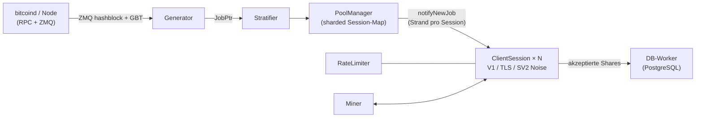

<div align="center">

# mkpool

### Moderne Solo-Mining-Pool-Engine für mehrere Coins, geschrieben in C++23

Stratum V1 · Stratum V1 über TLS · natives Stratum V2 (Noise-verschlüsselt) · 9 Coin-Familien · eine Codebasis

[](COPYING)
[](CMakeLists.txt)
[](#schnellstart)
[](#funktionsvergleich-mkpool-vs-ckpool)
[](https://mkpool.com/blog/mkpool-vs-ckpool-benchmark)
[](https://github.com/Mecanik/mkpool/stargazers)

[Live-Pool](https://mkpool.com) · [Benchmark-Bericht](https://mkpool.com/blog/mkpool-vs-ckpool-benchmark) · [Schnellstart](#schnellstart) · [Mitwirken](CONTRIBUTING.md) · [Sicherheitsrichtlinie](SECURITY.md)

[English](README.md) | [简体中文](README.zh-CN.md) | [Русский](README.ru.md) | [Español](README.es.md) | [Português (Brasil)](README.pt-BR.md) | **Deutsch** | [Français](README.fr.md) | [日本語](README.ja.md) | [한국어](README.ko.md) | [Türkçe](README.tr.md)

*Diese Übersetzung kann gelegentlich hinter der englischen README zurückliegen.*

</div>

---

**mkpool** ist eine hochperformante, multithreaded Solo-Mining-Pool-Engine. Sie spricht **Stratum V1**, **Stratum V1 über TLS** und natives **Stratum V2 (Noise-verschlüsselt)** und betreibt **neun Coin-Familien** (einschließlich merge-mined Dogecoin und Equihash-Zcash) aus einer einzigen Codebasis. Sie läuft heute live im Mainnet und treibt [mkpool.com](https://mkpool.com) an; diese README spiegelt den produktiv laufenden Stand wider.

Auf identischer Hardware liefert mkpool rund **2.8x den Share-Durchsatz**, **3.2x niedrigere mediane Latenz** und **16x die Reconnect-Kapazität** von ckpool, gemessen mit einem vollständig reproduzierbaren Open-Source-Benchmark ([Details unten](#benchmarks-mkpool-vs-ckpool)).

## Inhaltsverzeichnis

- [Warum mkpool?](#warum-mkpool)
- [Benchmarks: mkpool vs. ckpool](#benchmarks-mkpool-vs-ckpool)
- [Unterstützte Coins](#unterstützte-coins)
- [Funktionsvergleich: mkpool vs. ckpool](#funktionsvergleich-mkpool-vs-ckpool)
- [Schnellstart](#schnellstart)
- [Laufzeitsteuerung (`mkpool-ctl`)](#laufzeitsteuerung-mkpool-ctl)
- [Tests und Härtung](#tests-und-härtung)
- [Architektur](#architektur)
- [Projektumfang](#projektumfang)
- [Mitwirken](#mitwirken)
- [Das Projekt unterstützen](#das-projekt-unterstützen)
- [Danksagungen](#danksagungen)
- [Attribution und Lizenz](#attribution-und-lizenz)

## Warum mkpool?

- ⚡ **Schnell, wo es zählt.** ~330k vollständig validierte Shares pro Sekunde auf einer 8-Kern-Maschine, Submit-to-Ack unter einer Millisekunde in jedem Perzentil, und Reconnect-Stürme (im Stil von NiceHash oder MiningRigRentals) werden mit ~6,400 vollständigen Connect-Zyklen pro Sekunde abgefangen.
- 🔐 **Verschlüsseltes Stratum, direkt im Binary.** TLS (`stratum+ssl://`) und natives Stratum V2 mit Noise-`NX`-Handshake und signierten Authority-Zertifikaten. Kein stunnel, kein externer Proxy.
- 🪙 **Neun Coin-Familien, eine Codebasis.** BTC, BCH, BC2, BCH2, XEC, DGB, LTC mit merge-mined DOGE (AuxPoW) und Equihash-ZEC, jede davon nur eine Konfigurationsdatei entfernt.
- 🎯 **Echtes Solo-Mining.** Der Username des Miners ist seine Auszahlungsadresse; die Coinbase wird pro Session neu aufgebaut, sodass Block-Rewards direkt in die Wallet des Finders gehen.
- 🛡️ **Gehärtet gegen feindlichen Traffic.** Token-Bucket-Rate-Limiting, Auto-Ban bei Fluten ungültiger Shares, In-Memory-Blacklist, Ablehnung von Stale-by-Block- und Duplikat-Shares sowie ein veröffentlichter Fuzzing-Harness, der auf den Stratum-Parser eindrischt.
- 🔧 **Zur Laufzeit steuerbar.** Multi-Node-RPC-Failover mit Primär-Recovery-Watchdog, Block-Submit-Retry und ein JSON-Steuersocket (`mkpool-ctl`) für Live-Statistiken, `client.reconnect`, Trennen und Log-Level, plus Neustarts mit geringer Ausfallzeit dank `SO_REUSEPORT`. Sieh, wer minet, und steuere die Miner ohne Datenbank-Roundtrip oder Neustart.
- 🧪 **Entwickelt wie Software, nicht wie Folklore.** Unit-Tests, ASan/TSan/UBSan-Durchläufe, CI-freundliche CMake+Ninja-Builds und eingebaute Prometheus-Metriken.
- 🏭 **Produktionserprobt.** Jedes Feature in diesem Repository läuft genau jetzt im Mainnet, über alle neun Chains hinweg, unter echtem Churn gemieteter Hashrate.

## Benchmarks: mkpool vs. ckpool

Ein fairer, vollständig reproduzierbarer Stratum-Benchmark auf zwei identischen 8-Kern-Maschinen (Azure `Standard_D8lds_v7`), jeweils ein Pool zur Zeit, derselbe `bitcoind`-Regtest-Node, derselbe Lastgenerator, feste Difficulty 1. Jeder eingereichte Share wird vollständig validiert (Coinbase-Rebuild, Merkle-Root, 80-Byte-Header, doppeltes SHA-256), bevor der Pool antwortet, und die Reject-Gründe belegen das auf beiden Seiten.

| Szenario | mkpool | ckpool | Vorsprung |
| --- | --- | --- | --- |
| Anhaltend validierte Shares/s (128 bis 2,048 Verbindungen) | ~315k bis 337k | ~108k bis 118k | **~2.8x** |
| Mediane Submit-to-Ack-Latenz (100 Verbindungen, leichte Last) | 116 µs | 371 µs | **~3.2x niedriger** |
| Latenz im 99. Perzentil | 602 µs | 814 µs | in jedem Perzentil niedriger |
| Reconnect-Zyklen/s (200 parallele Connect-Subscribe-Authorize-Submit-Close-Schleifen) | ~6,391 (4 Fehler) | ~402 (1,000+ Fehler) | **~16x** |
| Resident Memory bei 2k / 4k / 8k Idle-Verbindungen | 66 / 108 / 197 MiB | 25 / 39 / 68 MiB | **ckpool ~2.7x schlanker** |

ckpools Speichersieg wird genau so veröffentlicht, wie er gemessen wurde: Sein knapper C-Fußabdruck ist eine echte Ingenieursleistung, und der Trade-off aus mkpools schwererem Per-Connection-Buffering und Threading-Modell ist real. Alles andere ging an mkpool, und die Verhältnisse bewegen sich bei steigender Last kaum.

- 📊 [Vollständiger Bericht mit Methodik und Diagrammen](https://mkpool.com/blog/mkpool-vs-ckpool-benchmark)
- 📄 [Der exakte, in sich geschlossene HTML-Report](https://mkpool.com/benchmarks/mkpool-vs-ckpool.html)
- 🔁 [Selbst reproduzieren: Benchmark-Kit (Lastgenerator, Orchestrator, Konfigurationen)](https://github.com/Mecanik/mkpool-vs-ckpool-benchmark)

> **Tipp für eigene mkpool-Benchmarks:** Verwende eine echte, gültige Auszahlungsadresse als Stratum-Username. mkpool validiert Adressen lokal beim Authorize und lehnt ungültige Usernames frühzeitig ab, wodurch genau die Arbeit, die gemessen werden soll, unfairerweise übersprungen würde.

## Unterstützte Coins

| Coin | Ticker | Algorithmus | Anmerkungen |
| --- | --- | --- | --- |
| Bitcoin | BTC | SHA-256d | V1, TLS, SV2 |
| Bitcoin Cash | BCH | SHA-256d | CashAddr, V1/TLS/SV2 |
| BitcoinII | BC2 | SHA-256d | V1/TLS/SV2 |
| Bitcoin Cash II | BCH2 | SHA-256d | CashAddr, V1/TLS/SV2 |
| eCash | XEC | SHA-256d | Avalanche-Pre-Consensus, SV2 |
| DigiByte | DGB | SHA-256d | V1/TLS/SV2 |
| Litecoin | LTC | Scrypt | Merge-Mining mit DOGE |
| Dogecoin | DOGE | Scrypt (AuxPoW) | merge-mined über LTC |
| Zcash | ZEC | Equihash 200,9 | `mining.set_target`, Blossom-Subsidy |

## Funktionsvergleich: mkpool vs. ckpool

Legende: ✅ unterstützt · ⚠️ teilweise / bedingt · ❌ nicht unterstützt

### Protokolle und Verschlüsselung

| Funktion | mkpool | ckpool |
| --- | :---: | :---: |
| Stratum V1 (`mining.*`) | ✅ | ✅ |
| Stratum V1 über **TLS** (`stratum+ssl://`) | ✅ In-Binary-`any_stream`-Variante, Zertifikats-Reload per SIGHUP | ❌ |
| **Stratum V2** nativ (Noise-`NX`-Handshake, verschlüsselt) | ✅ Full-Block-Modus, nimmt Gebühren mit | ❌ |
| SV2 Secret-Authority-Key / signierte Zertifikate | ✅ | ❌ |
| SV2-Umschalter Empty-Block vs. Full-Block (`v2EmptyBlocks`) | ✅ | ❌ |
| BIP310 `mining.configure` (Version-Rolling-Aushandlung) | ✅ | ✅ |
| ASICBoost / Version-Mask (`version_mask`) | ✅ validiert (BIP310) | ✅ |
| `subscribe-extranonce`-Erweiterung | ✅ | ✅ |
| Vorgeschlagene Difficulty (`mining.suggest_difficulty`, `d=` im Passwort) | ✅ pro Coin begrenzt | ✅ |

### Coins, Algorithmen und Merge-Mining

| Funktion | mkpool | ckpool |
| --- | :---: | :---: |
| Bitcoin (BTC, SHA-256d) | ✅ | ✅ |
| Bitcoin Cash (BCH, SHA-256d, CashAddr) | ✅ | ❌ |
| BitcoinII (BC2, SHA-256d) | ✅ | ❌ |
| Bitcoin Cash II (BCH2, SHA-256d, CashAddr) | ✅ | ❌ |
| eCash (XEC, SHA-256d + Avalanche-Pre-Consensus) | ✅ | ❌ |
| DigiByte (DGB, SHA-256d) | ✅ | ❌ |
| Litecoin (LTC, Scrypt) | ✅ | ❌ |
| **Dogecoin merge-mined auf LTC** (AuxPoW) | ✅ Parent- + Aux-Blöcke | ❌ |
| Zcash (ZEC, Equihash 200,9, `mining.set_target`) | ✅ | ❌ |
| Eine Codebasis, Konfiguration pro Coin | ✅ 9 Familien | ❌ nur Bitcoin |
| Equihash-Share-Validierung (in-process) | ✅ `equihash.hpp` + Unit-Test | ❌ |
| Blossom-gerechte Subsidy / Halving (ZEC) | ✅ | ❌ |

### Pool-Engine und Architektur

| Funktion | mkpool | ckpool |
| --- | :---: | :---: |
| Sprache / Standard | C++23 | C |
| Nebenläufigkeitsmodell | Einzelprozess, asynchroner `io_context`-Worker-Pool (`std::jthread`) | Multi-Prozess (fork) + Threads, IPC über Unix-Sockets |
| Networking | Boost.Asio / Beast, Strand pro Session | Handgeschriebenes epoll + Unix-Sockets |
| Session-Map | Sharded (standardmäßig 64 Shards), Broadcast mit geringer Contention | Hash-Tabellen (uthash) |
| Schreibpfad pro Session | Strand-gebundene `WriteQueue` + 1-MiB-Watermark (keine `async_write`-Races) | epoll-getriebene Sendepuffer |
| Job-/Work-Fenster | Rollierender `JobWindow`-Puffer (standardmäßig 32 Jobs), adressiert über `job_id` | Workbase-Liste |
| Neue Arbeit bei Blockwechsel | ✅ vollständiges Tx-Set, ZMQ-getrieben, keine transaktionslose Arbeit | ✅ |
| Periodisches Job-Rebroadcast (Keepalive für strikte Clients) | ✅ 30s, wird bei echten Blöcken zurückgesetzt | ✅ |
| ZMQ-Block-Hash-Benachrichtigung | ✅ Edge-Trigger-Bug behoben | ✅ (optional) |
| `bitcoind`-Failover (mehrere lokale oder entfernte Nodes) | ✅ geordnete `rpcFallbacks` + 30s-Primär-Recovery-Watchdog | ✅ |
| Block-Submit-Retry bei Transportfehler | ✅ wiederholt nur, wenn der Node keine Antwort gab (nie bei einem echten Ergebnis) | ✅ (bis zu 5×) |
| Redundante Block-Propagation (zusätzliche Submit-Nodes) | ✅ `additionalSubmitEndpoints`, Fire-and-Forget, blockiert nie den primären Submit | ⚠️ über Node-Modus |
| Solo-Coinbase (Miner-Adresse = Username) | ✅ coinbase2-Rebuild pro Session | ✅ (BTCSOLO-Modus) |
| Betreibergebühr / Spende aus der Coinbase | ✅ konfigurierbarer Prozentsatz, inkl. Aux-/DOGE-Split | ✅ standardmäßig 0.5% |
| Eigene Coinbase-Signatur | ✅ konfigurierbar | ✅ konfigurierbar |
| Proxy-Modus | ✅ TLS uplink; multi-upstream hot-standby + active/active | ✅ |
| Passthrough- / Node- / Redirector-Modi | ✅ all three (mkpool-native TLS cluster protocol; node adds local block submit; health/latency-aware redirector) | ✅ |
| Neustart mit geringer Ausfallzeit | ✅ Zero-Downtime-Deploy: 2-Slot-Wechsel (`SO_REUSEPORT` + gestaffeltes `client.reconnect`) | ✅ Socket-Handover |

### Difficulty und Share-Handling

| Funktion | mkpool | ckpool |
| --- | :---: | :---: |
| Vardiff (EMA / abklingender Durchschnitt) | ✅ originalgetreue Neuimplementierung von ckpools `decay_time`/`time_bias` | ✅ (Original) |
| Vardiff-Bereiche pro Coin | ✅ (z. B. BTC/BCH/BC2/BCH2/DGB/XEC `[1024, 1M]`, ZEC `[8192, 524288]`) | ⚠️ ein einziges `mindiff`/`maxdiff` |
| Feste Difficulty-Stufen (je ein eigener TCP-Port) | ✅ z. B. Ports für 10M / 50M / 100M | ⚠️ über separate Instanzen |
| Eigener `d=`-Clamp (1024-10M) | ✅ | ⚠️ |
| Ablehnung von Stale-by-Block-Shares | ✅ prevhash wird gegen die aktuelle Chain-Spitze geprüft | ✅ |
| Ablehnung von Duplikat-Shares | ✅ In-Memory-Dedupe-Set, pro Block geleert | ✅ |
| ntime-Validierung (BIP113-kompatibel) | ✅ `utils::valid_ntime` | ✅ |
| `int64_t`-Coinbase-Wert (überlaufsicher) | ✅ durchgängig | ✅ |
| Lokale Adressvalidierung (kein RPC pro Authorize) | ✅ BIP173-/BIP350-/Base58-/CashAddr-Decoder | ⚠️ verlässt sich auf bitcoind |

### Sicherheit und Betrieb

| Funktion | mkpool | ckpool |
| --- | :---: | :---: |
| Token-Bucket-Rate-Limiting pro IP | ✅ | ⚠️ |
| Auto-Ban bei übermäßig vielen ungültigen Shares | ✅ | ⚠️ |
| In-Memory-IP-Blacklist | ✅ | ⚠️ |
| Beobachtbarkeit von Verbindungsabbrüchen (Log pro Disconnect) | ✅ Grund/Worker/Lebensdauer/Shares | ⚠️ |
| Laufzeit-Steuer-/Admin-Socket | ✅ `mkpool-ctl` (21 JSON-Befehle) | ✅ `ckpmsg` |
| `client.reconnect` (Miner umziehen ohne betreiberseitiges Trennen) | ✅ Broadcast oder pro Client, über den Steuersocket | ✅ |
| Live-In-Process-Statistiken über Socket (Hashrate 1m/5m, Best-Share-der-Runde, Idle-Sekunden) | ✅ pro Miner / Worker / User / Pool, auf Anfrage aus Vardiff berechnet (kein DB-Zugriff) | ✅ |
| Erkennung inaktiver / toter Worker + optionales Reap | ✅ optional `idleDropSeconds` | ✅ |
| Datenbank-Resilienz (Auto-Reconnect + verlustfreies Requeue) | ✅ | n/a (keine DB) |
| Prometheus-Metrik-Endpunkt | ✅ optional (`MKPOOL_ENABLE_METRICS`) | ❌ |
| Sanitizer-Builds (ASan / TSan / UBSan) | ✅ CMake-Optionen + `scripts/run_sanitizers.sh` | ❌ |
| Unit-Tests (Catch2 / Catch-Stil) | ✅ Merkle, Vardiff, Adressen, SV2-Noise usw. | ❌ |
| Stratum-Fuzzing-Harness | ✅ `scripts/fuzz_*.sh` (7 Missbrauchskategorien, Daemon-Survival-Assertions) | ❌ |
| Build-System | CMake + Ninja | autotools (`./configure && make`) |
| Plattform | Linux (Ubuntu 24.04+) | Linux |
| Externe Abhängigkeiten | Boost, OpenSSL, libpq/pqxx, libzmq, libsodium | Minimal (glibc, yasm, optional zmq) |

## Schnellstart

### 1. Build (Ubuntu 24.04+)

```bash
# System-Abhängigkeiten
sudo apt update
sudo apt install -y build-essential cmake ninja-build pkg-config git \
    libboost-system-dev libboost-thread-dev libboost-program-options-dev \
    libssl-dev libpq-dev libpqxx-dev libzmq3-dev cppzmq-dev libsodium-dev libsecp256k1-dev

# klonen + konfigurieren + bauen (C++23)
git clone https://github.com/Mecanik/mkpool.git && cd mkpool
cmake -S . -B build -GNinja -DCMAKE_BUILD_TYPE=RelWithDebInfo
cmake --build build -j
```

<details>
<summary><b>CMake-Optionen</b></summary>

| Option | Standard | Beschreibung |
| --- | --- | --- |
| `MKPOOL_BUILD_TESTS` | `ON` | Catch2-Unit-Tests |
| `MKPOOL_ENABLE_LTO` | `ON` | Link-Time-Optimierung |
| `MKPOOL_ENABLE_TLS` | `ON` | Unterstützung für OpenSSL-TLS-Kontexte |
| `MKPOOL_ENABLE_METRICS` | `ON` | Prometheus-Exposer |
| `MKPOOL_ENABLE_ASAN` | `OFF` | AddressSanitizer |
| `MKPOOL_ENABLE_TSAN` | `OFF` | ThreadSanitizer |
| `MKPOOL_ENABLE_UBSAN` | `OFF` | UndefinedBehaviorSanitizer |
| `MKPOOL_ENABLE_NATIVE` | `OFF` | `-march=native` |

</details>

### 2. Konfigurieren

Du brauchst einen synchronisierten Coin-Node (mit aktivierten ZMQ-Blockbenachrichtigungen) und eine erreichbare PostgreSQL-Instanz.

```bash
cp config.json.example config.json
# anschließend config.json bearbeiten:
#  - RPC-Host/-Zugangsdaten für deine(n) Coin-Daemon(s)
#  - PostgreSQL-Zugangsdaten
#  - DEINE Spenden-/Auszahlungsadressen (niemals die Platzhalter stehen lassen)
#  - Stratum-Stufen/-Ports, Vardiff-Bereiche, optionale TLS-Zertifikatspfade, optionaler SV2-Port
```

[`config.json.example`](config.json.example) dokumentiert jedes Feld, das der Loader versteht, einschließlich fester Difficulty-Stufen, TLS-Stufen (`"tls": true`), Stratum-V2-Einstellungen und LTC+DOGE-Merge-Mining (`aux`-Block).

### 3. Starten

```bash
./build/mkpool --config config.json
```

Ein laufender Pool stellt, je nach Konfiguration, Folgendes bereit:

- **Stratum V1:** Vardiff- und Fixed-Difficulty-Stufen, je ein eigener Port (z. B. `3331` Vardiff, `3335` fest 10M).
- **Stratum über TLS:** Jede Stufe mit `"tls": true` spricht `stratum+ssl://` auf ihrem Port.
- **Stratum V2 (Noise):** der `stratumV2Port` (z. B. BTC `3340`).
- **Prometheus-Metriken:** `metricsListenPort` (Standard `9090`), sofern mit Metriken gebaut.

Miner verbinden sich mit ihrer **Auszahlungsadresse als Username**; der Block-Reward geht direkt an diese Adresse.

## Laufzeitsteuerung (`mkpool-ctl`)

Jede Instanz öffnet einen privaten Unix-Steuersocket (standardmäßig `/run/mkpool/<instanz>.sock`; mit `controlSocket` überschreiben oder auf `"off"` setzen, um ihn zu deaktivieren). Frage und steuere einen laufenden Pool mit dem beigelegten [`scripts/mkpool-ctl.py`](scripts/mkpool-ctl.py) (unten als `mkpool-ctl` gezeigt), ohne Neustart, ohne Datenbank-Roundtrip:

```bash
mkpool-ctl -i btc-mainnet stats          # Uptime, Verbindungen, Pool-Hashrate, Template + Best-Share pro Coin
mkpool-ctl -i btc-mainnet clients        # jede Verbindung: IP, Worker, Difficulty, Hashrate, Idle-Sekunden
mkpool-ctl -i btc-mainnet workers        # aggregiert pro address.worker
mkpool-ctl -i btc-mainnet users          # aggregiert pro Auszahlungsadresse
mkpool-ctl -i btc-mainnet getclient 42   # eine Verbindung im Detail
mkpool-ctl -i btc-mainnet reconnect      # client.reconnect an jeden Miner (z. B. vor Wartung)
mkpool-ctl -i btc-mainnet dropclient 42  # einen Miner trennen
mkpool-ctl -i btc-mainnet loglevel debug # Log-Level live ändern
mkpool-ctl -i btc-mainnet healthcheck    # Template-Frische pro Coin
mkpool-ctl -i btc-mainnet help           # vollständige Befehlsliste
```

Vollständiger Befehlssatz: `ping`, `help`, `version`, `uptime`, `stats`, `clients`, `workers`, `users`, `getclient`, `getuser`, `getworker`, `userclients`, `workerclients`, `loglevel`, `reconnect`, `reconnclient`, `dropclient`, `dropall`, `resetshares`, `blacklistreload`, `healthcheck`. Jede Antwort ist JSON. Hashrate, Best-Share-der-Runde und Idle-Zeit werden In-Process gehalten (abgeleitet aus der Share-Rate, die Vardiff ohnehin verfolgt) und auf Anfrage gelesen, sodass das Auflisten von 50k Workern nichts kostet, bis du fragst. Der Socket wird `0600` erstellt (nur Eigentümer); bei einem Prozess pro Coin unter systemd erhält jeder Coin seinen eigenen Socket.

## Tests und Härtung

### Unit-Tests

```bash
cd build
ctest --output-on-failure -j
```

### Sanitizer-Durchläufe

`scripts/run_sanitizers.sh` baut die Unit-Tests unter AddressSanitizer, UndefinedBehaviorSanitizer und ThreadSanitizer in einem Wegwerf-Verzeichnis `.san/` (dein normales `build/` bleibt unangetastet) und meldet alle Funde.

```bash
./scripts/run_sanitizers.sh            # asan+ubsan und tsan
./scripts/run_sanitizers.sh asan       # eine einzelne Variante
./scripts/run_sanitizers.sh --fuzz     # zusätzlich eine sanitized Instanz fuzzen
```

### Den Stratum-Parser fuzzen

`scripts/fuzz_*.sh` werfen fehlerhaften und missbräuchlichen Stratum-Traffic auf einen laufenden Pool und stellen sicher, dass er überlebt (gleiche PID vorher und nachher), ohne dass Handler-Exceptions auftreten. Richte sie auf eine lokale Instanz:

```bash
# schnelle Batterie fehlerhafter Frames
HOST=127.0.0.1 PORT=3331 ./scripts/fuzz_stratum.sh

# volle Suite: fehlerhaftes JSON, Protokollmissbrauch, Share-Spam, Auth-Missbrauch,
# Slowloris, Version-Rolling-Missbrauch, binäres Rauschen
HOST=127.0.0.1 PORT=3331 ./scripts/fuzz_suite.sh
```

## Architektur



- `IoPool` betreibt N Worker-`io_context`s (Standard = `hardware_concurrency()`).
- Jede `ClientSession` lebt über einen Asio-Strand auf einem Worker-`io_context`; der Socket-Typ (plain / TLS / SV2 Noise) ist hinter `any_stream` abstrahiert, und alle Schreibvorgänge laufen durch eine strand-gebundene `WriteQueue`.
- `PoolManager` iteriert bei jedem `JobPtr` über die Shards und dispatcht `notifyNewJob` an den Strand jeder Session.
- Der `Generator` sendet den aktuellen Job alle 30 Sekunden als Keepalive erneut (mit `clean_jobs=false`, es geht also keine Arbeit verloren). Das verhindert, dass strikte Clients wie Proxys von Miet-Marktplätzen und Farm-Controller zwischen Blöcken wegen Inaktivität die Verbindung trennen.

## Projektumfang

Dieses Repository ist die **Pool-Engine**, veröffentlicht aus Gründen der Transparenz. Der operative Stack, der sie in der Produktion umgibt (der Datenbank-/Analytics-Dienst, die öffentliche REST-API und die Website), ist **nicht** Teil dieser offenen Veröffentlichung.

mkpool ist eine originäre Codebasis. Die asynchrone C++-Engine, die Multi-Coin-Unterstützung, der Stratum-V2-(Noise)- und TLS-Stack, die Solo-Coinbase-Konstruktion pro Miner und das Security-Tooling wurden komplett neu geschrieben. Die eine Komponente, die sich bewusst bei [ckpool](https://bitbucket.org/ckolivas/ckpool) (Con Kolivas' GPLv3-Pool in C) bedient, ist die **Retarget-Mathematik der variablen Difficulty**, eine kleine, mit Quellenangabe versehene Neuimplementierung eines bewährten Algorithmus (siehe [Attribution und Lizenz](#attribution-und-lizenz)).

## Mitwirken

Beiträge sind willkommen: Bug-Reports, Protokoll-Grenzfälle, neue Coin-Familien, Performance-Arbeit, Dokumentation und Übersetzungen dieser README.

- Lies [CONTRIBUTING.md](CONTRIBUTING.md), bevor du einen PR öffnest.
- Sicherheitsprobleme: Bitte folge [SECURITY.md](SECURITY.md), statt ein öffentliches Issue zu eröffnen.
- Wenn mkpool dir nützt, hilft **ein Stern für das Repo** dem Projekt wirklich dabei, gefunden zu werden. ⭐

## Das Projekt unterstützen

mkpool ist frei und Open Source. Es gibt keine Gebühr für die Nutzung des Codes und keinen eingebauten Spendenabzug. Wenn dir das Projekt geholfen hat und du etwas zu seiner Entwicklung beitragen möchtest, kannst du hier ein Trinkgeld senden. Das ist völlig optional und wird sehr geschätzt.

**BTC:** `bc1qlugz6as6x3n03c6x8zddpnmypsaucdmh3lc5z0`

## Danksagungen

mkpool baut auf einer Menge exzellenter Open-Source-Arbeit auf. Ein aufrichtiges Dankeschön an die Maintainer und Mitwirkenden jedes der folgenden Projekte. Ohne sie gäbe es den Pool nicht.

| Bibliothek | Lizenz | Verwendet für |
| --- | --- | --- |
| [Boost](https://www.boost.org/) (Asio / Beast) | BSL-1.0 | Asynchrones Networking, Strands, HTTP-RPC-Client |
| [OpenSSL](https://www.openssl.org/) | Apache-2.0 | TLS, SHA-256 |
| [fmt](https://github.com/fmtlib/fmt) | MIT | Stratum-Formatierung im Hot-Path |
| [spdlog](https://github.com/gabime/spdlog) | MIT | Logging |
| [nlohmann/json](https://github.com/nlohmann/json) | MIT | Konfigurations- und RPC-JSON |
| [cxxopts](https://github.com/jarro2783/cxxopts) | MIT | Parsen der Kommandozeile |
| [libpqxx](https://github.com/jtv/libpqxx) / [libpq](https://www.postgresql.org/) | BSD-3-Clause / PostgreSQL | Datenbankzugriff |
| [ZeroMQ](https://zeromq.org/) (libzmq + [cppzmq](https://github.com/zeromq/cppzmq)-Binding) | MPL-2.0 / MIT | Block-Hash-Benachrichtigungen |
| [libsodium](https://libsodium.org/) | ISC | Stratum-V2-Noise-Kryptografie |
| [libsecp256k1](https://github.com/bitcoin-core/secp256k1) | MIT | EC-Schlüssel / Signaturen (SV2) |
| [Catch2](https://github.com/catchorg/Catch2) | BSL-1.0 | Unit-Tests |
| [prometheus-cpp](https://github.com/jupp0r/prometheus-cpp) | MIT | Optionaler Metrik-Endpunkt |

Alle stehen unter GPLv3-kompatiblen Lizenzen. mkpool vendored (kopiert) deren Quellcode nicht; die Bibliotheken werden über den Paketmanager deines Systems gelinkt oder beim Build von CMake geladen. Wenn du ein **kompiliertes** mkpool-Binary weitergibst, lege eine `THIRD-PARTY-NOTICES`-Datei bei, die die Copyright- und Lizenztexte dieser Projekte wiedergibt.

## Attribution und Lizenz

mkpool ist **originäre Software**, © 2025-2026 Mecanik1337 (<contact@mecanik.dev>), lizenziert unter der **GNU General Public License v3.0** (`GPL-3.0`). Jede Quelldatei trägt den vollständigen GPLv3-Header.

Nahezu die gesamte Codebasis (die asynchrone Engine, die Multi-Coin-Unterstützung, Stratum V2 (Noise) und TLS, die Solo-Coinbase-Konstruktion und das Security-Tooling) ist von Grund auf neu geschrieben und verdankt ckpool nichts, außer dieselbe Art von Programm zu sein.

Die einzige Ausnahme, aus Ehrlichkeit und zur Einhaltung der Lizenz offengelegt: Die **Retarget-Mathematik** der variablen Difficulty in [`vardiff.cpp`](src/vardiff.cpp) / [`vardiff.hpp`](src/vardiff.hpp) implementiert ckpools `decay_time()` (`src/libckpool.c`) sowie `time_bias()` / `add_submit()` (`src/stratifier.c`) von **Con Kolivas** (ebenfalls GPLv3) neu. Das ist der einzige aus ckpool übernommene Teil; keine ckpool-C-Quelldateien wurden vendored oder wörtlich kopiert, und einige Stratum-Feldkonventionen (z. B. 4-Byte-extranonce1) folgen schlicht der gängigen Praxis. Die Befehlsnamen des Laufzeit-Steuersockets (`stats`, `clients`, `workers`, `reconnect`, …) sind an ckpool angelehnt, damit sie Betreibern vertraut sind, aber Dispatch, JSON-Format und Implementierung sind vollständig eigenständig. All das ist inline attribuiert. Da mkpool unter GPLv3 steht, ist diese Wiederverwendung vollständig erlaubt; wenn du mkpool weiterverbreitest, behalte die GPLv3 bei, erhalte diese Attributionen und liefere den vollständigen Lizenztext mit ([`COPYING`](COPYING)).

ckpool: <https://bitbucket.org/ckolivas/ckpool>, © 2014-2026 Con Kolivas.

---

<div align="center">

**[⬆ zurück nach oben](#mkpool)**

Wenn du mkpool betreibst, damit einen Block findest oder einfach das Engineering magst, ist [ein Stern](https://github.com/Mecanik/mkpool/stargazers) der einfachste Weg, das Projekt zu unterstützen.

</div>
