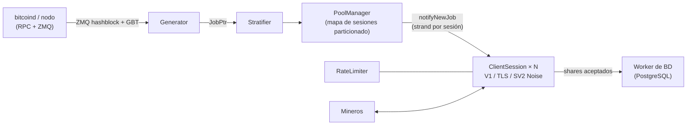

<div align="center">

# mkpool

### Motor moderno de pool de minería en solitario multi-moneda, escrito en C++23

Stratum V1 · Stratum V1 sobre TLS · Stratum V2 nativo (cifrado con Noise) · 9 familias de monedas · una sola base de código

[](COPYING)
[](CMakeLists.txt)
[](#inicio-rápido)
[](#comparación-de-características-mkpool-vs-ckpool)
[](https://mkpool.com/blog/mkpool-vs-ckpool-benchmark)
[](https://github.com/Mecanik/mkpool/stargazers)

[Pool en vivo](https://mkpool.com) · [Informe de benchmark](https://mkpool.com/blog/mkpool-vs-ckpool-benchmark) · [Inicio rápido](#inicio-rápido) · [Contribuir](CONTRIBUTING.md) · [Política de seguridad](SECURITY.md)

[English](README.md) | [简体中文](README.zh-CN.md) | [Русский](README.ru.md) | **Español** | [Português (Brasil)](README.pt-BR.md) | [Deutsch](README.de.md) | [Français](README.fr.md) | [日本語](README.ja.md) | [한국어](README.ko.md) | [Türkçe](README.tr.md)

*Es posible que esta traducción quede ocasionalmente desactualizada respecto al README en inglés.*

</div>

---

**mkpool** es un motor de pool de minería en solitario multihilo y de alto rendimiento. Habla **Stratum V1**, **Stratum V1 sobre TLS** y **Stratum V2 nativo (cifrado con Noise)**, y opera **nueve familias de monedas** (incluidas Dogecoin con minería fusionada y Zcash con Equihash) desde una sola base de código. Hoy está en producción en mainnet, impulsando [mkpool.com](https://mkpool.com); este README refleja el estado realmente desplegado.

Con hardware idéntico, mkpool ofrece aproximadamente **2.8x el rendimiento en shares**, **3.2x menos latencia mediana** y **16x la capacidad de reconexión** de ckpool, medido con un benchmark de código abierto totalmente reproducible ([detalles más abajo](#benchmarks-mkpool-vs-ckpool)).

## Tabla de contenidos

- [¿Por qué mkpool?](#por-qué-mkpool)
- [Benchmarks: mkpool vs ckpool](#benchmarks-mkpool-vs-ckpool)
- [Monedas soportadas](#monedas-soportadas)
- [Comparación de características: mkpool vs ckpool](#comparación-de-características-mkpool-vs-ckpool)
- [Inicio rápido](#inicio-rápido)
- [Control en tiempo de ejecución (`mkpool-ctl`)](#control-en-tiempo-de-ejecución-mkpool-ctl)
- [Pruebas y endurecimiento](#pruebas-y-endurecimiento)
- [Arquitectura](#arquitectura)
- [Alcance del proyecto](#alcance-del-proyecto)
- [Cómo contribuir](#cómo-contribuir)
- [Apoya el proyecto](#apoya-el-proyecto)
- [Agradecimientos](#agradecimientos)
- [Atribución y licencia](#atribución-y-licencia)

## ¿Por qué mkpool?

- ⚡ **Rápido donde importa.** ~330k shares totalmente validados por segundo en una máquina de 8 núcleos, latencia de submit a ack por debajo del milisegundo en todos los percentiles, y tormentas de reconexión (al estilo NiceHash o MiningRigRentals) absorbidas a ~6,400 ciclos completos de conexión por segundo.
- 🔐 **Stratum cifrado, dentro del binario.** TLS (`stratum+ssl://`) y Stratum V2 nativo con handshake Noise `NX` y certificados de autoridad firmados. Sin stunnel, sin proxy externo.
- 🪙 **Nueve familias de monedas, una sola base de código.** BTC, BCH, BC2, BCH2, XEC, DGB, LTC con DOGE en minería fusionada (AuxPoW) y ZEC con Equihash, cada una a un archivo de configuración de distancia.
- 🎯 **Minería en solitario de verdad.** El nombre de usuario del minero es su dirección de pago; la coinbase se reconstruye por sesión, de modo que la recompensa del bloque va directo a la billetera de quien lo encuentra.
- 🛡️ **Endurecido contra tráfico hostil.** Limitación de tasa con token bucket, baneo automático ante avalanchas de shares inválidos, lista negra en memoria, rechazo de shares obsoletos por cambio de bloque y de shares duplicados, y un harness de fuzzing publicado que castiga sin piedad el parser de Stratum.
- 🔧 **Operable en tiempo de ejecución.** Failover de RPC entre varios nodos con watchdog de recuperación del primario, reintento de envío de bloques y un socket de control JSON (`mkpool-ctl`) para estadísticas en vivo, `client.reconnect`, desconexión y nivel de log, además de reinicios de bajo tiempo de inactividad con `SO_REUSEPORT`. Mira quién está minando y gestiónalos sin un viaje de ida y vuelta a la base de datos ni un reinicio.
- 🧪 **Diseñado como software, no como folclore.** Pruebas unitarias, barridos con ASan/TSan/UBSan, builds con CMake + Ninja listos para CI, y métricas de Prometheus integradas.
- 🏭 **Probado en producción.** Cada característica de este repositorio corre ahora mismo en mainnet, en las nueve cadenas, bajo churn real de hashrate rentado.

## Benchmarks: mkpool vs ckpool

Un benchmark de Stratum justo y totalmente reproducible en dos máquinas idénticas de 8 núcleos (Azure `Standard_D8lds_v7`), un pool a la vez, el mismo nodo regtest de `bitcoind`, el mismo generador de carga, dificultad fija 1. Cada share enviado se valida por completo (reconstrucción de la coinbase, raíz de merkle, cabecera de 80 bytes, doble SHA-256) antes de que el pool responda, y los motivos de rechazo lo demuestran en ambos lados.

| Escenario | mkpool | ckpool | Margen |
| --- | --- | --- | --- |
| Shares validados sostenidos por segundo (128 a 2,048 conexiones) | ~315k a 337k | ~108k a 118k | **~2.8x** |
| Latencia mediana de submit a ack (100 conexiones, carga ligera) | 116 µs | 371 µs | **~3.2x menor** |
| Latencia en el percentil 99 | 602 µs | 814 µs | menor en todos los percentiles |
| Ciclos de reconexión/s (200 bucles paralelos de connect-subscribe-authorize-submit-close) | ~6,391 (4 errores) | ~402 (más de 1,000 errores) | **~16x** |
| Memoria residente con 2k / 4k / 8k conexiones inactivas | 66 / 108 / 197 MiB | 25 / 39 / 68 MiB | **ckpool ~2.7x más ligero** |

La victoria de ckpool en memoria se publica exactamente como se midió: su compacta huella en C es un logro de ingeniería genuino, y el costo del modelo más pesado de buffering y threading por conexión de mkpool es real. Todo lo demás fue para mkpool, y las proporciones apenas se mueven a medida que sube la carga.

- 📊 [Análisis completo con metodología y gráficos](https://mkpool.com/blog/mkpool-vs-ckpool-benchmark)
- 📄 [El informe HTML autocontenido exacto](https://mkpool.com/benchmarks/mkpool-vs-ckpool.html)
- 🔁 [Reprodúcelo tú mismo: kit de benchmark (generador de carga, orquestador, configuraciones)](https://github.com/Mecanik/mkpool-vs-ckpool-benchmark)

> **Consejo si haces tu propio benchmark de mkpool:** usa una dirección de pago real y válida como nombre de usuario de Stratum. mkpool valida las direcciones localmente en el momento del authorize y rechaza de inmediato los nombres de usuario inválidos, lo que se saltaría injustamente el trabajo que se quiere medir.

## Monedas soportadas

| Moneda | Ticker | Algoritmo | Notas |
| --- | --- | --- | --- |
| Bitcoin | BTC | SHA-256d | V1, TLS, SV2 |
| Bitcoin Cash | BCH | SHA-256d | CashAddr, V1/TLS/SV2 |
| BitcoinII | BC2 | SHA-256d | V1/TLS/SV2 |
| Bitcoin Cash II | BCH2 | SHA-256d | CashAddr, V1/TLS/SV2 |
| eCash | XEC | SHA-256d | preconsenso Avalanche, SV2 |
| DigiByte | DGB | SHA-256d | V1/TLS/SV2 |
| Litecoin | LTC | Scrypt | minería fusionada con DOGE |
| Dogecoin | DOGE | Scrypt (AuxPoW) | minado en fusión sobre LTC |
| Zcash | ZEC | Equihash 200,9 | `mining.set_target`, subsidio Blossom |

## Comparación de características: mkpool vs ckpool

Leyenda: ✅ soportado · ⚠️ parcial / condicional · ❌ no soportado

### Protocolos y cifrado

| Capacidad | mkpool | ckpool |
| --- | :---: | :---: |
| Stratum V1 (`mining.*`) | ✅ | ✅ |
| Stratum V1 sobre **TLS** (`stratum+ssl://`) | ✅ variante `any_stream` dentro del binario, recarga de certificados con SIGHUP | ❌ |
| **Stratum V2** nativo (handshake Noise `NX`, cifrado) | ✅ modo de bloque completo, recolecta comisiones | ❌ |
| Clave de autoridad secreta SV2 / certificados firmados | ✅ | ❌ |
| Alternancia SV2 entre bloque vacío y bloque completo (`v2EmptyBlocks`) | ✅ | ❌ |
| BIP310 `mining.configure` (negociación de version-rolling) | ✅ | ✅ |
| ASICBoost / version-mask (`version_mask`) | ✅ validado (BIP310) | ✅ |
| Extensión `subscribe-extranonce` | ✅ | ✅ |
| Dificultad sugerida (`mining.suggest_difficulty`, `d=` en la contraseña) | ✅ acotada por moneda | ✅ |

### Monedas, algoritmos y minería fusionada

| Capacidad | mkpool | ckpool |
| --- | :---: | :---: |
| Bitcoin (BTC, SHA-256d) | ✅ | ✅ |
| Bitcoin Cash (BCH, SHA-256d, CashAddr) | ✅ | ❌ |
| BitcoinII (BC2, SHA-256d) | ✅ | ❌ |
| Bitcoin Cash II (BCH2, SHA-256d, CashAddr) | ✅ | ❌ |
| eCash (XEC, SHA-256d + preconsenso Avalanche) | ✅ | ❌ |
| DigiByte (DGB, SHA-256d) | ✅ | ❌ |
| Litecoin (LTC, Scrypt) | ✅ | ❌ |
| **Dogecoin en minería fusionada sobre LTC** (AuxPoW) | ✅ bloques padre + aux | ❌ |
| Zcash (ZEC, Equihash 200,9, `mining.set_target`) | ✅ | ❌ |
| Una sola base de código, configuración por moneda | ✅ 9 familias | ❌ solo Bitcoin |
| Validación de shares Equihash (en el propio proceso) | ✅ `equihash.hpp` + prueba unitaria | ❌ |
| Subsidio / halving con soporte de Blossom (ZEC) | ✅ | ❌ |

### Motor del pool y arquitectura

| Capacidad | mkpool | ckpool |
| --- | :---: | :---: |
| Lenguaje / estándar | C++23 | C |
| Modelo de concurrencia | Un solo proceso, pool de workers `io_context` asíncronos (`std::jthread`) | Multiproceso (fork) + hilos, IPC por sockets Unix |
| Red | Boost.Asio / Beast, strand por sesión | epoll escrito a mano + sockets Unix |
| Mapa de sesiones | Particionado en shards (64 por defecto), broadcast de baja contención | Tablas hash (uthash) |
| Ruta de escritura por sesión | `WriteQueue` ligada al strand + marca de agua de 1 MiB (sin carreras en `async_write`) | Buffers de envío dirigidos por epoll |
| Ventana de trabajos | Buffer rotativo `JobWindow` (32 trabajos por defecto) indexado por `job_id` | Lista de workbases |
| Trabajo nuevo al cambiar de bloque | ✅ set completo de transacciones, dirigido por ZMQ, sin trabajo vacío de transacciones | ✅ |
| Rebroadcast periódico de trabajos (keepalive para clientes estrictos) | ✅ 30s, se reinicia con bloques reales | ✅ |
| Notificación de hash de bloque por ZMQ | ✅ bug de edge-trigger corregido | ✅ (opcional) |
| Failover de `bitcoind` (varios nodos locales o remotos) | ✅ `rpcFallbacks` ordenados + watchdog de recuperación del primario cada 30s | ✅ |
| Reintento de envío de bloque ante fallo de transporte | ✅ reintenta solo cuando el nodo no dio respuesta (nunca ante un resultado real) | ✅ (hasta 5×) |
| Propagación redundante de bloques (nodos de envío adicionales) | ✅ `additionalSubmitEndpoints`, fire-and-forget, nunca bloquea el envío primario | ⚠️ mediante modo node |
| Coinbase en solitario (dirección del minero = nombre de usuario) | ✅ reconstrucción de coinbase2 por sesión | ✅ (modo BTCSOLO) |
| Comisión del operador / donación desde la coinbase | ✅ % configurable, incluida la división aux/DOGE | ✅ 0.5% por defecto |
| Firma de coinbase personalizada | ✅ configurable | ✅ configurable |
| Modo proxy | ✅ TLS uplink; multi-upstream hot-standby + active/active | ✅ |
| Modos passthrough / node / redirector | ✅ all three (mkpool-native TLS cluster protocol; node adds local block submit; health/latency-aware redirector) | ✅ |
| Reinicio de bajo tiempo de inactividad | ✅ despliegue sin cortes: cambio de 2 ranuras (`SO_REUSEPORT` + `client.reconnect` escalonado) | ✅ traspaso de sockets |

### Dificultad y manejo de shares

| Capacidad | mkpool | ckpool |
| --- | :---: | :---: |
| Vardiff (EMA / promedio con decaimiento) | ✅ reimplementación fiel de `decay_time`/`time_bias` de ckpool | ✅ (original) |
| Rangos de vardiff por moneda | ✅ (p. ej. BTC/BCH/BC2/BCH2/DGB/XEC `[1024, 1M]`, ZEC `[8192, 524288]`) | ⚠️ un solo `mindiff`/`maxdiff` |
| Niveles de dificultad fija (un puerto TCP cada uno) | ✅ p. ej. puertos de 10M / 50M / 100M | ⚠️ mediante instancias separadas |
| Límite de `d=` personalizado (1024-10M) | ✅ | ⚠️ |
| Rechazo de shares obsoletos por cambio de bloque | ✅ prevhash verificado contra la punta actual de la cadena | ✅ |
| Rechazo de shares duplicados | ✅ set de deduplicación en memoria, limpiado en cada bloque | ✅ |
| Validación de ntime (compatible con BIP113) | ✅ `utils::valid_ntime` | ✅ |
| Valor de coinbase en `int64_t` (a prueba de desbordamiento) | ✅ de extremo a extremo | ✅ |
| Validación local de direcciones (sin RPC por cada authorize) | ✅ decodificadores BIP173/BIP350/base58/CashAddr | ⚠️ depende de bitcoind |

### Seguridad y operaciones

| Capacidad | mkpool | ckpool |
| --- | :---: | :---: |
| Limitación de tasa por IP con token bucket | ✅ | ⚠️ |
| Baneo automático por exceso de shares inválidos | ✅ | ⚠️ |
| Lista negra de IPs en memoria | ✅ | ⚠️ |
| Observabilidad de desconexiones (log por cada desconexión) | ✅ motivo/worker/tiempo de vida/shares | ⚠️ |
| Socket de control / administración en tiempo de ejecución | ✅ `mkpool-ctl` (21 comandos JSON) | ✅ `ckpmsg` |
| `client.reconnect` (mover mineros sin una desconexión del lado del operador) | ✅ broadcast o por cliente, vía el socket de control | ✅ |
| Estadísticas en el propio proceso vía socket (hashrate 1m/5m, mejor share de la ronda, segundos inactivo) | ✅ por minero / worker / usuario / pool, calculadas bajo demanda desde vardiff (sin acceso a BD) | ✅ |
| Detección de workers inactivos / muertos + reap opcional | ✅ `idleDropSeconds` opcional | ✅ |
| Resiliencia de base de datos (reconexión automática + reencolado sin pérdidas) | ✅ | n/a (sin BD) |
| Endpoint de métricas de Prometheus | ✅ opcional (`MKPOOL_ENABLE_METRICS`) | ❌ |
| Builds con sanitizadores (ASan / TSan / UBSan) | ✅ opciones de CMake + `scripts/run_sanitizers.sh` | ❌ |
| Pruebas unitarias (Catch2 / estilo Catch) | ✅ merkle, vardiff, direcciones, Noise de SV2, etc. | ❌ |
| Harness de fuzzing de Stratum | ✅ `scripts/fuzz_*.sh` (7 categorías de abuso, aserciones de supervivencia del daemon) | ❌ |
| Sistema de build | CMake + Ninja | autotools (`./configure && make`) |
| Plataforma | Linux (Ubuntu 24.04+) | Linux |
| Dependencias externas | Boost, OpenSSL, libpq/pqxx, libzmq, libsodium | Mínimas (glibc, yasm, zmq opcional) |

## Inicio rápido

### 1. Compilar (Ubuntu 24.04+)

```bash
# dependencias del sistema
sudo apt update
sudo apt install -y build-essential cmake ninja-build pkg-config git \
    libboost-system-dev libboost-thread-dev libboost-program-options-dev \
    libssl-dev libpq-dev libpqxx-dev libzmq3-dev cppzmq-dev libsodium-dev libsecp256k1-dev

# clonar + configurar + compilar (C++23)
git clone https://github.com/Mecanik/mkpool.git && cd mkpool
cmake -S . -B build -GNinja -DCMAKE_BUILD_TYPE=RelWithDebInfo
cmake --build build -j
```

<details>
<summary><b>Opciones de CMake</b></summary>

| Opción | Valor por defecto | Descripción |
| --- | --- | --- |
| `MKPOOL_BUILD_TESTS` | `ON` | Pruebas unitarias con Catch2 |
| `MKPOOL_ENABLE_LTO` | `ON` | Optimización en tiempo de enlace |
| `MKPOOL_ENABLE_TLS` | `ON` | Soporte de contexto TLS con OpenSSL |
| `MKPOOL_ENABLE_METRICS` | `ON` | Exportador de Prometheus |
| `MKPOOL_ENABLE_ASAN` | `OFF` | AddressSanitizer |
| `MKPOOL_ENABLE_TSAN` | `OFF` | ThreadSanitizer |
| `MKPOOL_ENABLE_UBSAN` | `OFF` | UndefinedBehaviorSanitizer |
| `MKPOOL_ENABLE_NATIVE` | `OFF` | `-march=native` |

</details>

### 2. Configurar

Necesitas un nodo de la moneda sincronizado (con las notificaciones de bloque por ZMQ habilitadas) y una instancia de PostgreSQL accesible.

```bash
cp config.json.example config.json
# luego edita config.json:
#  - host/credenciales RPC de tus daemons de moneda
#  - credenciales de PostgreSQL
#  - TUS direcciones de donación/pago (nunca dejes los valores de ejemplo)
#  - niveles/puertos de stratum, rangos de vardiff, rutas opcionales de certificados TLS, puerto SV2 opcional
```

[`config.json.example`](config.json.example) documenta cada campo que el cargador entiende, incluidos los niveles de dificultad fija, los niveles TLS (`"tls": true`), la configuración de Stratum V2 y la minería fusionada LTC+DOGE (bloque `aux`).

### 3. Ejecutar

```bash
./build/mkpool --config config.json
```

Un pool en ejecución expone, según la configuración:

- **Stratum V1:** niveles de vardiff y de dificultad fija, un puerto cada uno (p. ej. `3331` vardiff, `3335` fijo en 10M).
- **Stratum sobre TLS:** cualquier nivel con `"tls": true` habla `stratum+ssl://` en su puerto.
- **Stratum V2 (Noise):** el `stratumV2Port` (p. ej. BTC `3340`).
- **Métricas de Prometheus:** `metricsListenPort` (por defecto `9090`) cuando se compila con métricas.

Los mineros se conectan con su **dirección de pago como nombre de usuario**; la recompensa del bloque va directo a esa dirección.

## Control en tiempo de ejecución (`mkpool-ctl`)

Cada instancia abre un socket Unix de control privado (por defecto `/run/mkpool/<instancia>.sock`; usa `controlSocket` para cambiarlo, o `"off"` para desactivarlo). Consulta y gestiona un pool en ejecución con el [`scripts/mkpool-ctl.py`](scripts/mkpool-ctl.py) incluido (mostrado abajo como `mkpool-ctl`), sin reinicio, sin viaje de ida y vuelta a la base de datos:

```bash
mkpool-ctl -i btc-mainnet stats          # uptime, conexiones, hashrate del pool, template + mejor share por moneda
mkpool-ctl -i btc-mainnet clients        # cada conexión: IP, worker, dificultad, hashrate, segundos inactivo
mkpool-ctl -i btc-mainnet workers        # agregado por address.worker
mkpool-ctl -i btc-mainnet users          # agregado por dirección de pago
mkpool-ctl -i btc-mainnet getclient 42   # una conexión en detalle
mkpool-ctl -i btc-mainnet reconnect      # client.reconnect a cada minero (p. ej. antes de mantenimiento)
mkpool-ctl -i btc-mainnet dropclient 42  # desconectar un minero
mkpool-ctl -i btc-mainnet loglevel debug # cambiar el nivel de log en vivo
mkpool-ctl -i btc-mainnet healthcheck    # frescura del template por moneda
mkpool-ctl -i btc-mainnet help           # lista completa de comandos
```

Conjunto completo de comandos: `ping`, `help`, `version`, `uptime`, `stats`, `clients`, `workers`, `users`, `getclient`, `getuser`, `getworker`, `userclients`, `workerclients`, `loglevel`, `reconnect`, `reconnclient`, `dropclient`, `dropall`, `resetshares`, `blacklistreload`, `healthcheck`. Cada respuesta es JSON. El hashrate, el mejor share de la ronda y el tiempo de inactividad se mantienen en el propio proceso (derivados de la tasa de shares que vardiff ya rastrea) y se leen bajo demanda, así que listar 50k workers no cuesta nada hasta que lo pides. El socket se crea con permisos `0600` (solo el propietario); con un proceso por moneda bajo systemd, cada moneda tiene su propio socket.

## Pruebas y endurecimiento

### Pruebas unitarias

```bash
cd build
ctest --output-on-failure -j
```

### Barridos con sanitizadores

`scripts/run_sanitizers.sh` compila las pruebas unitarias bajo AddressSanitizer, UndefinedBehaviorSanitizer y ThreadSanitizer en un directorio desechable `.san/` (tu `build/` normal queda intacto) e informa de cualquier hallazgo.

```bash
./scripts/run_sanitizers.sh            # asan+ubsan y tsan
./scripts/run_sanitizers.sh asan       # un solo sabor
./scripts/run_sanitizers.sh --fuzz     # además hace fuzzing sobre una instancia sanitizada
```

### Fuzzing del parser de Stratum

Los `scripts/fuzz_*.sh` lanzan tráfico Stratum malformado y abusivo contra un pool en ejecución y verifican que sobrevive (mismo PID antes y después) sin excepciones en los handlers. Apúntalos a una instancia local:

```bash
# batería rápida de frames malformados
HOST=127.0.0.1 PORT=3331 ./scripts/fuzz_stratum.sh

# suite completa: JSON malformado, abuso de protocolo, spam de shares, abuso de autenticación,
# slowloris, abuso de version-rolling, ruido binario
HOST=127.0.0.1 PORT=3331 ./scripts/fuzz_suite.sh
```

## Arquitectura



- `IoPool` ejecuta N `io_context` de trabajo (por defecto = `hardware_concurrency()`).
- Cada `ClientSession` vive en un `io_context` de trabajo mediante un strand de Asio; el tipo de socket (plano / TLS / SV2 Noise) se abstrae detrás de `any_stream`, y todas las escrituras pasan por una `WriteQueue` ligada al strand.
- `PoolManager` recorre los shards con cada `JobPtr` y despacha `notifyNewJob` al strand de cada sesión.
- El `Generator` retransmite el trabajo actual cada 30 segundos como keepalive (con `clean_jobs=false`, así que no se descarta ningún trabajo), lo que evita que clientes estrictos, como los proxies de mercados de renta de hashrate y los controladores de granjas, se desconecten por inactividad entre bloques.

## Alcance del proyecto

Este repositorio es el **motor del pool**, publicado por transparencia. La pila operativa que lo rodea en producción (el servicio de base de datos/analítica, la API REST pública y el sitio web) **no** forma parte de esta publicación abierta.

mkpool es una base de código original. El motor asíncrono en C++, el soporte multi-moneda, la pila de Stratum V2 (Noise) y TLS, la construcción de la coinbase en solitario por minero y las herramientas de seguridad se escribieron desde cero. El único componente que toma prestado de forma deliberada de [ckpool](https://bitbucket.org/ckolivas/ckpool) (el pool GPLv3 en C de Con Kolivas) es la **matemática de reajuste de dificultad variable**, una reimplementación pequeña y debidamente atribuida de un algoritmo bien probado (ver [Atribución y licencia](#atribución-y-licencia)).

## Cómo contribuir

Las contribuciones son bienvenidas: reportes de bugs, casos límite del protocolo, nuevas familias de monedas, mejoras de rendimiento, documentación y traducciones de este README.

- Lee [CONTRIBUTING.md](CONTRIBUTING.md) antes de abrir un PR.
- Problemas de seguridad: por favor sigue [SECURITY.md](SECURITY.md) en lugar de abrir un issue público.
- Si mkpool te resulta útil, **darle una estrella al repositorio** ayuda genuinamente a que el proyecto sea descubierto. ⭐

## Apoya el proyecto

mkpool es gratuito y de código abierto. No hay ninguna comisión por usar el código ni ningún recorte de donación incorporado. Si el proyecto te ha sido útil y quieres aportar a su desarrollo, puedes enviar una propina aquí. Es totalmente opcional y muy apreciado.

**BTC:** `bc1qlugz6as6x3n03c6x8zddpnmypsaucdmh3lc5z0`

## Agradecimientos

mkpool está construido sobre una gran cantidad de excelente trabajo de código abierto. Un sincero agradecimiento a los mantenedores y colaboradores de cada uno de los proyectos de abajo. El pool no existiría sin ellos.

| Biblioteca | Licencia | Se usa para |
| --- | --- | --- |
| [Boost](https://www.boost.org/) (Asio / Beast) | BSL-1.0 | Red asíncrona, strands, cliente HTTP para RPC |
| [OpenSSL](https://www.openssl.org/) | Apache-2.0 | TLS, SHA-256 |
| [fmt](https://github.com/fmtlib/fmt) | MIT | Formateo de Stratum en la ruta caliente |
| [spdlog](https://github.com/gabime/spdlog) | MIT | Logging |
| [nlohmann/json](https://github.com/nlohmann/json) | MIT | JSON de configuración y RPC |
| [cxxopts](https://github.com/jarro2783/cxxopts) | MIT | Análisis de la línea de comandos |
| [libpqxx](https://github.com/jtv/libpqxx) / [libpq](https://www.postgresql.org/) | BSD-3-Clause / PostgreSQL | Acceso a la base de datos |
| [ZeroMQ](https://zeromq.org/) (libzmq + binding [cppzmq](https://github.com/zeromq/cppzmq)) | MPL-2.0 / MIT | Notificaciones de hash de bloque |
| [libsodium](https://libsodium.org/) | ISC | Criptografía Noise de Stratum V2 |
| [libsecp256k1](https://github.com/bitcoin-core/secp256k1) | MIT | Claves EC / firmas (SV2) |
| [Catch2](https://github.com/catchorg/Catch2) | BSL-1.0 | Pruebas unitarias |
| [prometheus-cpp](https://github.com/jupp0r/prometheus-cpp) | MIT | Endpoint de métricas opcional |

Todos ellos están bajo licencias compatibles con GPLv3. mkpool no incorpora (copia) su código fuente; se enlazan desde el gestor de paquetes de tu sistema o CMake los descarga en tiempo de compilación. Si distribuyes un binario **compilado** de mkpool, acompáñalo de un archivo `THIRD-PARTY-NOTICES` que reproduzca los textos de copyright y licencia de estos proyectos.

## Atribución y licencia

mkpool es **software original**, © 2025-2026 Mecanik1337 (<contact@mecanik.dev>), licenciado bajo la **GNU General Public License v3.0** (`GPL-3.0`). Cada archivo fuente lleva el encabezado completo de la GPLv3.

Casi toda la base de código (el motor asíncrono, el soporte multi-moneda, Stratum V2 (Noise) y TLS, la construcción de la coinbase en solitario y las herramientas de seguridad) está escrita desde cero y no le debe nada a ckpool más allá de ser el mismo tipo de programa.

La única excepción, revelada por honestidad y por cumplimiento de licencia: la **matemática de reajuste** de dificultad variable en [`vardiff.cpp`](src/vardiff.cpp) / [`vardiff.hpp`](src/vardiff.hpp) reimplementa `decay_time()` (`src/libckpool.c`) y `time_bias()` / `add_submit()` (`src/stratifier.c`) de ckpool, obra de **Con Kolivas** (también GPLv3). Esa es la única parte adaptada de ckpool; ningún archivo fuente C de ckpool está incorporado ni copiado literalmente, y unas pocas convenciones de campos de Stratum (p. ej. extranonce1 de 4 bytes) simplemente siguen la práctica común. Los nombres de los comandos del socket de control en tiempo de ejecución (`stats`, `clients`, `workers`, `reconnect`, …) imitan los de ckpool para que resulten familiares a los operadores, pero el dispatch, el formato JSON y la implementación son totalmente originales. Todo esto está atribuido en el propio código. Como mkpool es GPLv3, esta reutilización está plenamente permitida; si redistribuyes mkpool, mantenlo bajo GPLv3, conserva estas atribuciones e incluye el texto completo de la licencia ([`COPYING`](COPYING)).

ckpool: <https://bitbucket.org/ckolivas/ckpool>, © 2014-2026 Con Kolivas.

---

<div align="center">

**[⬆ volver arriba](#mkpool)**

Si usas mkpool, encuentras un bloque con él o simplemente te gusta la ingeniería, [una estrella](https://github.com/Mecanik/mkpool/stargazers) es la forma más fácil de apoyar el proyecto.

</div>
