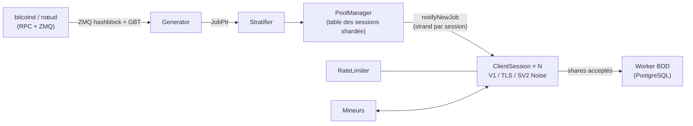

<div align="center">

# mkpool

### Moteur moderne de pool de minage solo multi-monnaies, écrit en C++23

Stratum V1 · Stratum V1 sur TLS · Stratum V2 natif (chiffré via Noise) · 9 familles de monnaies · une seule base de code

[](COPYING)
[](CMakeLists.txt)
[](#démarrage-rapide)
[](#comparaison-des-fonctionnalités--mkpool-vs-ckpool)
[](https://mkpool.com/blog/mkpool-vs-ckpool-benchmark)
[](https://github.com/Mecanik/mkpool/stargazers)

[Pool en production](https://mkpool.com) · [Rapport de benchmark](https://mkpool.com/blog/mkpool-vs-ckpool-benchmark) · [Démarrage rapide](#démarrage-rapide) · [Contribuer](CONTRIBUTING.md) · [Politique de sécurité](SECURITY.md)

[English](README.md) | [简体中文](README.zh-CN.md) | [Русский](README.ru.md) | [Español](README.es.md) | [Português (Brasil)](README.pt-BR.md) | [Deutsch](README.de.md) | **Français** | [日本語](README.ja.md) | [한국어](README.ko.md) | [Türkçe](README.tr.md)

*Cette traduction peut parfois être en retard sur le README anglais.*

</div>

---

**mkpool** est un moteur de pool de minage solo multi-thread et haute performance. Il parle **Stratum V1**, **Stratum V1 sur TLS** et **Stratum V2 natif (chiffré via Noise)**, et fait tourner **neuf familles de monnaies** (dont Dogecoin en minage fusionné et Zcash en Equihash) à partir d'une seule base de code. Il est en production sur le mainnet aujourd'hui et propulse [mkpool.com](https://mkpool.com) ; ce README reflète l'état réellement déployé.

À matériel identique, mkpool offre environ **2.8x le débit de shares**, **une latence médiane 3.2x plus faible** et **16x la capacité de reconnexion** de ckpool, le tout mesuré par un benchmark open source entièrement reproductible ([détails plus bas](#benchmarks--mkpool-vs-ckpool)).

## Table des matières

- [Pourquoi mkpool ?](#pourquoi-mkpool-)
- [Benchmarks : mkpool vs ckpool](#benchmarks--mkpool-vs-ckpool)
- [Monnaies prises en charge](#monnaies-prises-en-charge)
- [Comparaison des fonctionnalités : mkpool vs ckpool](#comparaison-des-fonctionnalités--mkpool-vs-ckpool)
- [Démarrage rapide](#démarrage-rapide)
- [Contrôle à chaud (`mkpool-ctl`)](#contrôle-à-chaud-mkpool-ctl)
- [Tests et durcissement](#tests-et-durcissement)
- [Architecture](#architecture)
- [Périmètre du projet](#périmètre-du-projet)
- [Contribuer](#contribuer)
- [Soutenir le projet](#soutenir-le-projet)
- [Remerciements](#remerciements)
- [Attribution et licence](#attribution-et-licence)

## Pourquoi mkpool ?

- ⚡ **Rapide là où ça compte.** ~330k shares entièrement validés par seconde sur une machine 8 cœurs, un aller-retour submit-ack sous la milliseconde à tous les percentiles, et des tempêtes de reconnexion (façon NiceHash ou MiningRigRentals) absorbées à ~6,400 cycles de connexion complets par seconde.
- 🔐 **Stratum chiffré, directement dans le binaire.** TLS (`stratum+ssl://`) et Stratum V2 natif avec un handshake Noise `NX` et des certificats d'autorité signés. Pas de stunnel, pas de proxy externe.
- 🪙 **Neuf familles de monnaies, une seule base de code.** BTC, BCH, BC2, BCH2, XEC, DGB, LTC avec DOGE en minage fusionné (AuxPoW), et ZEC en Equihash, chacune à un simple fichier de configuration près.
- 🎯 **Du vrai minage solo.** Le nom d'utilisateur du mineur est son adresse de paiement ; la coinbase est reconstruite par session, si bien que la récompense de bloc part directement vers le portefeuille de celui qui trouve le bloc.
- 🛡️ **Durci contre le trafic hostile.** Limitation de débit par token bucket, bannissement automatique en cas de flood de shares invalides, liste noire en mémoire, rejet des shares périmés (stale) au changement de bloc et des shares dupliqués, plus un harnais de fuzzing publié qui martèle le parseur Stratum.
- 🔧 **Pilotable à l'exécution.** Failover RPC multi-nœuds avec watchdog de reprise du primaire, réessai d'envoi de bloc et un socket de contrôle JSON (`mkpool-ctl`) pour les statistiques en direct, `client.reconnect`, la déconnexion et le niveau de log, plus des redémarrages à faible coupure grâce à `SO_REUSEPORT`. Voyez qui mine et pilotez-les sans aller-retour vers la base de données ni redémarrage.
- 🧪 **Conçu comme du logiciel, pas comme du folklore.** Tests unitaires, passes ASan/TSan/UBSan, builds CMake + Ninja adaptés à la CI, et métriques Prometheus intégrées.
- 🏭 **Éprouvé en production.** Chaque fonctionnalité de ce dépôt tourne en ce moment même sur le mainnet, sur les neuf chaînes, sous une vraie rotation de hashrate loué.

## Benchmarks : mkpool vs ckpool

Un benchmark Stratum équitable et entièrement reproductible sur deux machines 8 cœurs identiques (Azure `Standard_D8lds_v7`), un pool à la fois, même nœud `bitcoind` en regtest, même générateur de charge, difficulté fixe à 1. Chaque share soumis est entièrement validé (reconstruction de la coinbase, racine de Merkle, en-tête de 80 octets, double SHA-256) avant que le pool ne réponde, et les motifs de rejet le prouvent des deux côtés.

| Scénario | mkpool | ckpool | Écart |
| --- | --- | --- | --- |
| Shares validés/s en continu (128 à 2,048 connexions) | ~315k à 337k | ~108k à 118k | **~2.8x** |
| Latence médiane submit-ack (100 connexions, charge légère) | 116 µs | 371 µs | **~3.2x plus faible** |
| Latence au 99e percentile | 602 µs | 814 µs | plus faible à tous les percentiles |
| Cycles de reconnexion/s (200 boucles connect-subscribe-authorize-submit-close en parallèle) | ~6,391 (4 erreurs) | ~402 (1,000+ erreurs) | **~16x** |
| Mémoire résidente à 2k / 4k / 8k connexions inactives | 66 / 108 / 197 MiB | 25 / 39 / 68 MiB | **ckpool ~2.7x plus sobre** |

La victoire mémoire de ckpool est publiée exactement telle que mesurée : son empreinte C très compacte est une vraie réussite d'ingénierie, et le compromis du modèle de threading et de bufferisation par connexion plus lourd de mkpool est bien réel. Tout le reste est allé à mkpool, et les ratios bougent à peine quand la charge monte.

- 📊 [Analyse complète avec méthodologie et graphiques](https://mkpool.com/blog/mkpool-vs-ckpool-benchmark)
- 📄 [Le rapport HTML autonome exact](https://mkpool.com/benchmarks/mkpool-vs-ckpool.html)
- 🔁 [Reproduisez-le vous-même : kit de benchmark (générateur de charge, orchestrateur, configurations)](https://github.com/Mecanik/mkpool-vs-ckpool-benchmark)

> **Astuce si vous benchmarkez mkpool vous-même :** utilisez une adresse de paiement réelle et valide comme nom d'utilisateur Stratum. mkpool valide les adresses localement au moment de l'authorize et rejette d'emblée les noms d'utilisateur invalides, ce qui ferait injustement sauter le travail que l'on cherche justement à mesurer.

## Monnaies prises en charge

| Monnaie | Ticker | Algorithme | Notes |
| --- | --- | --- | --- |
| Bitcoin | BTC | SHA-256d | V1, TLS, SV2 |
| Bitcoin Cash | BCH | SHA-256d | CashAddr, V1/TLS/SV2 |
| BitcoinII | BC2 | SHA-256d | V1/TLS/SV2 |
| Bitcoin Cash II | BCH2 | SHA-256d | CashAddr, V1/TLS/SV2 |
| eCash | XEC | SHA-256d | Pré-consensus Avalanche, SV2 |
| DigiByte | DGB | SHA-256d | V1/TLS/SV2 |
| Litecoin | LTC | Scrypt | mine DOGE en fusion |
| Dogecoin | DOGE | Scrypt (AuxPoW) | miné en fusion via LTC |
| Zcash | ZEC | Equihash 200,9 | `mining.set_target`, récompense Blossom |

## Comparaison des fonctionnalités : mkpool vs ckpool

Légende : ✅ pris en charge · ⚠️ partiel / sous conditions · ❌ non pris en charge

### Protocoles et chiffrement

| Fonctionnalité | mkpool | ckpool |
| --- | :---: | :---: |
| Stratum V1 (`mining.*`) | ✅ | ✅ |
| Stratum V1 sur **TLS** (`stratum+ssl://`) | ✅ variante `any_stream` intégrée au binaire, rechargement des certificats sur SIGHUP | ❌ |
| **Stratum V2** natif (handshake Noise `NX`, chiffré) | ✅ mode full-block, collecte les frais | ❌ |
| Clé d'autorité secrète SV2 / certificats signés | ✅ | ❌ |
| Bascule SV2 blocs vides vs blocs pleins (`v2EmptyBlocks`) | ✅ | ❌ |
| BIP310 `mining.configure` (négociation du version-rolling) | ✅ | ✅ |
| ASICBoost / masque de version (`version_mask`) | ✅ validé (BIP310) | ✅ |
| Extension `subscribe-extranonce` | ✅ | ✅ |
| Difficulté suggérée (`mining.suggest_difficulty`, `d=` dans le mot de passe) | ✅ bornée par monnaie | ✅ |

### Monnaies, algorithmes et minage fusionné

| Fonctionnalité | mkpool | ckpool |
| --- | :---: | :---: |
| Bitcoin (BTC, SHA-256d) | ✅ | ✅ |
| Bitcoin Cash (BCH, SHA-256d, CashAddr) | ✅ | ❌ |
| BitcoinII (BC2, SHA-256d) | ✅ | ❌ |
| Bitcoin Cash II (BCH2, SHA-256d, CashAddr) | ✅ | ❌ |
| eCash (XEC, SHA-256d + pré-consensus Avalanche) | ✅ | ❌ |
| DigiByte (DGB, SHA-256d) | ✅ | ❌ |
| Litecoin (LTC, Scrypt) | ✅ | ❌ |
| **Dogecoin miné en fusion via LTC** (AuxPoW) | ✅ blocs parent + aux | ❌ |
| Zcash (ZEC, Equihash 200,9, `mining.set_target`) | ✅ | ❌ |
| Base de code unique, configuration par monnaie | ✅ 9 familles | ❌ Bitcoin uniquement |
| Validation des shares Equihash (en interne) | ✅ `equihash.hpp` + test unitaire | ❌ |
| Récompense / halving compatibles Blossom (ZEC) | ✅ | ❌ |

### Moteur de pool et architecture

| Fonctionnalité | mkpool | ckpool |
| --- | :---: | :---: |
| Langage / standard | C++23 | C |
| Modèle de concurrence | Mono-processus, pool de workers `io_context` asynchrones (`std::jthread`) | Multi-processus (fork) + threads, IPC par sockets Unix |
| Réseau | Boost.Asio / Beast, un strand par session | epoll codé à la main + sockets Unix |
| Table des sessions | Shardée (64 shards par défaut), diffusion à faible contention | Tables de hachage (uthash) |
| Chemin d'écriture par session | `WriteQueue` liée au strand + watermark de 1 MiB (aucune course sur `async_write`) | Buffers d'envoi pilotés par epoll |
| Fenêtre de jobs / de travail | Buffer glissant `JobWindow` (32 jobs par défaut) indexé par `job_id` | Liste de workbases |
| Nouveau travail au changement de bloc | ✅ jeu de transactions complet, piloté par ZMQ, jamais de travail sans transactions | ✅ |
| Rediffusion périodique des jobs (keepalive pour les clients stricts) | ✅ 30s, réinitialisée sur les vrais blocs | ✅ |
| Notification de hash de bloc via ZMQ | ✅ bug d'edge-trigger corrigé | ✅ (optionnelle) |
| Failover `bitcoind` (plusieurs nœuds locaux ou distants) | ✅ `rpcFallbacks` ordonnés + watchdog de reprise du primaire toutes les 30s | ✅ |
| Réessai d'envoi de bloc en cas d'échec de transport | ✅ ne réessaie que si le nœud n'a pas répondu (jamais sur un vrai résultat) | ✅ (jusqu'à 5×) |
| Propagation redondante des blocs (nœuds d'envoi supplémentaires) | ✅ `additionalSubmitEndpoints`, fire-and-forget, ne bloque jamais l'envoi primaire | ⚠️ via le mode node |
| Coinbase solo (adresse du mineur = nom d'utilisateur) | ✅ reconstruction de la coinbase2 par session | ✅ (mode BTCSOLO) |
| Commission opérateur / don prélevé sur la coinbase | ✅ % configurable, y compris la répartition aux/DOGE | ✅ 0.5% par défaut |
| Signature de coinbase personnalisée | ✅ configurable | ✅ configurable |
| Mode proxy | ✅ TLS uplink; multi-upstream hot-standby + active/active | ✅ |
| Modes passthrough / node / redirector | ✅ all three (mkpool-native TLS cluster protocol; node adds local block submit; health/latency-aware redirector) | ✅ |
| Redémarrage à faible coupure | ✅ déploiement sans coupure : bascule à 2 slots (`SO_REUSEPORT` + `client.reconnect` échelonné) | ✅ transfert de socket |

### Difficulté et gestion des shares

| Fonctionnalité | mkpool | ckpool |
| --- | :---: | :---: |
| Vardiff (EMA / moyenne à décroissance) | ✅ réimplémentation fidèle des `decay_time`/`time_bias` de ckpool | ✅ (l'original) |
| Plages de vardiff par monnaie | ✅ (ex. BTC/BCH/BC2/BCH2/DGB/XEC `[1024, 1M]`, ZEC `[8192, 524288]`) | ⚠️ un seul couple `mindiff`/`maxdiff` |
| Paliers à difficulté fixe (un port TCP chacun) | ✅ ex. ports 10M / 50M / 100M | ⚠️ via des instances séparées |
| Clamp personnalisé `d=` (1024-10M) | ✅ | ⚠️ |
| Rejet des shares périmés au changement de bloc | ✅ prevhash vérifié contre le tip courant | ✅ |
| Rejet des shares dupliqués | ✅ table de déduplication en mémoire, vidée à chaque bloc | ✅ |
| Validation du ntime (compatible BIP113) | ✅ `utils::valid_ntime` | ✅ |
| Valeur de coinbase en `int64_t` (protégée contre les débordements) | ✅ de bout en bout | ✅ |
| Validation locale des adresses (aucun RPC par authorize) | ✅ décodeurs BIP173/BIP350/base58/CashAddr | ⚠️ s'appuie sur bitcoind |

### Sécurité et exploitation

| Fonctionnalité | mkpool | ckpool |
| --- | :---: | :---: |
| Limitation de débit par IP (token bucket) | ✅ | ⚠️ |
| Bannissement automatique en cas d'excès de shares invalides | ✅ | ⚠️ |
| Liste noire d'IP en mémoire | ✅ | ⚠️ |
| Observabilité des pertes de connexion (log à chaque déconnexion) | ✅ raison/worker/durée de vie/shares | ⚠️ |
| Socket de contrôle / d'administration à l'exécution | ✅ `mkpool-ctl` (21 commandes JSON) | ✅ `ckpmsg` |
| `client.reconnect` (déplacer les mineurs sans déconnexion côté opérateur) | ✅ broadcast ou par client, via le socket de contrôle | ✅ |
| Statistiques internes via socket (hashrate 1m/5m, meilleur share du round, secondes d'inactivité) | ✅ par mineur / worker / utilisateur / pool, calculées à la demande depuis vardiff (sans accès BDD) | ✅ |
| Détection des workers inactifs / morts + reap optionnel | ✅ `idleDropSeconds` optionnel | ✅ |
| Résilience de la base de données (reconnexion auto + remise en file sans perte) | ✅ | n/a (pas de BDD) |
| Endpoint de métriques Prometheus | ✅ optionnel (`MKPOOL_ENABLE_METRICS`) | ❌ |
| Builds avec sanitizers (ASan / TSan / UBSan) | ✅ options CMake + `scripts/run_sanitizers.sh` | ❌ |
| Tests unitaires (Catch2 / style Catch) | ✅ merkle, vardiff, adresses, Noise SV2, etc. | ❌ |
| Harnais de fuzzing Stratum | ✅ `scripts/fuzz_*.sh` (7 catégories d'abus, assertions de survie du démon) | ❌ |
| Système de build | CMake + Ninja | autotools (`./configure && make`) |
| Plateforme | Linux (Ubuntu 24.04+) | Linux |
| Dépendances externes | Boost, OpenSSL, libpq/pqxx, libzmq, libsodium | Minimales (glibc, yasm, zmq optionnel) |

## Démarrage rapide

### 1. Compiler (Ubuntu 24.04+)

```bash
# dépendances système
sudo apt update
sudo apt install -y build-essential cmake ninja-build pkg-config git \
    libboost-system-dev libboost-thread-dev libboost-program-options-dev \
    libssl-dev libpq-dev libpqxx-dev libzmq3-dev cppzmq-dev libsodium-dev libsecp256k1-dev

# cloner + configurer + compiler (C++23)
git clone https://github.com/Mecanik/mkpool.git && cd mkpool
cmake -S . -B build -GNinja -DCMAKE_BUILD_TYPE=RelWithDebInfo
cmake --build build -j
```

<details>
<summary><b>Options CMake</b></summary>

| Option | Défaut | Description |
| --- | --- | --- |
| `MKPOOL_BUILD_TESTS` | `ON` | Tests unitaires Catch2 |
| `MKPOOL_ENABLE_LTO` | `ON` | Optimisation à l'édition de liens (LTO) |
| `MKPOOL_ENABLE_TLS` | `ON` | Prise en charge du contexte TLS OpenSSL |
| `MKPOOL_ENABLE_METRICS` | `ON` | Exposition Prometheus |
| `MKPOOL_ENABLE_ASAN` | `OFF` | AddressSanitizer |
| `MKPOOL_ENABLE_TSAN` | `OFF` | ThreadSanitizer |
| `MKPOOL_ENABLE_UBSAN` | `OFF` | UndefinedBehaviorSanitizer |
| `MKPOOL_ENABLE_NATIVE` | `OFF` | `-march=native` |

</details>

### 2. Configurer

Il vous faut un nœud de la monnaie synchronisé (avec les notifications de bloc ZMQ activées) et une instance PostgreSQL joignable.

```bash
cp config.json.example config.json
# puis éditez config.json :
#  - hôte/identifiants RPC de votre ou vos démons de monnaie
#  - identifiants PostgreSQL
#  - VOS adresses de don/paiement (ne gardez jamais les valeurs d'exemple)
#  - paliers/ports stratum, plages de vardiff, chemins de certificats TLS optionnels, port SV2 optionnel
```

[`config.json.example`](config.json.example) documente chaque champ compris par le chargeur, y compris les paliers à difficulté fixe, les paliers TLS (`"tls": true`), les réglages Stratum V2 et le minage fusionné LTC+DOGE (bloc `aux`).

### 3. Lancer

```bash
./build/mkpool --config config.json
```

Un pool en fonctionnement expose, selon la configuration :

- **Stratum V1 :** paliers vardiff et à difficulté fixe, un port chacun (ex. `3331` pour le vardiff, `3335` pour le 10M fixe).
- **Stratum sur TLS :** tout palier avec `"tls": true` parle `stratum+ssl://` sur son port.
- **Stratum V2 (Noise) :** le `stratumV2Port` (ex. BTC `3340`).
- **Métriques Prometheus :** `metricsListenPort` (défaut `9090`) si compilé avec les métriques.

Les mineurs se connectent avec leur **adresse de paiement comme nom d'utilisateur** ; la récompense de bloc part directement vers cette adresse.

## Contrôle à chaud (`mkpool-ctl`)

Chaque instance ouvre un socket Unix de contrôle privé (par défaut `/run/mkpool/<instance>.sock` ; utilisez `controlSocket` pour le changer, ou `"off"` pour le désactiver). Interrogez et pilotez un pool en fonctionnement avec le [`scripts/mkpool-ctl.py`](scripts/mkpool-ctl.py) fourni (présenté ci-dessous comme `mkpool-ctl`), sans redémarrage, sans aller-retour vers la base de données :

```bash
mkpool-ctl -i btc-mainnet stats          # uptime, connexions, hashrate du pool, template + meilleur share par monnaie
mkpool-ctl -i btc-mainnet clients        # chaque connexion : IP, worker, difficulté, hashrate, secondes d'inactivité
mkpool-ctl -i btc-mainnet workers        # agrégé par address.worker
mkpool-ctl -i btc-mainnet users          # agrégé par adresse de paiement
mkpool-ctl -i btc-mainnet getclient 42   # une connexion en détail
mkpool-ctl -i btc-mainnet reconnect      # client.reconnect vers chaque mineur (ex. avant maintenance)
mkpool-ctl -i btc-mainnet dropclient 42  # déconnecter un mineur
mkpool-ctl -i btc-mainnet loglevel debug # changer le niveau de log en direct
mkpool-ctl -i btc-mainnet healthcheck    # fraîcheur du template par monnaie
mkpool-ctl -i btc-mainnet help           # liste complète des commandes
```

Jeu de commandes complet : `ping`, `help`, `version`, `uptime`, `stats`, `clients`, `workers`, `users`, `getclient`, `getuser`, `getworker`, `userclients`, `workerclients`, `loglevel`, `reconnect`, `reconnclient`, `dropclient`, `dropall`, `resetshares`, `blacklistreload`, `healthcheck`. Chaque réponse est en JSON. Le hashrate, le meilleur share du round et le temps d'inactivité sont maintenus en interne (dérivés du taux de shares que vardiff suit déjà) et lus à la demande, si bien que lister 50k workers ne coûte rien tant que vous ne le demandez pas. Le socket est créé en `0600` (propriétaire uniquement) ; avec un processus par monnaie sous systemd, chaque monnaie a son propre socket.

## Tests et durcissement

### Tests unitaires

```bash
cd build
ctest --output-on-failure -j
```

### Passes de sanitizers

`scripts/run_sanitizers.sh` compile les tests unitaires sous AddressSanitizer, UndefinedBehaviorSanitizer et ThreadSanitizer dans un répertoire jetable `.san/` (votre `build/` habituel reste intact) et rapporte toute anomalie détectée.

```bash
./scripts/run_sanitizers.sh            # asan+ubsan et tsan
./scripts/run_sanitizers.sh asan       # une seule variante
./scripts/run_sanitizers.sh --fuzz     # fuzz aussi une instance instrumentée
```

### Fuzzer le parseur Stratum

Les `scripts/fuzz_*.sh` envoient du trafic Stratum malformé et abusif à un pool en fonctionnement et vérifient qu'il survit (même PID avant et après) sans aucune exception dans les handlers. Pointez-les vers une instance locale :

```bash
# batterie rapide de trames malformées
HOST=127.0.0.1 PORT=3331 ./scripts/fuzz_stratum.sh

# suite complète : JSON malformé, abus de protocole, spam de shares, abus d'authentification,
# slowloris, abus de version-rolling, bruit binaire
HOST=127.0.0.1 PORT=3331 ./scripts/fuzz_suite.sh
```

## Architecture



- `IoPool` fait tourner N `io_context` workers (défaut = `hardware_concurrency()`).
- Chaque `ClientSession` vit sur un seul `io_context` worker via un strand Asio ; le type de socket (clair / TLS / SV2 Noise) est abstrait derrière `any_stream`, et toutes les écritures passent par une `WriteQueue` liée au strand.
- `PoolManager` parcourt les shards à chaque `JobPtr` et déclenche `notifyNewJob` sur le strand de chaque session.
- Le `Generator` rediffuse le job courant toutes les 30 secondes en guise de keepalive (avec `clean_jobs=false`, donc aucun travail n'est jeté), ce qui évite aux clients stricts, comme les proxys des places de marché de location et les contrôleurs de fermes, de se déconnecter pour inactivité entre les blocs.

## Périmètre du projet

Ce dépôt contient le **moteur de pool**, publié par souci de transparence. La pile opérationnelle qui l'entoure en production (le service base de données/analytique, l'API REST publique et le site web) ne fait **pas** partie de cette publication open source.

mkpool est une base de code originale. Le moteur C++ asynchrone, le support multi-monnaies, la pile Stratum V2 (Noise) et TLS, la construction de coinbase solo par mineur et l'outillage de sécurité ont tous été écrits de zéro. Le seul composant qui emprunte délibérément à [ckpool](https://bitbucket.org/ckolivas/ckpool) (le pool en C sous GPLv3 de Con Kolivas) est le **calcul de reciblage de la difficulté variable**, une petite réimplémentation, dûment attribuée, d'un algorithme qui a largement fait ses preuves (voir [Attribution et licence](#attribution-et-licence)).

## Contribuer

Les contributions sont les bienvenues : rapports de bugs, cas limites de protocole, nouvelles familles de monnaies, travail sur les performances, documentation et traductions de ce README.

- Lisez [CONTRIBUTING.md](CONTRIBUTING.md) avant d'ouvrir une PR.
- Failles de sécurité : merci de suivre [SECURITY.md](SECURITY.md) plutôt que d'ouvrir une issue publique.
- Si mkpool vous est utile, **mettre une étoile au dépôt** aide réellement le projet à se faire connaître. ⭐

## Soutenir le projet

mkpool est libre et open source. L'utilisation du code est gratuite et il n'y a aucun prélèvement de don intégré. Si le projet vous a été utile et que vous souhaitez donner un coup de pouce à son développement, vous pouvez envoyer un pourboire ici. C'est entièrement facultatif et très apprécié.

**BTC :** `bc1qlugz6as6x3n03c6x8zddpnmypsaucdmh3lc5z0`

## Remerciements

mkpool s'appuie sur beaucoup d'excellents projets open source. Un merci sincère aux mainteneurs et contributeurs de chacun des projets ci-dessous. Le pool n'existerait pas sans eux.

| Bibliothèque | Licence | Utilisée pour |
| --- | --- | --- |
| [Boost](https://www.boost.org/) (Asio / Beast) | BSL-1.0 | Réseau asynchrone, strands, client RPC HTTP |
| [OpenSSL](https://www.openssl.org/) | Apache-2.0 | TLS, SHA-256 |
| [fmt](https://github.com/fmtlib/fmt) | MIT | Formatage Stratum sur le chemin chaud |
| [spdlog](https://github.com/gabime/spdlog) | MIT | Journalisation |
| [nlohmann/json](https://github.com/nlohmann/json) | MIT | JSON de configuration et de RPC |
| [cxxopts](https://github.com/jarro2783/cxxopts) | MIT | Analyse de la ligne de commande |
| [libpqxx](https://github.com/jtv/libpqxx) / [libpq](https://www.postgresql.org/) | BSD-3-Clause / PostgreSQL | Accès à la base de données |
| [ZeroMQ](https://zeromq.org/) (libzmq + le binding [cppzmq](https://github.com/zeromq/cppzmq)) | MPL-2.0 / MIT | Notifications de hash de bloc |
| [libsodium](https://libsodium.org/) | ISC | Crypto Noise de Stratum V2 |
| [libsecp256k1](https://github.com/bitcoin-core/secp256k1) | MIT | Clés / signatures EC (SV2) |
| [Catch2](https://github.com/catchorg/Catch2) | BSL-1.0 | Tests unitaires |
| [prometheus-cpp](https://github.com/jupp0r/prometheus-cpp) | MIT | Endpoint de métriques optionnel |

Toutes ces bibliothèques sont sous des licences compatibles GPLv3. mkpool n'embarque pas (ne copie pas) leur code source ; elles sont liées depuis le gestionnaire de paquets de votre système ou récupérées par CMake au moment de la compilation. Si vous distribuez un binaire mkpool **compilé**, joignez-lui un fichier `THIRD-PARTY-NOTICES` reproduisant les textes de copyright et de licence de ces projets.

## Attribution et licence

mkpool est un **logiciel original**, © 2025-2026 Mecanik1337 (<contact@mecanik.dev>), sous licence **GNU General Public License v3.0** (`GPL-3.0`). Chaque fichier source porte l'en-tête GPLv3 complet.

La quasi-totalité de la base de code (le moteur asynchrone, le support multi-monnaies, Stratum V2 (Noise) et TLS, la construction de coinbase solo et l'outillage de sécurité) est écrite de zéro et ne doit rien à ckpool, sinon d'être le même genre de programme.

L'unique exception, divulguée par honnêteté et pour la conformité de licence : le **calcul de reciblage** de la difficulté variable dans [`vardiff.cpp`](src/vardiff.cpp) / [`vardiff.hpp`](src/vardiff.hpp) réimplémente les fonctions `decay_time()` (`src/libckpool.c`) et `time_bias()` / `add_submit()` (`src/stratifier.c`) de ckpool, par **Con Kolivas** (également sous GPLv3). C'est la seule partie adaptée de ckpool ; aucun fichier source C de ckpool n'est embarqué ou copié tel quel, et quelques conventions de champs Stratum (ex. extranonce1 sur 4 octets) suivent simplement l'usage courant. Les noms des commandes du socket de contrôle à l'exécution (`stats`, `clients`, `workers`, `reconnect`, …) reprennent ceux de ckpool pour rester familiers aux opérateurs, mais le dispatch, le format JSON et l'implémentation sont entièrement originaux. Tout cela est attribué directement dans le code. Comme mkpool est sous GPLv3, cette réutilisation est pleinement autorisée ; si vous redistribuez mkpool, gardez-le sous GPLv3, conservez ces attributions et joignez le texte complet de la licence ([`COPYING`](COPYING)).

ckpool : <https://bitbucket.org/ckolivas/ckpool>, © 2014-2026 Con Kolivas.

---

<div align="center">

**[⬆ retour en haut](#mkpool)**

Si vous faites tourner mkpool, trouvez un bloc avec lui, ou appréciez simplement le travail d'ingénierie, [une étoile](https://github.com/Mecanik/mkpool/stargazers) est la façon la plus simple de soutenir le projet.

</div>
