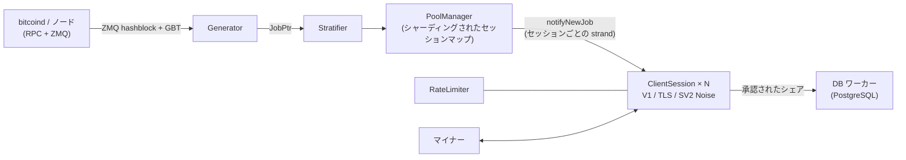

<div align="center">

# mkpool

### C++23 で書かれたモダンなマルチコイン・ソロマイニングプールエンジン

Stratum V1 · Stratum V1 over TLS · ネイティブ Stratum V2（Noise 暗号化）· 9 つのコインファミリー · 単一のコードベース

[](COPYING)
[](CMakeLists.txt)
[](#クイックスタート)
[](#機能比較mkpool-vs-ckpool)
[](https://mkpool.com/blog/mkpool-vs-ckpool-benchmark)
[](https://github.com/Mecanik/mkpool/stargazers)

[稼働中のプール](https://mkpool.com) · [ベンチマークレポート](https://mkpool.com/blog/mkpool-vs-ckpool-benchmark) · [クイックスタート](#クイックスタート) · [コントリビューション](CONTRIBUTING.md) · [セキュリティポリシー](SECURITY.md)

[English](README.md) | [简体中文](README.zh-CN.md) | [Русский](README.ru.md) | [Español](README.es.md) | [Português (Brasil)](README.pt-BR.md) | [Deutsch](README.de.md) | [Français](README.fr.md) | **日本語** | [한국어](README.ko.md) | [Türkçe](README.tr.md)

*この翻訳は、英語版の README より内容が古くなっている場合があります。*

</div>

---

**mkpool** は、高性能なマルチスレッドのソロマイニングプールエンジンです。**Stratum V1**、**Stratum V1 over TLS**、そしてネイティブの **Stratum V2（Noise 暗号化）** に対応し、マージマイニングされる Dogecoin や Equihash の Zcash を含む **9 つのコインファミリー** を単一のコードベースで動かします。現在メインネットで実際に稼働しており、[mkpool.com](https://mkpool.com) を支えています。この README はそのデプロイ済みの状態を反映したものです。

同一のハードウェア上で、mkpool は ckpool に対しておよそ **2.8 倍のシェアスループット**、**3.2 分の 1 の中央値レイテンシ**、**16 倍の再接続処理能力** を達成しています。これは完全に再現可能なオープンソースのベンチマークで測定した結果です（[詳細は後述](#ベンチマークmkpool-vs-ckpool)）。

## 目次

- [なぜ mkpool なのか？](#なぜ-mkpool-なのか)
- [ベンチマーク：mkpool vs ckpool](#ベンチマークmkpool-vs-ckpool)
- [対応コイン](#対応コイン)
- [機能比較：mkpool vs ckpool](#機能比較mkpool-vs-ckpool)
- [クイックスタート](#クイックスタート)
- [ランタイム制御（`mkpool-ctl`）](#ランタイム制御mkpool-ctl)
- [テストとハードニング](#テストとハードニング)
- [アーキテクチャ](#アーキテクチャ)
- [プロジェクトの範囲](#プロジェクトの範囲)
- [コントリビューション](#コントリビューション)
- [プロジェクトを支援する](#プロジェクトを支援する)
- [謝辞](#謝辞)
- [帰属表示とライセンス](#帰属表示とライセンス)

## なぜ mkpool なのか？

- ⚡ **肝心なところで速い。** 8 コアのマシンで毎秒約 330k 件の完全検証済みシェアを処理し、submit から ack まではあらゆるパーセンタイルでサブミリ秒。NiceHash や MiningRigRentals 型の再接続ストームも、毎秒約 6,400 回のフル接続サイクルとして吸収します。
- 🔐 **暗号化 Stratum をバイナリに内蔵。** TLS（`stratum+ssl://`）と、Noise `NX` ハンドシェイクおよび署名付きオーソリティ証明書によるネイティブ Stratum V2。stunnel も外部プロキシも不要です。
- 🪙 **9 つのコインファミリーを単一コードベースで。** BTC、BCH、BC2、BCH2、XEC、DGB、マージマイニングの DOGE（AuxPoW）を伴う LTC、そして Equihash の ZEC。いずれも設定ファイル 1 つで動きます。
- 🎯 **本物のソロマイニング。** マイナーのユーザー名がそのまま payout アドレスになります。coinbase はセッションごとに再構築され、ブロック報酬は発見者のウォレットへ直接支払われます。
- 🛡️ **悪意あるトラフィックへの耐性。** トークンバケット方式のレート制限、無効シェアの洪水に対する自動 BAN、インメモリのブラックリスト、ブロック切り替わりによる stale シェアと重複シェアの拒否、そして Stratum パーサーを叩き続ける公開済みのファジングハーネス。
- 🔧 **実行中に制御できる。** プライマリ復帰ウォッチドッグ付きのマルチノード RPC フェイルオーバー、ブロック送信のリトライ、そしてライブ統計・`client.reconnect`・切断・ログレベルのための JSON 制御ソケット（`mkpool-ctl`）。さらに `SO_REUSEPORT` によるダウンタイムの少ない再起動。誰がマイニングしているかを確認し、データベースへの往復も再起動もなしにマイナーを操作できます。
- 🧪 **口伝ではなく、ソフトウェアとして設計。** ユニットテスト、ASan/TSan/UBSan による検査、CI に馴染む CMake + Ninja ビルド、組み込みの Prometheus メトリクス。
- 🏭 **本番で実証済み。** このリポジトリのすべての機能が、9 チェーンすべてで、レンタルハッシュレート特有の激しい接続変動にさらされながら、今この瞬間もメインネットで動いています。

## ベンチマーク：mkpool vs ckpool

同一スペックの 8 コアマシン 2 台（Azure `Standard_D8lds_v7`）で、プールは 1 つずつ、同じ `bitcoind` regtest ノード、同じ負荷生成ツール、固定難易度 1 という条件で実施した、公平で完全に再現可能な Stratum ベンチマークです。送信されたすべてのシェアは、プールが応答する前に完全検証（coinbase 再構築、マークルルート、80 バイトヘッダー、二重 SHA-256）されており、リジェクト理由が双方でそれを証明しています。

| シナリオ | mkpool | ckpool | 差 |
| --- | --- | --- | --- |
| 持続的な検証済みシェア数/秒（128～2,048 接続） | 約 315k～337k | 約 108k～118k | **約 2.8 倍** |
| submit から ack までの中央値レイテンシ（100 接続、軽負荷） | 116 µs | 371 µs | **約 3.2 分の 1** |
| 99 パーセンタイルのレイテンシ | 602 µs | 814 µs | 全パーセンタイルで低い |
| 再接続サイクル数/秒（connect-subscribe-authorize-submit-close ループを 200 並列） | 約 6,391（エラー 4 件） | 約 402（エラー 1,000 件超） | **約 16 倍** |
| アイドル接続 2k / 4k / 8k 時の常駐メモリ | 66 / 108 / 197 MiB | 25 / 39 / 68 MiB | **ckpool が約 2.7 倍軽量** |

ckpool のメモリ面での勝利は、測定値のまま掲載しています。あの引き締まった C のフットプリントは紛れもないエンジニアリングの成果であり、mkpool の接続あたりのバッファリングとスレッディングモデルが重めであるというトレードオフは実在します。それ以外の項目はすべて mkpool の勝ちで、負荷が上がってもその比率はほとんど動きません。

- 📊 [手法とグラフを含む完全な解説記事](https://mkpool.com/blog/mkpool-vs-ckpool-benchmark)
- 📄 [自己完結型の HTML レポートそのもの](https://mkpool.com/benchmarks/mkpool-vs-ckpool.html)
- 🔁 [自分で再現する：ベンチマークキット（負荷生成ツール、オーケストレーター、設定一式）](https://github.com/Mecanik/mkpool-vs-ckpool-benchmark)

> **mkpool を自分でベンチマークする際のヒント：** Stratum のユーザー名には、実在する有効な payout アドレスを使ってください。mkpool は authorize の時点でアドレスをローカル検証し、無効なユーザー名を早期にリジェクトするため、測定したい処理が不当にスキップされてしまいます。

## 対応コイン

| コイン | ティッカー | アルゴリズム | 備考 |
| --- | --- | --- | --- |
| Bitcoin | BTC | SHA-256d | V1、TLS、SV2 |
| Bitcoin Cash | BCH | SHA-256d | CashAddr、V1/TLS/SV2 |
| BitcoinII | BC2 | SHA-256d | V1/TLS/SV2 |
| Bitcoin Cash II | BCH2 | SHA-256d | CashAddr、V1/TLS/SV2 |
| eCash | XEC | SHA-256d | Avalanche プレコンセンサス、SV2 |
| DigiByte | DGB | SHA-256d | V1/TLS/SV2 |
| Litecoin | LTC | Scrypt | DOGE をマージマイニング |
| Dogecoin | DOGE | Scrypt (AuxPoW) | LTC 上でマージマイニング |
| Zcash | ZEC | Equihash 200,9 | `mining.set_target`、Blossom 対応の報酬計算 |

## 機能比較：mkpool vs ckpool

凡例：✅ 対応 · ⚠️ 部分的 / 条件付き · ❌ 非対応

### プロトコルと暗号化

| 機能 | mkpool | ckpool |
| --- | :---: | :---: |
| Stratum V1（`mining.*`） | ✅ | ✅ |
| Stratum V1 over **TLS**（`stratum+ssl://`） | ✅ バイナリ内蔵の `any_stream` バリアント、SIGHUP による証明書リロード | ❌ |
| **Stratum V2** ネイティブ（Noise `NX` ハンドシェイク、暗号化） | ✅ フルブロックモード、手数料も回収 | ❌ |
| SV2 シークレットオーソリティ鍵 / 署名付き証明書 | ✅ | ❌ |
| SV2 の空ブロック / フルブロック切り替え（`v2EmptyBlocks`） | ✅ | ❌ |
| BIP310 `mining.configure`（version-rolling ネゴシエーション） | ✅ | ✅ |
| ASICBoost / version-mask（`version_mask`） | ✅ 検証あり（BIP310） | ✅ |
| `subscribe-extranonce` 拡張 | ✅ | ✅ |
| 希望難易度（`mining.suggest_difficulty`、パスワードの `d=`） | ✅ コインごとにクランプ | ✅ |

### コイン、アルゴリズム、マージマイニング

| 機能 | mkpool | ckpool |
| --- | :---: | :---: |
| Bitcoin（BTC、SHA-256d） | ✅ | ✅ |
| Bitcoin Cash（BCH、SHA-256d、CashAddr） | ✅ | ❌ |
| BitcoinII（BC2、SHA-256d） | ✅ | ❌ |
| Bitcoin Cash II（BCH2、SHA-256d、CashAddr） | ✅ | ❌ |
| eCash（XEC、SHA-256d + Avalanche プレコンセンサス） | ✅ | ❌ |
| DigiByte（DGB、SHA-256d） | ✅ | ❌ |
| Litecoin（LTC、Scrypt） | ✅ | ❌ |
| **LTC 上での Dogecoin マージマイニング**（AuxPoW） | ✅ 親ブロック + aux ブロック | ❌ |
| Zcash（ZEC、Equihash 200,9、`mining.set_target`） | ✅ | ❌ |
| 単一コードベース、コインごとの設定 | ✅ 9 ファミリー | ❌ Bitcoin のみ |
| Equihash のシェア検証（インプロセス） | ✅ `equihash.hpp` + ユニットテスト | ❌ |
| Blossom 対応の報酬 / 半減期計算（ZEC） | ✅ | ❌ |

### プールエンジンとアーキテクチャ

| 機能 | mkpool | ckpool |
| --- | :---: | :---: |
| 言語 / 標準 | C++23 | C |
| 並行処理モデル | シングルプロセス、非同期 `io_context` ワーカープール（`std::jthread`） | マルチプロセス（fork）+ スレッド、Unix ソケット IPC |
| ネットワーキング | Boost.Asio / Beast、セッションごとの strand | 手書きの epoll + Unix ソケット |
| セッションマップ | シャーディング（デフォルト 64 シャード）、低競合のブロードキャスト | ハッシュテーブル（uthash） |
| セッションごとの書き込みパス | strand に束縛された `WriteQueue` + 1 MiB ウォーターマーク（`async_write` の競合なし） | epoll 駆動の送信バッファ |
| ジョブ / ワークウィンドウ | `job_id` をキーとする `JobWindow` ローリングバッファ（デフォルト 32 ジョブ） | Workbase リスト |
| ブロック切り替わり時の新規ワーク | ✅ フル tx セット、ZMQ 駆動、トランザクションなしのワークは配らない | ✅ |
| 定期的なジョブ再ブロードキャスト（厳格なクライアント向けキープアライブ） | ✅ 30 秒ごと、実ブロックでリセット | ✅ |
| ZMQ ブロックハッシュ通知 | ✅ エッジトリガーのバグ修正済み | ✅（オプション） |
| `bitcoind` フェイルオーバー（ローカルまたはリモートの複数ノード） | ✅ 順序付き `rpcFallbacks` + 30 秒ごとのプライマリ復帰ウォッチドッグ | ✅ |
| 転送失敗時のブロック送信リトライ | ✅ ノードから応答がなかったときのみ再送（実際の結果に対しては再送しない） | ✅（最大 5 回） |
| 冗長なブロック伝播（追加の送信ノード） | ✅ `additionalSubmitEndpoints`、fire-and-forget、プライマリ送信を妨げない | ⚠️ ノードモードで対応 |
| ソロ coinbase（マイナーのアドレス = ユーザー名） | ✅ セッションごとに coinbase2 を再構築 | ✅（BTCSOLO モード） |
| coinbase からのオペレーター手数料 / 寄付 | ✅ % を設定可能、aux/DOGE の分配にも対応 | ✅ デフォルト 0.5% |
| カスタム coinbase 署名 | ✅ 設定可能 | ✅ 設定可能 |
| プロキシモード | ✅ TLS uplink; multi-upstream hot-standby + active/active | ✅ |
| パススルー / ノード / リダイレクターモード | ✅ all three (mkpool-native TLS cluster protocol; node adds local block submit; health/latency-aware redirector) | ✅ |
| ダウンタイムの少ない再起動 | ✅ ゼロダウンタイム配備：2スロット切り替え（`SO_REUSEPORT` + 段階的な `client.reconnect`） | ✅ ソケットハンドオーバー |

### 難易度とシェア処理

| 機能 | mkpool | ckpool |
| --- | :---: | :---: |
| vardiff（EMA / 減衰平均） | ✅ ckpool の `decay_time`/`time_bias` の忠実な再実装 | ✅（オリジナル） |
| コインごとの vardiff 範囲 | ✅（例：BTC/BCH/BC2/BCH2/DGB/XEC は `[1024, 1M]`、ZEC は `[8192, 524288]`） | ⚠️ 単一の `mindiff`/`maxdiff` |
| 固定難易度ティア（それぞれ専用の TCP ポート） | ✅ 例：10M / 50M / 100M ポート | ⚠️ 別インスタンスで対応 |
| カスタム `d=` クランプ（1024-10M） | ✅ | ⚠️ |
| ブロック切り替わりによる stale シェアの拒否 | ✅ prevhash を現在のチップと照合 | ✅ |
| 重複シェアの拒否 | ✅ インメモリの重複排除セット、ブロックごとにクリア | ✅ |
| ntime 検証（BIP113 互換） | ✅ `utils::valid_ntime` | ✅ |
| `int64_t` の coinbase 値（オーバーフロー安全） | ✅ エンドツーエンド | ✅ |
| ローカルでのアドレス検証（authorize ごとの RPC なし） | ✅ BIP173/BIP350/base58/CashAddr デコーダー | ⚠️ bitcoind に依存 |

### セキュリティと運用

| 機能 | mkpool | ckpool |
| --- | :---: | :---: |
| トークンバケット方式の IP ごとレート制限 | ✅ | ⚠️ |
| 過剰な無効シェアに対する自動 BAN | ✅ | ⚠️ |
| インメモリの IP ブラックリスト | ✅ | ⚠️ |
| 切断の可観測性（切断ごとのログ） | ✅ 理由 / ワーカー / 接続時間 / シェア数 | ⚠️ |
| ランタイム制御 / 管理ソケット | ✅ `mkpool-ctl`（21 個の JSON コマンド） | ✅ `ckpmsg` |
| `client.reconnect`（オペレーター側で切断せずにマイナーを移動） | ✅ ブロードキャストまたはクライアント単位、制御ソケット経由 | ✅ |
| ソケット経由のインプロセス統計（ハッシュレート 1m/5m、ラウンドのベストシェア、アイドル秒数） | ✅ マイナー / ワーカー / ユーザー / プール単位、vardiff からオンデマンドで算出（DB アクセスなし） | ✅ |
| アイドル / 停止ワーカーの検出 + 任意の刈り取り | ✅ 任意の `idleDropSeconds` | ✅ |
| データベース耐障害性（自動再接続 + 損失ゼロの再キュー） | ✅ | n/a（DB なし） |
| Prometheus メトリクスエンドポイント | ✅ オプション（`MKPOOL_ENABLE_METRICS`） | ❌ |
| サニタイザービルド（ASan / TSan / UBSan） | ✅ CMake オプション + `scripts/run_sanitizers.sh` | ❌ |
| ユニットテスト（Catch2 / Catch スタイル） | ✅ merkle、vardiff、アドレス、SV2 noise など | ❌ |
| Stratum ファジングハーネス | ✅ `scripts/fuzz_*.sh`（7 種類の攻撃カテゴリ、デーモン生存アサーション） | ❌ |
| ビルドシステム | CMake + Ninja | autotools（`./configure && make`） |
| プラットフォーム | Linux (Ubuntu 24.04+) | Linux |
| 外部依存 | Boost、OpenSSL、libpq/pqxx、libzmq、libsodium | 最小限（glibc、yasm、オプションで zmq） |

## クイックスタート

### 1. ビルド（Ubuntu 24.04+）

```bash
# システム依存パッケージ
sudo apt update
sudo apt install -y build-essential cmake ninja-build pkg-config git \
    libboost-system-dev libboost-thread-dev libboost-program-options-dev \
    libssl-dev libpq-dev libpqxx-dev libzmq3-dev cppzmq-dev libsodium-dev libsecp256k1-dev

# クローン + 設定 + ビルド（C++23）
git clone https://github.com/Mecanik/mkpool.git && cd mkpool
cmake -S . -B build -GNinja -DCMAKE_BUILD_TYPE=RelWithDebInfo
cmake --build build -j
```

<details>
<summary><b>CMake オプション</b></summary>

| オプション | デフォルト | 説明 |
| --- | --- | --- |
| `MKPOOL_BUILD_TESTS` | `ON` | Catch2 ユニットテスト |
| `MKPOOL_ENABLE_LTO` | `ON` | リンク時最適化 |
| `MKPOOL_ENABLE_TLS` | `ON` | OpenSSL の TLS コンテキスト対応 |
| `MKPOOL_ENABLE_METRICS` | `ON` | Prometheus エクスポーザー |
| `MKPOOL_ENABLE_ASAN` | `OFF` | AddressSanitizer |
| `MKPOOL_ENABLE_TSAN` | `OFF` | ThreadSanitizer |
| `MKPOOL_ENABLE_UBSAN` | `OFF` | UndefinedBehaviorSanitizer |
| `MKPOOL_ENABLE_NATIVE` | `OFF` | `-march=native` |

</details>

### 2. 設定

同期済みのコインノード（ZMQ ブロック通知を有効にしたもの）と、接続可能な PostgreSQL インスタンスが必要です。

```bash
cp config.json.example config.json
# 続いて config.json を編集します：
#  - コインデーモンの RPC ホスト / 認証情報
#  - PostgreSQL の認証情報
#  - あなた自身の寄付 / payout アドレス（プレースホルダーのまま使わないこと）
#  - stratum のティア / ポート、vardiff 範囲、必要なら TLS 証明書パス、必要なら SV2 ポート
```

[`config.json.example`](config.json.example) には、固定難易度ティア、TLS ティア（`"tls": true`）、Stratum V2 の設定、LTC+DOGE マージマイニング（`aux` ブロック）を含め、ローダーが理解するすべてのフィールドが記載されています。

### 3. 実行

```bash
./build/mkpool --config config.json
```

起動したプールは、設定に応じて次を公開します：

- **Stratum V1：** vardiff ティアと固定難易度ティア、それぞれ 1 ポート（例：`3331` が vardiff、`3335` が固定 10M）。
- **Stratum over TLS：** `"tls": true` を指定したティアは、そのポートで `stratum+ssl://` を話します。
- **Stratum V2（Noise）：** `stratumV2Port`（例：BTC は `3340`）。
- **Prometheus メトリクス：** メトリクスを有効にしてビルドした場合の `metricsListenPort`（デフォルト `9090`）。

マイナーは **payout アドレスをユーザー名として** 接続します。ブロック報酬はそのアドレスへ直接支払われます。

## ランタイム制御（`mkpool-ctl`）

各インスタンスは、プライベートな Unix 制御ソケットを開きます（デフォルトは `/run/mkpool/<インスタンス>.sock`。`controlSocket` で変更でき、`"off"` で無効化できます）。付属の [`scripts/mkpool-ctl.py`](scripts/mkpool-ctl.py)（以下では `mkpool-ctl` と表記）を使えば、再起動もデータベースへの往復もなしに、稼働中のプールを照会・操作できます：

```bash
mkpool-ctl -i btc-mainnet stats          # 稼働時間、接続数、プールのハッシュレート、コインごとのテンプレート + ベストシェア
mkpool-ctl -i btc-mainnet clients        # 各接続：IP、ワーカー、難易度、ハッシュレート、アイドル秒数
mkpool-ctl -i btc-mainnet workers        # address.worker 単位で集計
mkpool-ctl -i btc-mainnet users          # payout アドレス単位で集計
mkpool-ctl -i btc-mainnet getclient 42   # 1 接続の詳細
mkpool-ctl -i btc-mainnet reconnect      # 各マイナーへ client.reconnect（例：メンテナンス前）
mkpool-ctl -i btc-mainnet dropclient 42  # 1 マイナーを切断
mkpool-ctl -i btc-mainnet loglevel debug # ログレベルをライブで変更
mkpool-ctl -i btc-mainnet healthcheck    # コインごとのテンプレートの鮮度
mkpool-ctl -i btc-mainnet help           # コマンド一覧
```

コマンド一式：`ping`、`help`、`version`、`uptime`、`stats`、`clients`、`workers`、`users`、`getclient`、`getuser`、`getworker`、`userclients`、`workerclients`、`loglevel`、`reconnect`、`reconnclient`、`dropclient`、`dropall`、`resetshares`、`blacklistreload`、`healthcheck`。応答はすべて JSON です。ハッシュレート、ラウンドのベストシェア、アイドル時間はインプロセスで保持され（vardiff がすでに追跡しているシェアレートから導出）、オンデマンドで読み出されるため、5 万ワーカーを一覧してもリクエストするまでコストはかかりません。ソケットは `0600`（所有者のみ）で作成され、systemd 下ではコインごとに 1 プロセスなので、各コインが専用のソケットを持ちます。

## テストとハードニング

### ユニットテスト

```bash
cd build
ctest --output-on-failure -j
```

### サニタイザーによる検査

`scripts/run_sanitizers.sh` は、AddressSanitizer、UndefinedBehaviorSanitizer、ThreadSanitizer の下でユニットテストを使い捨ての `.san/` ディレクトリにビルドし（通常の `build/` には手を付けません）、検出結果を報告します。

```bash
./scripts/run_sanitizers.sh            # asan+ubsan と tsan
./scripts/run_sanitizers.sh asan       # 単一のフレーバーのみ
./scripts/run_sanitizers.sh --fuzz     # サニタイズ済みインスタンスへのファジングも実行
```

### Stratum パーサーをファジングする

`scripts/fuzz_*.sh` は、稼働中のプールに不正で悪意ある Stratum トラフィックを投げつけ、ハンドラー例外を出さずに生き残ること（実行前後で PID が同じであること）をアサートします。ローカルのインスタンスに向けて実行してください：

```bash
# 不正フレームのクイックテスト一式
HOST=127.0.0.1 PORT=3331 ./scripts/fuzz_stratum.sh

# フルスイート：不正な JSON、プロトコル悪用、シェアスパム、認証悪用、
# slowloris、version-rolling 悪用、バイナリノイズ
HOST=127.0.0.1 PORT=3331 ./scripts/fuzz_suite.sh
```

## アーキテクチャ



- `IoPool` は N 個のワーカー `io_context` を実行します（デフォルトは `hardware_concurrency()`）。
- 各 `ClientSession` は、Asio の strand を介して 1 つのワーカー `io_context` 上に常駐します。ソケットの種類（平文 / TLS / SV2 Noise）は `any_stream` の背後に抽象化され、すべての書き込みは strand に束縛された `WriteQueue` を通ります。
- `PoolManager` は `JobPtr` が届くたびにシャードを走査し、各セッションの strand に `notifyNewJob` をディスパッチします。
- `Generator` はキープアライブとして、現在のジョブを 30 秒ごとに再ブロードキャストします（`clean_jobs=false` なので作業は破棄されません）。これにより、レンタルマーケットプレイスのプロキシやファームコントローラーのような厳格なクライアントが、ブロック間のアイドル時間で切断してしまうのを防ぎます。

## プロジェクトの範囲

このリポジトリは、透明性のために公開している **プールエンジン** です。本番環境でこれを取り巻く運用スタック（データベース / 分析サービス、公開 REST API、ウェブサイト）は、このオープンリリースには **含まれません**。

mkpool はオリジナルのコードベースです。非同期 C++ エンジン、マルチコイン対応、Stratum V2（Noise）と TLS のスタック、マイナーごとのソロ coinbase 構築、セキュリティツール群は、すべてゼロから書かれています。意図的に [ckpool](https://bitbucket.org/ckolivas/ckpool)（Con Kolivas 氏による GPLv3 の C 製プール）から借用している唯一のコンポーネントは **可変難易度のリターゲット計算** で、十分に実績のあるアルゴリズムを出典明記のうえで小さく再実装したものです（[帰属表示とライセンス](#帰属表示とライセンス) を参照）。

## コントリビューション

コントリビューションを歓迎します：バグ報告、プロトコルのエッジケース、新しいコインファミリー、パフォーマンス改善、ドキュメント、そしてこの README の翻訳。

- PR を開く前に [CONTRIBUTING.md](CONTRIBUTING.md) をお読みください。
- セキュリティ上の問題：公開 issue を立てず、[SECURITY.md](SECURITY.md) に従ってください。
- mkpool が役に立ったなら、**リポジトリにスターを付ける** ことが、プロジェクトが見つけてもらううえで本当に役立ちます。⭐

## プロジェクトを支援する

mkpool は無料のオープンソースです。コードの利用に料金はかからず、組み込みの寄付の天引きもありません。プロジェクトが役に立ち、開発を支援したいと思っていただけたなら、こちらにチップを送ることができます。完全に任意であり、とてもありがたく受け取ります。

**BTC:** `bc1qlugz6as6x3n03c6x8zddpnmypsaucdmh3lc5z0`

## 謝辞

mkpool は、数多くの優れたオープンソースの成果の上に築かれています。以下のすべてのプロジェクトのメンテナーとコントリビューターに心から感謝します。彼らなしに、このプールは存在しません。

| ライブラリ | ライセンス | 用途 |
| --- | --- | --- |
| [Boost](https://www.boost.org/) (Asio / Beast) | BSL-1.0 | 非同期ネットワーキング、strand、HTTP RPC クライアント |
| [OpenSSL](https://www.openssl.org/) | Apache-2.0 | TLS、SHA-256 |
| [fmt](https://github.com/fmtlib/fmt) | MIT | ホットパスの Stratum フォーマット処理 |
| [spdlog](https://github.com/gabime/spdlog) | MIT | ロギング |
| [nlohmann/json](https://github.com/nlohmann/json) | MIT | 設定と RPC の JSON |
| [cxxopts](https://github.com/jarro2783/cxxopts) | MIT | コマンドライン解析 |
| [libpqxx](https://github.com/jtv/libpqxx) / [libpq](https://www.postgresql.org/) | BSD-3-Clause / PostgreSQL | データベースアクセス |
| [ZeroMQ](https://zeromq.org/)（libzmq + [cppzmq](https://github.com/zeromq/cppzmq) バインディング） | MPL-2.0 / MIT | ブロックハッシュ通知 |
| [libsodium](https://libsodium.org/) | ISC | Stratum V2 の Noise 暗号 |
| [libsecp256k1](https://github.com/bitcoin-core/secp256k1) | MIT | EC 鍵 / 署名（SV2） |
| [Catch2](https://github.com/catchorg/Catch2) | BSL-1.0 | ユニットテスト |
| [prometheus-cpp](https://github.com/jupp0r/prometheus-cpp) | MIT | オプションのメトリクスエンドポイント |

これらはすべて GPLv3 互換のライセンスです。mkpool はこれらのソースをベンダリング（コピー）していません。システムのパッケージマネージャーからリンクされるか、ビルド時に CMake が取得します。**コンパイル済み** の mkpool バイナリを配布する場合は、これらのプロジェクトの著作権表示とライセンス文を収録した `THIRD-PARTY-NOTICES` ファイルを同梱してください。

## 帰属表示とライセンス

mkpool は **オリジナルのソフトウェア** であり、© 2025-2026 Mecanik1337（<contact@mecanik.dev>）、**GNU General Public License v3.0**（`GPL-3.0`）の下でライセンスされています。すべてのソースファイルに完全な GPLv3 ヘッダーが付いています。

コードベースのほぼすべて（非同期エンジン、マルチコイン対応、Stratum V2（Noise）と TLS、ソロ coinbase 構築、セキュリティツール群）はゼロから書かれており、同じ種類のプログラムであるという点を除けば、ckpool には何も負っていません。

唯一の例外を、誠実さとライセンス遵守のために明記します。[`vardiff.cpp`](src/vardiff.cpp) / [`vardiff.hpp`](src/vardiff.hpp) の可変難易度 **リターゲット計算** は、**Con Kolivas** 氏による ckpool の `decay_time()`（`src/libckpool.c`）と `time_bias()` / `add_submit()`（`src/stratifier.c`）を再実装したものです（こちらも GPLv3）。ckpool から取り入れたのはこの部分だけで、ckpool の C ソースファイルをベンダリングしたり逐語的にコピーしたりはしていません。いくつかの Stratum フィールドの慣習（例：4 バイトの extranonce1）は、単に一般的な慣行に従っているにすぎません。ランタイム制御ソケットのコマンド名（`stats`、`clients`、`workers`、`reconnect` など）は、オペレーターにとって馴染みやすいように ckpool のものに合わせていますが、ディスパッチ、JSON フォーマット、実装はすべて独自のものです。これらはコード内で出典を明記しています。mkpool は GPLv3 なので、この再利用は完全に許可されています。mkpool を再配布する場合は、GPLv3 のまま維持し、これらの帰属表示を保持し、完全なライセンス文（[`COPYING`](COPYING)）を同梱してください。

ckpool: <https://bitbucket.org/ckolivas/ckpool>、© 2014-2026 Con Kolivas.

---

<div align="center">

**[⬆ トップに戻る](#mkpool)**

mkpool を運用している、mkpool でブロックを見つけた、あるいは単にこのエンジニアリングが気に入った。そんなときは、[スター](https://github.com/Mecanik/mkpool/stargazers) がプロジェクトを支援するいちばん簡単な方法です。

</div>
