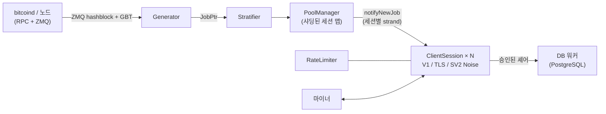

<div align="center">

# mkpool

### C++23으로 작성된 모던 멀티 코인 솔로 마이닝 풀 엔진

Stratum V1 · Stratum V1 over TLS · 네이티브 Stratum V2 (Noise 암호화) · 9개 코인 패밀리 · 하나의 코드베이스

[](COPYING)
[](CMakeLists.txt)
[](#빠른-시작)
[](#기능-비교-mkpool-vs-ckpool)
[](https://mkpool.com/blog/mkpool-vs-ckpool-benchmark)
[](https://github.com/Mecanik/mkpool/stargazers)

[라이브 풀](https://mkpool.com) · [벤치마크 리포트](https://mkpool.com/blog/mkpool-vs-ckpool-benchmark) · [빠른 시작](#빠른-시작) · [기여 가이드](CONTRIBUTING.md) · [보안 정책](SECURITY.md)

[English](README.md) | [简体中文](README.zh-CN.md) | [Русский](README.ru.md) | [Español](README.es.md) | [Português (Brasil)](README.pt-BR.md) | [Deutsch](README.de.md) | [Français](README.fr.md) | [日本語](README.ja.md) | **한국어** | [Türkçe](README.tr.md)

*이 번역은 영어 README보다 최신 내용이 늦게 반영될 수 있습니다.*

</div>

---

**mkpool**은 고성능 멀티스레드 솔로 마이닝 풀 엔진입니다. **Stratum V1**, **Stratum V1 over TLS**, 네이티브 **Stratum V2 (Noise 암호화)**를 지원하며, 하나의 코드베이스로 병합 채굴되는 Dogecoin과 Equihash 기반 Zcash를 포함한 **9개 코인 패밀리**를 구동합니다. 지금 이 순간에도 메인넷에서 [mkpool.com](https://mkpool.com)을 실제로 운영하고 있으며, 이 README는 배포된 상태를 그대로 반영합니다.

동일한 하드웨어에서 mkpool은 완전히 재현 가능한 오픈 소스 벤치마크로 측정했을 때 ckpool 대비 약 **2.8배의 셰어 처리량**, **3.2배 낮은 중앙값 지연 시간**, **16배의 재연결 처리 용량**을 보여줍니다 ([자세한 내용은 아래 참조](#벤치마크-mkpool-vs-ckpool)).

## 목차

- [왜 mkpool인가?](#왜-mkpool인가)
- [벤치마크: mkpool vs ckpool](#벤치마크-mkpool-vs-ckpool)
- [지원 코인](#지원-코인)
- [기능 비교: mkpool vs ckpool](#기능-비교-mkpool-vs-ckpool)
- [빠른 시작](#빠른-시작)
- [런타임 제어 (`mkpool-ctl`)](#런타임-제어-mkpool-ctl)
- [테스트와 하드닝](#테스트와-하드닝)
- [아키텍처](#아키텍처)
- [프로젝트 범위](#프로젝트-범위)
- [기여하기](#기여하기)
- [프로젝트 후원](#프로젝트-후원)
- [감사의 말](#감사의-말)
- [저작자 표시 및 라이선스](#저작자-표시-및-라이선스)

## 왜 mkpool인가?

- ⚡ **중요한 곳에서 빠릅니다.** 8코어 머신에서 초당 ~330k개의 완전 검증 셰어를 처리하고, 모든 백분위에서 1밀리초 미만의 submit-to-ack 지연 시간을 유지하며, NiceHash나 MiningRigRentals 스타일의 재연결 폭풍도 초당 ~6,400회의 전체 연결 사이클로 흡수합니다.
- 🔐 **바이너리에 내장된 암호화 Stratum.** TLS(`stratum+ssl://`)와 Noise `NX` 핸드셰이크 및 서명된 authority 인증서를 갖춘 네이티브 Stratum V2를 지원합니다. stunnel도, 외부 프록시도 필요 없습니다.
- 🪙 **9개 코인 패밀리, 하나의 코드베이스.** BTC, BCH, BC2, BCH2, XEC, DGB, DOGE(AuxPoW)를 병합 채굴하는 LTC, 그리고 Equihash 기반 ZEC까지, 각각 설정 파일 하나면 충분합니다.
- 🎯 **진짜 솔로 채굴.** 마이너의 사용자 이름이 곧 지급 주소이며, 코인베이스는 세션마다 다시 만들어지므로 블록 보상이 블록을 찾은 사람의 지갑으로 곧장 갑니다.
- 🛡️ **악성 트래픽에 강하게 단련되었습니다.** 토큰 버킷 방식의 요청 제한, 무효 셰어 폭주 시 자동 차단, 인메모리 블랙리스트, 블록 기준 스테일 셰어와 중복 셰어 거부, 그리고 Stratum 파서를 두들기는 공개 퍼징 하네스까지 갖추고 있습니다.
- 🔧 **런타임에 제어 가능.** 프라이머리 복구 워치독이 붙은 다중 노드 RPC 페일오버, 블록 제출 재시도, 그리고 라이브 통계·`client.reconnect`·연결 해제·로그 레벨을 위한 JSON 제어 소켓(`mkpool-ctl`). 여기에 `SO_REUSEPORT` 기반의 저중단 재시작까지. 데이터베이스 왕복이나 재시작 없이 누가 채굴 중인지 확인하고 마이너를 제어할 수 있습니다.
- 🧪 **감이 아니라 공학으로 만들었습니다.** 단위 테스트, ASan/TSan/UBSan 스윕, CI 친화적인 CMake + Ninja 빌드, 내장 Prometheus 메트릭을 제공합니다.
- 🏭 **프로덕션에서 검증되었습니다.** 이 저장소의 모든 기능은 지금 이 순간에도 9개 체인 전부에서, 실제 임대 해시레이트의 잦은 접속 변동 속에 메인넷을 구동하고 있습니다.

## 벤치마크: mkpool vs ckpool

동일한 8코어 머신 2대(Azure `Standard_D8lds_v7`)에서 한 번에 풀 하나씩, 같은 `bitcoind` regtest 노드와 같은 부하 생성기, 고정 난이도 1로 진행한 공정하고 완전히 재현 가능한 Stratum 벤치마크입니다. 제출된 모든 셰어는 풀이 응답하기 전에 완전 검증(코인베이스 재구성, 머클 루트, 80바이트 헤더, 이중 SHA-256)을 거치며, 양쪽 모두 거부 사유를 통해 이를 확인할 수 있습니다.

| 시나리오 | mkpool | ckpool | 격차 |
| --- | --- | --- | --- |
| 지속 검증 셰어/초 (128에서 2,048 연결) | ~315k에서 337k | ~108k에서 118k | **~2.8x** |
| 중앙값 submit-to-ack 지연 시간 (100 연결, 가벼운 부하) | 116 µs | 371 µs | **~3.2x 더 낮음** |
| 99번째 백분위 지연 시간 | 602 µs | 814 µs | 모든 백분위에서 더 낮음 |
| 재연결 사이클/초 (connect-subscribe-authorize-submit-close 루프 200개 병렬) | ~6,391 (오류 4건) | ~402 (오류 1,000건 이상) | **~16x** |
| 유휴 연결 2k / 4k / 8k에서의 상주 메모리 | 66 / 108 / 197 MiB | 25 / 39 / 68 MiB | **ckpool이 ~2.7x 더 가벼움** |

ckpool의 메모리 우위는 측정된 그대로 싣습니다. 그 촘촘한 C 메모리 풋프린트는 진정한 엔지니어링 성과이며, mkpool의 더 무거운 연결당 버퍼링과 스레딩 모델이라는 트레이드오프도 실재합니다. 그 외 모든 항목은 mkpool의 승리였고, 부하가 올라가도 이 비율은 거의 변하지 않습니다.

- 📊 [방법론과 차트가 포함된 전체 벤치마크 글](https://mkpool.com/blog/mkpool-vs-ckpool-benchmark)
- 📄 [자체 완결형 HTML 리포트 원본](https://mkpool.com/benchmarks/mkpool-vs-ckpool.html)
- 🔁 [직접 재현해 보기: 벤치마크 키트 (부하 생성기, 오케스트레이터, 설정 파일)](https://github.com/Mecanik/mkpool-vs-ckpool-benchmark)

> **mkpool을 직접 벤치마크할 때 팁:** Stratum 사용자 이름으로 실제 유효한 지급 주소를 사용하세요. mkpool은 authorize 시점에 주소를 로컬에서 검증하고 잘못된 사용자 이름을 조기에 거부하므로, 유효하지 않은 주소를 쓰면 측정해야 할 작업 자체를 건너뛰어 결과가 불공정해집니다.

## 지원 코인

| 코인 | 티커 | 알고리즘 | 비고 |
| --- | --- | --- | --- |
| Bitcoin | BTC | SHA-256d | V1, TLS, SV2 |
| Bitcoin Cash | BCH | SHA-256d | CashAddr, V1/TLS/SV2 |
| BitcoinII | BC2 | SHA-256d | V1/TLS/SV2 |
| Bitcoin Cash II | BCH2 | SHA-256d | CashAddr, V1/TLS/SV2 |
| eCash | XEC | SHA-256d | Avalanche 사전 합의, SV2 |
| DigiByte | DGB | SHA-256d | V1/TLS/SV2 |
| Litecoin | LTC | Scrypt | DOGE 병합 채굴 |
| Dogecoin | DOGE | Scrypt (AuxPoW) | LTC에서 병합 채굴 |
| Zcash | ZEC | Equihash 200,9 | `mining.set_target`, Blossom 보조금 |

## 기능 비교: mkpool vs ckpool

범례: ✅ 지원 · ⚠️ 부분 / 조건부 지원 · ❌ 미지원

### 프로토콜과 암호화

| 기능 | mkpool | ckpool |
| --- | :---: | :---: |
| Stratum V1 (`mining.*`) | ✅ | ✅ |
| **TLS** 기반 Stratum V1 (`stratum+ssl://`) | ✅ 바이너리 내장 `any_stream` 변형, SIGHUP 인증서 리로드 | ❌ |
| 네이티브 **Stratum V2** (Noise `NX` 핸드셰이크, 암호화) | ✅ 풀 블록 모드, 수수료 수집 | ❌ |
| SV2 시크릿 authority 키 / 서명된 인증서 | ✅ | ❌ |
| SV2 빈 블록 vs 풀 블록 전환 (`v2EmptyBlocks`) | ✅ | ❌ |
| BIP310 `mining.configure` (버전 롤링 협상) | ✅ | ✅ |
| ASICBoost / 버전 마스크 (`version_mask`) | ✅ 검증 포함 (BIP310) | ✅ |
| `subscribe-extranonce` 확장 | ✅ | ✅ |
| 제안 난이도 (`mining.suggest_difficulty`, 패스워드의 `d=`) | ✅ 코인별 클램프 | ✅ |

### 코인, 알고리즘, 병합 채굴

| 기능 | mkpool | ckpool |
| --- | :---: | :---: |
| Bitcoin (BTC, SHA-256d) | ✅ | ✅ |
| Bitcoin Cash (BCH, SHA-256d, CashAddr) | ✅ | ❌ |
| BitcoinII (BC2, SHA-256d) | ✅ | ❌ |
| Bitcoin Cash II (BCH2, SHA-256d, CashAddr) | ✅ | ❌ |
| eCash (XEC, SHA-256d + Avalanche 사전 합의) | ✅ | ❌ |
| DigiByte (DGB, SHA-256d) | ✅ | ❌ |
| Litecoin (LTC, Scrypt) | ✅ | ❌ |
| **LTC에서 병합 채굴되는 Dogecoin** (AuxPoW) | ✅ 부모 + 보조 블록 | ❌ |
| Zcash (ZEC, Equihash 200,9, `mining.set_target`) | ✅ | ❌ |
| 단일 코드베이스, 코인별 설정 | ✅ 9개 패밀리 | ❌ Bitcoin 전용 |
| Equihash 셰어 검증 (인프로세스) | ✅ `equihash.hpp` + 단위 테스트 | ❌ |
| Blossom 반영 보조금 / 반감기 (ZEC) | ✅ | ❌ |

### 풀 엔진과 아키텍처

| 기능 | mkpool | ckpool |
| --- | :---: | :---: |
| 언어 / 표준 | C++23 | C |
| 동시성 모델 | 단일 프로세스, 비동기 `io_context` 워커 풀 (`std::jthread`) | 멀티 프로세스(fork) + 스레드, Unix 소켓 IPC |
| 네트워킹 | Boost.Asio / Beast, 세션별 strand | 직접 작성한 epoll + Unix 소켓 |
| 세션 맵 | 샤딩 (기본 64 샤드), 경합이 낮은 브로드캐스트 | 해시 테이블 (uthash) |
| 세션별 쓰기 경로 | strand에 묶인 `WriteQueue` + 1 MiB 워터마크 (`async_write` 경쟁 없음) | epoll 기반 송신 버퍼 |
| 잡/작업 윈도우 | `job_id`를 키로 하는 `JobWindow` 롤링 버퍼 (기본 32개 잡) | Workbase 리스트 |
| 블록 변경 시 새 작업 | ✅ 전체 tx 집합, ZMQ 기반, 트랜잭션 없는 작업 없음 | ✅ |
| 주기적 잡 재브로드캐스트 (엄격한 클라이언트용 keepalive) | ✅ 30초, 실제 블록에서 리셋 | ✅ |
| ZMQ 블록 해시 알림 | ✅ 엣지 트리거 버그 수정됨 | ✅ (선택) |
| `bitcoind` 페일오버 (로컬 또는 원격 다중 노드) | ✅ 순서 지정 `rpcFallbacks` + 30초 주기 프라이머리 복구 워치독 | ✅ |
| 전송 실패 시 블록 제출 재시도 | ✅ 노드가 응답하지 않았을 때만 재전송 (실제 결과에는 재전송하지 않음) | ✅ (최대 5회) |
| 중복 블록 전파 (추가 제출 노드) | ✅ `additionalSubmitEndpoints`, fire-and-forget, 기본 제출을 막지 않음 | ⚠️ 노드 모드로 |
| 솔로 코인베이스 (마이너 주소 = 사용자 이름) | ✅ 세션별 coinbase2 재구성 | ✅ (BTCSOLO 모드) |
| 코인베이스 내 운영자 수수료 / 기부 | ✅ 비율 설정 가능, aux/DOGE 분배 포함 | ✅ 기본 0.5% |
| 커스텀 코인베이스 시그니처 | ✅ 설정 가능 | ✅ 설정 가능 |
| 프록시 모드 | ✅ TLS uplink; multi-upstream hot-standby + active/active | ✅ |
| 패스스루 / 노드 / 리디렉터 모드 | ✅ all three (mkpool-native TLS cluster protocol; node adds local block submit; health/latency-aware redirector) | ✅ |
| 저중단 재시작 | ✅ 무중단 배포: 2슬롯 전환 (`SO_REUSEPORT` + 단계적 `client.reconnect`) | ✅ 소켓 핸드오버 |

### 난이도와 셰어 처리

| 기능 | mkpool | ckpool |
| --- | :---: | :---: |
| Vardiff (EMA / 감쇠 평균) | ✅ ckpool `decay_time`/`time_bias`의 충실한 재구현 | ✅ (원본) |
| 코인별 vardiff 범위 | ✅ (예: BTC/BCH/BC2/BCH2/DGB/XEC `[1024, 1M]`, ZEC `[8192, 524288]`) | ⚠️ 단일 `mindiff`/`maxdiff` |
| 고정 난이도 티어 (티어당 TCP 포트 1개) | ✅ 예: 10M / 50M / 100M 포트 | ⚠️ 별도 인스턴스로 |
| 커스텀 `d=` 클램프 (1024-10M) | ✅ | ⚠️ |
| 블록 기준 스테일 셰어 거부 | ✅ prevhash를 현재 팁과 대조 | ✅ |
| 중복 셰어 거부 | ✅ 인메모리 중복 제거 집합, 블록마다 초기화 | ✅ |
| ntime 검증 (BIP113 호환) | ✅ `utils::valid_ntime` | ✅ |
| `int64_t` 코인베이스 값 (오버플로 안전) | ✅ 엔드 투 엔드 | ✅ |
| 로컬 주소 검증 (authorize마다 RPC 호출 없음) | ✅ BIP173/BIP350/base58/CashAddr 디코더 | ⚠️ bitcoind에 의존 |

### 보안과 운영

| 기능 | mkpool | ckpool |
| --- | :---: | :---: |
| 토큰 버킷 IP별 요청 제한 | ✅ | ⚠️ |
| 과도한 무효 셰어 시 자동 차단 | ✅ | ⚠️ |
| 인메모리 IP 블랙리스트 | ✅ | ⚠️ |
| 연결 종료 가시성 (연결 해제마다 로그) | ✅ 사유/워커/수명/셰어 | ⚠️ |
| 런타임 제어 / 관리 소켓 | ✅ `mkpool-ctl` (21개 JSON 명령) | ✅ `ckpmsg` |
| `client.reconnect` (운영자 측 연결 해제 없이 마이너 이동) | ✅ 브로드캐스트 또는 클라이언트 단위, 제어 소켓 경유 | ✅ |
| 소켓을 통한 인프로세스 통계 (해시레이트 1m/5m, 라운드 최고 셰어, 유휴 초) | ✅ 마이너 / 워커 / 사용자 / 풀 단위, vardiff에서 요청 시 계산 (DB 접근 없음) | ✅ |
| 유휴 / 죽은 워커 감지 + 선택적 정리 | ✅ 선택적 `idleDropSeconds` | ✅ |
| 데이터베이스 복원력 (자동 재연결 + 무손실 재큐잉) | ✅ | n/a (DB 없음) |
| Prometheus 메트릭 엔드포인트 | ✅ 선택 (`MKPOOL_ENABLE_METRICS`) | ❌ |
| 새니타이저 빌드 (ASan / TSan / UBSan) | ✅ CMake 옵션 + `scripts/run_sanitizers.sh` | ❌ |
| 단위 테스트 (Catch2 / Catch 스타일) | ✅ merkle, vardiff, 주소, SV2 noise 등 | ❌ |
| Stratum 퍼징 하네스 | ✅ `scripts/fuzz_*.sh` (7가지 남용 범주, 데몬 생존 검증) | ❌ |
| 빌드 시스템 | CMake + Ninja | autotools (`./configure && make`) |
| 플랫폼 | Linux (Ubuntu 24.04+) | Linux |
| 외부 의존성 | Boost, OpenSSL, libpq/pqxx, libzmq, libsodium | 최소 (glibc, yasm, 선택적 zmq) |

## 빠른 시작

### 1. 빌드 (Ubuntu 24.04+)

```bash
# 시스템 의존성
sudo apt update
sudo apt install -y build-essential cmake ninja-build pkg-config git \
    libboost-system-dev libboost-thread-dev libboost-program-options-dev \
    libssl-dev libpq-dev libpqxx-dev libzmq3-dev cppzmq-dev libsodium-dev libsecp256k1-dev

# 클론 + 구성 + 빌드 (C++23)
git clone https://github.com/Mecanik/mkpool.git && cd mkpool
cmake -S . -B build -GNinja -DCMAKE_BUILD_TYPE=RelWithDebInfo
cmake --build build -j
```

<details>
<summary><b>CMake 옵션</b></summary>

| 옵션 | 기본값 | 설명 |
| --- | --- | --- |
| `MKPOOL_BUILD_TESTS` | `ON` | Catch2 단위 테스트 |
| `MKPOOL_ENABLE_LTO` | `ON` | 링크 타임 최적화 |
| `MKPOOL_ENABLE_TLS` | `ON` | OpenSSL TLS 컨텍스트 지원 |
| `MKPOOL_ENABLE_METRICS` | `ON` | Prometheus 익스포저 |
| `MKPOOL_ENABLE_ASAN` | `OFF` | AddressSanitizer |
| `MKPOOL_ENABLE_TSAN` | `OFF` | ThreadSanitizer |
| `MKPOOL_ENABLE_UBSAN` | `OFF` | UndefinedBehaviorSanitizer |
| `MKPOOL_ENABLE_NATIVE` | `OFF` | `-march=native` |

</details>

### 2. 설정

동기화가 끝난 코인 노드(ZMQ 블록 알림 활성화)와 접근 가능한 PostgreSQL 인스턴스가 필요합니다.

```bash
cp config.json.example config.json
# 이후 config.json을 편집하세요:
#  - 코인 데몬의 RPC 호스트/자격 증명
#  - PostgreSQL 자격 증명
#  - 본인의 기부/지급 주소 (플레이스홀더를 절대 그대로 두지 마세요)
#  - stratum 티어/포트, vardiff 범위, 선택적 TLS 인증서 경로, 선택적 SV2 포트
```

[`config.json.example`](config.json.example)에는 고정 난이도 티어, TLS 티어(`"tls": true`), Stratum V2 설정, LTC+DOGE 병합 채굴(`aux` 블록)을 포함해 로더가 이해하는 모든 필드가 문서화되어 있습니다.

### 3. 실행

```bash
./build/mkpool --config config.json
```

실행 중인 풀은 설정에 따라 다음을 노출합니다:

- **Stratum V1:** vardiff 및 고정 난이도 티어, 티어당 포트 1개 (예: `3331` vardiff, `3335` 고정 10M).
- **Stratum over TLS:** `"tls": true`인 모든 티어는 해당 포트에서 `stratum+ssl://`을 사용합니다.
- **Stratum V2 (Noise):** `stratumV2Port` (예: BTC `3340`).
- **Prometheus 메트릭:** 메트릭을 포함해 빌드한 경우 `metricsListenPort` (기본 `9090`).

마이너는 **지급 주소를 사용자 이름으로** 연결하며, 블록 보상은 그 주소로 곧장 지급됩니다.

## 런타임 제어 (`mkpool-ctl`)

각 인스턴스는 전용 Unix 제어 소켓을 엽니다(기본값 `/run/mkpool/<인스턴스>.sock`; `controlSocket`으로 변경하거나 `"off"`로 비활성화). 함께 제공되는 [`scripts/mkpool-ctl.py`](scripts/mkpool-ctl.py)(아래에서는 `mkpool-ctl`로 표기)로 재시작이나 데이터베이스 왕복 없이 실행 중인 풀을 조회하고 제어할 수 있습니다:

```bash
mkpool-ctl -i btc-mainnet stats          # 가동 시간, 연결 수, 풀 해시레이트, 코인별 템플릿 + 최고 셰어
mkpool-ctl -i btc-mainnet clients        # 각 연결: IP, 워커, 난이도, 해시레이트, 유휴 초
mkpool-ctl -i btc-mainnet workers        # address.worker 단위 집계
mkpool-ctl -i btc-mainnet users          # 지급 주소 단위 집계
mkpool-ctl -i btc-mainnet getclient 42   # 연결 하나 상세
mkpool-ctl -i btc-mainnet reconnect      # 모든 마이너에 client.reconnect (예: 유지보수 전)
mkpool-ctl -i btc-mainnet dropclient 42  # 마이너 하나 연결 해제
mkpool-ctl -i btc-mainnet loglevel debug # 로그 레벨 실시간 변경
mkpool-ctl -i btc-mainnet healthcheck    # 코인별 템플릿 신선도
mkpool-ctl -i btc-mainnet help           # 전체 명령 목록
```

전체 명령 집합: `ping`, `help`, `version`, `uptime`, `stats`, `clients`, `workers`, `users`, `getclient`, `getuser`, `getworker`, `userclients`, `workerclients`, `loglevel`, `reconnect`, `reconnclient`, `dropclient`, `dropall`, `resetshares`, `blacklistreload`, `healthcheck`. 모든 응답은 JSON입니다. 해시레이트, 라운드 최고 셰어, 유휴 시간은 인프로세스로 유지되며(vardiff가 이미 추적하는 셰어 레이트에서 도출) 요청 시에 읽으므로, 5만 워커를 나열해도 요청하기 전까지는 비용이 들지 않습니다. 소켓은 `0600`(소유자 전용)으로 생성되며, systemd에서 코인마다 프로세스가 하나씩이므로 각 코인이 자체 소켓을 가집니다.

## 테스트와 하드닝

### 단위 테스트

```bash
cd build
ctest --output-on-failure -j
```

### 새니타이저 스윕

`scripts/run_sanitizers.sh`는 AddressSanitizer, UndefinedBehaviorSanitizer, ThreadSanitizer로 단위 테스트를 일회용 `.san/` 디렉터리에 빌드하고(평소 사용하는 `build/`는 건드리지 않습니다) 발견된 문제를 보고합니다.

```bash
./scripts/run_sanitizers.sh            # asan+ubsan 및 tsan
./scripts/run_sanitizers.sh asan       # 한 가지 종류만
./scripts/run_sanitizers.sh --fuzz     # 새니타이즈된 인스턴스에 퍼징까지 수행
```

### Stratum 파서 퍼징

`scripts/fuzz_*.sh`는 실행 중인 풀에 잘못된 형식의 악성 Stratum 트래픽을 퍼붓고, 핸들러 예외 없이 풀이 살아남는지(실행 전후 PID 동일) 검증합니다. 로컬 인스턴스를 대상으로 실행하세요:

```bash
# 빠른 malformed 프레임 배터리
HOST=127.0.0.1 PORT=3331 ./scripts/fuzz_stratum.sh

# 전체 스위트: 잘못된 JSON, 프로토콜 남용, 셰어 스팸, 인증 남용,
# 슬로우로리스, 버전 롤링 남용, 바이너리 노이즈
HOST=127.0.0.1 PORT=3331 ./scripts/fuzz_suite.sh
```

## 아키텍처



- `IoPool`은 N개의 워커 `io_context`를 실행합니다 (기본값 = `hardware_concurrency()`).
- 각 `ClientSession`은 Asio strand를 통해 하나의 워커 `io_context` 위에서 동작합니다. 소켓 타입(plain / TLS / SV2 Noise)은 `any_stream` 뒤로 추상화되고, 모든 쓰기는 strand에 묶인 `WriteQueue`를 거칩니다.
- `PoolManager`는 `JobPtr`가 들어올 때마다 샤드를 순회하며 모든 세션의 strand에 `notifyNewJob`을 디스패치합니다.
- `Generator`는 keepalive 목적으로 현재 잡을 30초마다 재브로드캐스트합니다(`clean_jobs=false`라서 진행 중인 작업이 버려지지 않습니다). 덕분에 임대 마켓플레이스 프록시나 채굴 팜 컨트롤러 같은 엄격한 클라이언트가 블록 사이의 조용한 구간에 유휴 상태로 연결을 끊는 일이 없습니다.

## 프로젝트 범위

이 저장소는 투명성을 위해 공개한 **풀 엔진**입니다. 프로덕션에서 엔진을 둘러싸고 있는 운영 스택(데이터베이스/분석 서비스, 공개 REST API, 웹사이트)은 이 오픈 릴리스에 포함되지 **않습니다**.

mkpool은 독자적인 코드베이스입니다. 비동기 C++ 엔진, 멀티 코인 지원, Stratum V2(Noise)와 TLS 스택, 마이너별 솔로 코인베이스 구성, 보안 도구는 모두 처음부터 새로 작성되었습니다. 의도적으로 [ckpool](https://bitbucket.org/ckolivas/ckpool)(Con Kolivas의 GPLv3 C 풀)에서 가져온 유일한 구성 요소는 **가변 난이도 리타겟 수식**으로, 충분히 검증된 알고리즘을 출처를 밝히고 소규모로 재구현한 것입니다([저작자 표시 및 라이선스](#저작자-표시-및-라이선스) 참조).

## 기여하기

버그 리포트, 프로토콜 엣지 케이스, 새로운 코인 패밀리, 성능 개선, 문서화, 그리고 이 README의 번역까지, 어떤 기여든 환영합니다.

- PR을 열기 전에 [CONTRIBUTING.md](CONTRIBUTING.md)를 읽어 주세요.
- 보안 문제: 공개 이슈를 여는 대신 [SECURITY.md](SECURITY.md)를 따라 주세요.
- mkpool이 유용했다면 **저장소에 스타를 눌러 주세요**. 프로젝트가 알려지는 데 정말 큰 도움이 됩니다. ⭐

## 프로젝트 후원

mkpool은 무료 오픈 소스입니다. 코드 사용에 수수료가 없고, 기부금을 몰래 떼어가는 장치도 내장되어 있지 않습니다. 프로젝트가 도움이 되었고 개발에 힘을 보태고 싶다면 아래 주소로 팁을 보낼 수 있습니다. 전적으로 선택 사항이며, 보내주신다면 정말 감사하겠습니다.

**BTC:** `bc1qlugz6as6x3n03c6x8zddpnmypsaucdmh3lc5z0`

## 감사의 말

mkpool은 수많은 훌륭한 오픈 소스 위에 세워졌습니다. 아래 모든 프로젝트의 메인테이너와 기여자분들께 진심으로 감사드립니다. 이분들이 없었다면 이 풀은 존재하지 못했을 것입니다.

| 라이브러리 | 라이선스 | 용도 |
| --- | --- | --- |
| [Boost](https://www.boost.org/) (Asio / Beast) | BSL-1.0 | 비동기 네트워킹, strand, HTTP RPC 클라이언트 |
| [OpenSSL](https://www.openssl.org/) | Apache-2.0 | TLS, SHA-256 |
| [fmt](https://github.com/fmtlib/fmt) | MIT | 핫패스 Stratum 포매팅 |
| [spdlog](https://github.com/gabime/spdlog) | MIT | 로깅 |
| [nlohmann/json](https://github.com/nlohmann/json) | MIT | 설정 및 RPC JSON |
| [cxxopts](https://github.com/jarro2783/cxxopts) | MIT | 명령줄 파싱 |
| [libpqxx](https://github.com/jtv/libpqxx) / [libpq](https://www.postgresql.org/) | BSD-3-Clause / PostgreSQL | 데이터베이스 접근 |
| [ZeroMQ](https://zeromq.org/) (libzmq + [cppzmq](https://github.com/zeromq/cppzmq) 바인딩) | MPL-2.0 / MIT | 블록 해시 알림 |
| [libsodium](https://libsodium.org/) | ISC | Stratum V2 Noise 암호화 |
| [libsecp256k1](https://github.com/bitcoin-core/secp256k1) | MIT | EC 키 / 서명 (SV2) |
| [Catch2](https://github.com/catchorg/Catch2) | BSL-1.0 | 단위 테스트 |
| [prometheus-cpp](https://github.com/jupp0r/prometheus-cpp) | MIT | 선택적 메트릭 엔드포인트 |

이들은 모두 GPLv3 호환 라이선스를 사용합니다. mkpool은 이들의 소스를 벤더링(복사)하지 않으며, 시스템 패키지 관리자를 통해 링크되거나 빌드 시 CMake가 가져옵니다. **컴파일된** mkpool 바이너리를 배포한다면, 이 프로젝트들의 저작권 및 라이선스 전문을 담은 `THIRD-PARTY-NOTICES` 파일을 함께 제공하세요.

## 저작자 표시 및 라이선스

mkpool은 **독자적인 소프트웨어**이며, © 2025-2026 Mecanik1337 (<contact@mecanik.dev>), **GNU General Public License v3.0**(`GPL-3.0`)로 라이선스됩니다. 모든 소스 파일에 GPLv3 헤더 전문이 들어 있습니다.

코드베이스의 거의 전부(비동기 엔진, 멀티 코인 지원, Stratum V2(Noise)와 TLS, 솔로 코인베이스 구성, 보안 도구)는 처음부터 작성되었으며, 같은 종류의 프로그램이라는 점 외에는 ckpool에 빚진 것이 없습니다.

정직성과 라이선스 준수를 위해 밝히는 단 하나의 예외: [`vardiff.cpp`](src/vardiff.cpp) / [`vardiff.hpp`](src/vardiff.hpp)의 가변 난이도 **리타겟 수식**은 **Con Kolivas**가 작성한 ckpool(역시 GPLv3)의 `decay_time()`(`src/libckpool.c`)과 `time_bias()` / `add_submit()`(`src/stratifier.c`)를 재구현한 것입니다. ckpool에서 가져와 손본 부분은 이것이 전부이며, ckpool의 C 소스 파일을 벤더링하거나 그대로 복사한 곳은 없고, 일부 Stratum 필드 관례(예: 4바이트 extranonce1)는 단지 일반적인 관행을 따른 것입니다. 런타임 제어 소켓의 명령 이름(`stats`, `clients`, `workers`, `reconnect` 등)은 운영자에게 익숙하도록 ckpool의 것을 따랐지만, 디스패치·JSON 형식·구현은 모두 독자적으로 작성되었습니다. 이들 출처는 코드에 인라인으로 표기되어 있습니다. mkpool이 GPLv3이므로 이러한 재사용은 완전히 허용됩니다. mkpool을 재배포한다면 GPLv3를 유지하고, 이 저작자 표시를 보존하고, 라이선스 전문([`COPYING`](COPYING))을 함께 배포하세요.

ckpool: <https://bitbucket.org/ckolivas/ckpool>, © 2014-2026 Con Kolivas.

---

<div align="center">

**[⬆ 맨 위로](#mkpool)**

mkpool을 운영하고 있거나, mkpool로 블록을 찾았거나, 그저 이 엔지니어링이 마음에 든다면, [스타 하나](https://github.com/Mecanik/mkpool/stargazers)가 프로젝트를 응원하는 가장 쉬운 방법입니다.

</div>
