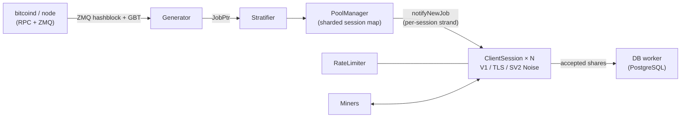

<div align="center">

# mkpool

### Modern multi-coin solo mining pool engine, written in C++23

Stratum V1 · Stratum V1 over TLS · native Stratum V2 (Noise-encrypted) · 9 coin families · one codebase

[](https://github.com/Mecanik/mkpool/actions/workflows/ci.yml)
[](https://github.com/Mecanik/mkpool/actions/workflows/fuzz.yml)
[](https://github.com/Mecanik/mkpool/security/code-scanning)
[](https://github.com/Mecanik/mkpool/actions/workflows/release.yml)

[](COPYING)
[](CMakeLists.txt)
[](#quick-start)
[](#feature-comparison-mkpool-vs-ckpool)
[](https://mkpool.com/blog/mkpool-vs-ckpool-benchmark)
[](https://github.com/Mecanik/mkpool/stargazers)

[Live pool](https://mkpool.com) · [Benchmark report](https://mkpool.com/blog/mkpool-vs-ckpool-benchmark) · [Quick start](#quick-start) · [Contributing](CONTRIBUTING.md) · [Security policy](SECURITY.md)

**English** | [简体中文](README.zh-CN.md) | [Русский](README.ru.md) | [Español](README.es.md) | [Português (Brasil)](README.pt-BR.md) | [Deutsch](README.de.md) | [Français](README.fr.md) | [日本語](README.ja.md) | [한국어](README.ko.md) | [Türkçe](README.tr.md)

</div>

---

**mkpool** is a high-performance, multi-threaded solo mining pool engine. It speaks **Stratum V1**, **Stratum V1 over TLS**, and native **Stratum V2 (Noise-encrypted)**, and runs **nine coin families** (including merge-mined Dogecoin and Equihash Zcash) out of a single codebase. It is live on mainnet today, powering [mkpool.com](https://mkpool.com); this README reflects the deployed state.

On identical hardware, mkpool delivers roughly **2.8x the share throughput**, **3.2x lower median latency**, and **16x the reconnect capacity** of ckpool, measured by a fully reproducible open source benchmark ([details below](#benchmarks-mkpool-vs-ckpool)).

## Table of contents

- [Why mkpool?](#why-mkpool)
- [Benchmarks: mkpool vs ckpool](#benchmarks-mkpool-vs-ckpool)
- [Supported coins](#supported-coins)
- [Feature comparison: mkpool vs ckpool](#feature-comparison-mkpool-vs-ckpool)
- [Quick start](#quick-start)
- [Runtime control (`mkpool-ctl`)](#runtime-control-mkpool-ctl)
- [Scale-out roles](#scale-out-roles)
- [Testing and hardening](#testing-and-hardening)
- [Architecture](#architecture)
- [Project scope](#project-scope)
- [Contributing](#contributing)
- [Support the project](#support-the-project)
- [Acknowledgments](#acknowledgments)
- [Attribution and license](#attribution-and-license)

## Why mkpool?

- ⚡ **Fast where it matters.** ~330k fully validated shares per second on an 8-core box, sub-millisecond submit-to-ack at every percentile, and reconnect storms (NiceHash, MiningRigRentals style) absorbed at ~6,400 full connect cycles per second.
- 🔐 **Encrypted Stratum, in the binary.** TLS (`stratum+ssl://`) and native Stratum V2 with a Noise `NX` handshake and signed authority certificates. No stunnel, no external proxy.
- 🔀 **Bidirectional Stratum V2 ↔ V1 translator.** A built-in proxy that works both ways: point an SV2 ASIC (e.g. a Bitaxe, over encrypted Noise) at *any* plain-V1 pool, **or** point plain-V1 rigs at an SV2-only pool. Most mining hardware still speaks V1, so this bridges the whole fleet in either direction — verified end-to-end on real hardware. (SV2 miner-facing side supports standard channels for now.)
- 🪙 **Nine coin families, one codebase.** BTC, BCH, BC2, BCH2, XEC, DGB, LTC with merge-mined DOGE (AuxPoW), and Equihash ZEC, each a config file away.
- 🎯 **True solo mining.** The miner's username is their payout address; the coinbase is rebuilt per session so block rewards go straight to the finder's wallet.
- 🛡️ **Hardened against hostile traffic.** Token-bucket rate limiting, auto-ban on invalid-share floods, in-memory blacklist, stale-by-block and duplicate-share rejection, and a published fuzzing harness that beats on the Stratum parser.
- 🔧 **Operable at runtime.** Multi-node RPC failover with a primary-recovery watchdog, block-submit retry, and a JSON control socket (`mkpool-ctl`) for live stats, `client.reconnect`, drop, and log-level, plus `SO_REUSEPORT` low-downtime restarts. See who's mining and steer them without a database round-trip or a restart.
- 🧪 **Engineered like software, not folklore.** Unit tests, ASan/TSan/UBSan sweeps, CI-friendly CMake + Ninja builds, and Prometheus metrics built in.
- 🏭 **Production-proven.** Every feature in this repo runs on mainnet right now, across all nine chains, under real rented-hashrate churn.

## Benchmarks: mkpool vs ckpool

A fair, fully reproducible Stratum benchmark on two identical 8-core boxes (Azure `Standard_D8lds_v7`), one pool at a time, same `bitcoind` regtest node, same load generator, fixed difficulty 1. Every submitted share is fully validated (coinbase rebuild, merkle root, 80-byte header, double SHA-256) before the pool answers, and the reject reasons prove it on both sides.

| Scenario | mkpool | ckpool | Margin |
| --- | --- | --- | --- |
| Sustained validated shares/s (128 to 2,048 connections) | ~315k to 337k | ~108k to 118k | **~2.8x** |
| Median submit-to-ack latency (100 connections, light load) | 116 µs | 371 µs | **~3.2x lower** |
| 99th percentile latency | 602 µs | 814 µs | lower at every percentile |
| Reconnect cycles/s (200 parallel connect-subscribe-authorize-submit-close loops) | ~6,391 (4 errors) | ~402 (1,000+ errors) | **~16x** |
| Resident memory at 2k / 4k / 8k idle connections | 66 / 108 / 197 MiB | 25 / 39 / 68 MiB | **ckpool ~2.7x leaner** |

ckpool's memory win is published exactly as measured: its tight C footprint is a genuine engineering achievement, and the trade-off of mkpool's heavier per-connection buffering and threading model is real. Everything else went to mkpool, and the ratios barely move as load rises.

- 📊 [Full write-up with methodology and charts](https://mkpool.com/blog/mkpool-vs-ckpool-benchmark)
- 📄 [The exact self-contained HTML report](https://mkpool.com/benchmarks/mkpool-vs-ckpool.html)
- 🔁 [Reproduce it yourself: benchmark kit (load generator, orchestrator, configs)](https://github.com/Mecanik/mkpool-vs-ckpool-benchmark)

> **Tip when benchmarking mkpool yourself:** use a real, valid payout address as the Stratum username. mkpool validates addresses locally at authorize time and early-rejects invalid usernames, which would unfairly skip the work being measured.

## Supported coins

| Coin | Ticker | Algorithm | Notes |
| --- | --- | --- | --- |
| Bitcoin | BTC | SHA-256d | V1, TLS, SV2 |
| Bitcoin Cash | BCH | SHA-256d | CashAddr, V1/TLS/SV2 |
| BitcoinII | BC2 | SHA-256d | V1/TLS/SV2 |
| Bitcoin Cash II | BCH2 | SHA-256d | CashAddr, V1/TLS/SV2 |
| eCash | XEC | SHA-256d | Avalanche pre-consensus, SV2 |
| DigiByte | DGB | SHA-256d | V1/TLS/SV2 |
| Litecoin | LTC | Scrypt | merge-mines DOGE |
| Dogecoin | DOGE | Scrypt (AuxPoW) | merge-mined on LTC |
| Zcash | ZEC | Equihash 200,9 | `mining.set_target`, Blossom subsidy |

## Feature comparison: mkpool vs ckpool

Legend: ✅ supported · ⚠️ partial / conditional · ❌ not supported

### Protocols and encryption

| Capability | mkpool | ckpool |
| --- | :---: | :---: |
| Stratum V1 (`mining.*`) | ✅ | ✅ |
| Stratum V1 over **TLS** (`stratum+ssl://`) | ✅ in-binary `any_stream` variant, SIGHUP cert reload | ❌ |
| **Stratum V2** native (Noise `NX` handshake, encrypted) | ✅ full-block mode, collects fees | ❌ |
| SV2 secret-authority key / signed certs | ✅ | ❌ |
| SV2 empty-block vs full-block toggle (`v2EmptyBlocks`) | ✅ | ❌ |
| BIP310 `mining.configure` (version-rolling negotiation) | ✅ | ✅ |
| ASICBoost / version-mask (`version_mask`) | ✅ validated (BIP310) | ✅ |
| `subscribe-extranonce` extension | ✅ | ✅ |
| Suggested difficulty (`mining.suggest_difficulty`, `d=` in password) | ✅ clamped per coin | ✅ |

### Coins, algorithms and merge mining

| Capability | mkpool | ckpool |
| --- | :---: | :---: |
| Bitcoin (BTC, SHA-256d) | ✅ | ✅ |
| Bitcoin Cash (BCH, SHA-256d, CashAddr) | ✅ | ❌ |
| BitcoinII (BC2, SHA-256d) | ✅ | ❌ |
| Bitcoin Cash II (BCH2, SHA-256d, CashAddr) | ✅ | ❌ |
| eCash (XEC, SHA-256d + Avalanche pre-consensus) | ✅ | ❌ |
| DigiByte (DGB, SHA-256d) | ✅ | ❌ |
| Litecoin (LTC, Scrypt) | ✅ | ❌ |
| **Dogecoin merge-mined on LTC** (AuxPoW) | ✅ parent + aux blocks | ❌ |
| Zcash (ZEC, Equihash 200,9, `mining.set_target`) | ✅ | ❌ |
| Single codebase, per-coin config | ✅ 9 families | ❌ Bitcoin-only |
| Equihash share validation (in-process) | ✅ `equihash.hpp` + unit test | ❌ |
| Blossom-aware subsidy / halving (ZEC) | ✅ | ❌ |

### Pool engine and architecture

| Capability | mkpool | ckpool |
| --- | :---: | :---: |
| Language / standard | C++23 | C |
| Concurrency model | Single-process, async `io_context` worker pool (`std::jthread`) | Multi-process (fork) + threads, Unix-socket IPC |
| Networking | Boost.Asio / Beast, per-session strand | Hand-coded epoll + Unix sockets |
| Session map | Sharded (default 64 shards), low-contention broadcast | Hash tables (uthash) |
| Per-session write path | Strand-bound `WriteQueue` + 1 MiB watermark (no `async_write` races) | epoll-driven send buffers |
| Job/work window | `JobWindow` rolling buffer (default 32 jobs) keyed by `job_id` | Workbase list |
| New work on block change | ✅ full tx set, ZMQ-driven, no transactionless work | ✅ |
| Periodic job rebroadcast (keepalive for strict clients) | ✅ 30s, resets on real blocks | ✅ |
| ZMQ block-hash notification | ✅ edge-trigger bug fixed | ✅ (optional) |
| `bitcoind` failover (multiple local or remote nodes) | ✅ ordered `rpcFallbacks` + 30s primary-recovery watchdog | ✅ |
| Block-submission retry on transport failure | ✅ retries only when the node returned no answer (never on a real result) | ✅ (up to 5×) |
| Redundant block propagation (extra submit nodes) | ✅ `additionalSubmitEndpoints`, fire-and-forget, never gates the primary submit | ⚠️ via node mode |
| Solo coinbase (miner address = username) | ✅ per-session coinbase2 rebuild | ✅ (BTCSOLO mode) |
| Operator fee / donation from coinbase | ✅ configurable %, incl. aux/DOGE split | ✅ default 0.5% |
| Custom coinbase signature | ✅ configurable | ✅ configurable |
| Proxy mode | ✅ TLS uplink; multi-upstream hot-standby + active/active | ✅ |
| Passthrough / node / redirector modes | ✅ all three, over an mkpool-native TLS cluster protocol (trunk multiplexing + loopback-bridge origin ingest; node adds local block submission; weighted, health/latency-aware redirector) | ✅ |
| Graceful low-downtime restart | ✅ zero-downtime 2-slot swap (`SO_REUSEPORT` + staggered `client.reconnect`) | ✅ socket handover |

### Difficulty and share handling

| Capability | mkpool | ckpool |
| --- | :---: | :---: |
| Vardiff (EMA / decaying-average) | ✅ faithful re-impl of ckpool `decay_time`/`time_bias` | ✅ (original) |
| Per-coin vardiff ranges | ✅ (e.g. BTC/BCH/BC2/BCH2/DGB/XEC `[1024, 1M]`, ZEC `[8192, 524288]`) | ⚠️ single `mindiff`/`maxdiff` |
| Fixed-difficulty tiers (one TCP port each) | ✅ e.g. 10M / 50M / 100M ports | ⚠️ via separate instances |
| Custom `d=` clamp (1024-10M) | ✅ | ⚠️ |
| Stale-by-block share rejection | ✅ prevhash checked against current tip | ✅ |
| Duplicate-share rejection | ✅ in-memory dedupe set, cleared per block | ✅ |
| ntime validation (BIP113-compatible) | ✅ `utils::valid_ntime` | ✅ |
| `int64_t` coinbase value (overflow-safe) | ✅ end-to-end | ✅ |
| Local address validation (no RPC per authorize) | ✅ BIP173/BIP350/base58/CashAddr decoders | ⚠️ relies on bitcoind |

### Security and operations

| Capability | mkpool | ckpool |
| --- | :---: | :---: |
| Token-bucket per-IP rate limiting | ✅ | ⚠️ |
| Auto-ban on excessive invalid shares | ✅ | ⚠️ |
| In-memory IP blacklist | ✅ | ⚠️ |
| Connection-drop observability (per-disconnect logs) | ✅ reason/worker/lifetime/shares | ⚠️ |
| Runtime control / admin socket | ✅ `mkpool-ctl` (21 JSON commands) | ✅ `ckpmsg` |
| `client.reconnect` (move miners without an operator-side drop) | ✅ broadcast or per-client, via the control socket | ✅ |
| Live in-process stats via socket (hashrate 1m/5m, best-share-of-round, idle secs) | ✅ per miner / worker / user / pool, computed on demand from vardiff (no DB hit) | ✅ |
| Idle / dead-worker detection + optional reap | ✅ opt-in `idleDropSeconds` | ✅ |
| Database resilience (auto-reconnect + zero-loss requeue) | ✅ | n/a (no DB) |
| Prometheus metrics endpoint | ✅ optional (`MKPOOL_ENABLE_METRICS`) | ❌ |
| Sanitizer builds (ASan / TSan / UBSan) | ✅ CMake options + `scripts/run_sanitizers.sh` | ❌ |
| Unit tests (Catch2 / Catch-style) | ✅ merkle, vardiff, address, SV2 noise, etc. | ❌ |
| Stratum fuzzing harness | ✅ `scripts/fuzz_*.sh` (7 abuse categories, daemon-survival assertions) | ❌ |
| Build system | CMake + Ninja | autotools (`./configure && make`) |
| Platform | Linux (Ubuntu 24.04+) | Linux |
| External dependencies | Boost, OpenSSL, libpq/pqxx, libzmq, libsodium | Minimal (glibc, yasm, optional zmq) |

## Quick start

### 1. Build (Ubuntu 24.04+)

```bash
# system deps
sudo apt update
sudo apt install -y build-essential cmake ninja-build pkg-config git \
    libboost-system-dev libboost-thread-dev libboost-program-options-dev \
    libssl-dev libpq-dev libpqxx-dev libzmq3-dev cppzmq-dev libsodium-dev libsecp256k1-dev

# clone + configure + build (C++23)
git clone https://github.com/Mecanik/mkpool.git && cd mkpool
cmake -S . -B build -GNinja -DCMAKE_BUILD_TYPE=RelWithDebInfo
cmake --build build -j
```

<details>
<summary><b>CMake options</b></summary>

| Option | Default | Description |
| --- | --- | --- |
| `MKPOOL_BUILD_TESTS` | `ON` | Catch2 unit tests |
| `MKPOOL_ENABLE_LTO` | `ON` | Link-time optimization |
| `MKPOOL_ENABLE_TLS` | `ON` | OpenSSL TLS context support |
| `MKPOOL_ENABLE_METRICS` | `ON` | Prometheus exposer |
| `MKPOOL_ENABLE_ASAN` | `OFF` | AddressSanitizer |
| `MKPOOL_ENABLE_TSAN` | `OFF` | ThreadSanitizer |
| `MKPOOL_ENABLE_UBSAN` | `OFF` | UndefinedBehaviorSanitizer |
| `MKPOOL_ENABLE_NATIVE` | `OFF` | `-march=native` |

</details>

### 2. Configure

You need a synced coin node (with ZMQ block notifications enabled) and a reachable PostgreSQL instance.

```bash
cp config.json.example config.json
# then edit config.json:
#  - RPC host/credentials for your coin daemon(s)
#  - PostgreSQL credentials
#  - YOUR donation/payout addresses (never keep the placeholders)
#  - stratum tiers/ports, vardiff ranges, optional TLS cert paths, optional SV2 port
```

[`config.json.example`](config.json.example) documents every field the loader understands, including fixed-difficulty tiers, TLS tiers (`"tls": true`), Stratum V2 settings, and LTC+DOGE merge mining (`aux` block).

### 3. Run

```bash
./build/mkpool --config config.json
```

A running pool exposes, depending on config:

- **Stratum V1:** vardiff and fixed-difficulty tiers, one port each (e.g. `3331` vardiff, `3335` fixed-10M).
- **Stratum over TLS:** any tier with `"tls": true` speaks `stratum+ssl://` on its port.
- **Stratum V2 (Noise):** the `stratumV2Port` (e.g. BTC `3340`).
- **Prometheus metrics:** `metricsListenPort` (default `9090`) when built with metrics.

Miners connect with their **payout address as username**; the block reward goes straight to that address.

## Runtime control (`mkpool-ctl`)

Each instance opens a private Unix control socket (default `/run/mkpool/<instance>.sock`; set `controlSocket` to override, or `"off"` to disable). Query and steer a live pool with the bundled [`scripts/mkpool-ctl.py`](scripts/mkpool-ctl.py) (shown below as `mkpool-ctl`), no restart, no database round-trip:

```bash
mkpool-ctl -i btc-mainnet stats          # uptime, connections, pool hashrate, per-coin template + best share
mkpool-ctl -i btc-mainnet clients        # every connection: ip, worker, diff, hashrate, idle secs
mkpool-ctl -i btc-mainnet workers        # aggregated per address.worker
mkpool-ctl -i btc-mainnet users          # aggregated per payout address
mkpool-ctl -i btc-mainnet getclient 42   # one connection in detail
mkpool-ctl -i btc-mainnet reconnect      # client.reconnect to every miner (e.g. before maintenance)
mkpool-ctl -i btc-mainnet dropclient 42  # disconnect one miner
mkpool-ctl -i btc-mainnet loglevel debug # change log level live
mkpool-ctl -i btc-mainnet healthcheck    # template freshness per coin
mkpool-ctl -i btc-mainnet help           # full command list
```

Full command set: `ping`, `help`, `version`, `uptime`, `stats`, `clients`, `workers`, `users`, `getclient`, `getuser`, `getworker`, `userclients`, `workerclients`, `loglevel`, `reconnect`, `reconnclient`, `dropclient`, `dropall`, `resetshares`, `blacklistreload`, `healthcheck`. Every reply is JSON. Hashrate, best-share-of-round and idle time are maintained in-process (derived from the share-rate vardiff already tracks) and read on demand, so listing 50k workers costs nothing until you ask. The socket is created `0600` (owner-only); with one process per coin under systemd, each coin gets its own socket.

## Scale-out roles

Beyond the default solo **pool** engine, mkpool can run as one of four distribution roles, selected with `global.role`. Each has a fully commented example config in the repo root, and every role other than `pool` is **stateless** (no database or blacklist).

| Role | What it does | Example |
| --- | --- | --- |
| `proxy` | Terminates downstream miners and relays their work to one or more **upstream** pools, subdividing the upstream extranonce per miner and forwarding qualifying shares. Multi-upstream hot-standby (`failover`) or weighted `activeactive`; the upstream owns payout and block submission. **Also translates between Stratum V2 and V1 in either direction** (see below). | [`config.proxy.json.example`](config.proxy.json.example) |
| `redirector` | Accepts a miner, immediately `client.reconnect`s it onto one of several backends, then closes. Round-robin / random / latency steering with active health probing. | [`config.redirector.json.example`](config.redirector.json.example) |
| `passthrough` | Edge aggregator: terminates miners regionally and multiplexes all of them over one TLS **trunk** to an mkpool **origin**, which keeps full per-miner accounting. Collapses many public miner connections into a handful of trunks. | [`config.passthrough.json.example`](config.passthrough.json.example) |
| `node` | A passthrough that also runs a local `bitcoind`: the origin streams found blocks down the trunk and the node submits them locally for geographically redundant / faster propagation. | [`config.node.json.example`](config.node.json.example) |

### Bidirectional Stratum V2 ↔ V1 translator

The proxy translates **both directions** between Stratum V2 and Stratum V1, so mixed-protocol fleets and pools interoperate transparently. Verified end-to-end on real hardware (a Bitaxe over encrypted Noise) and against mkpool's own SV2 pool.

| Direction | What it enables | Example |
| --- | --- | --- |
| **SV2 miners → V1 pool** | Point a modern, Noise-encrypted Stratum V2 ASIC at *any* plain Stratum V1 pool. The proxy runs the SV2 Noise handshake + certificate, serves a standard mining channel, and translates jobs/shares to V1. | [`config.sv2-to-v1.json.example`](config.sv2-to-v1.json.example) |
| **V1 miners → SV2 pool** | Point plain Stratum V1 rigs (which is most hardware) at an SV2-only pool. The proxy opens an SV2 extended channel upstream, subdivides its extranonce across your V1 miners, and translates shares to `SubmitSharesExtended`. | [`config.v1-to-sv2.json.example`](config.v1-to-sv2.json.example) |

The SV2 miner-facing side (SV2 → V1) currently supports **standard** mining channels; the SV2 pool-facing side (V1 → SV2) uses **extended** channels. The upstream-SV2 transport is plaintext SV2 for now (a Noise-encrypted upstream is a follow-up).

### Cluster protocol (passthrough / node)

Passthrough and node speak a versioned, TLS-capable trunk protocol of mkpool's own. The **origin** is an ordinary `pool` that opts in with a per-coin `cluster.ingestPort`; it bridges each multiplexed miner to its own local stratum port, so clustered miners are served exactly like direct ones with no change to the solo path. The trunk hello carries a shared `cluster.token` that must match on both ends; set `cluster.rawblockZmq` on the origin (pointed at its node's `rawblock` feed) to enable node block relay. See [`config.cluster-origin.json.example`](config.cluster-origin.json.example) for the origin side.

```bash
# origin: an ordinary pool with cluster ingest enabled (keeps the database + accounting)
mkpool -c config.cluster-origin.json.example
# edge: aggregates miners and trunks them to the origin's ingest port
mkpool -c config.passthrough.json.example
```

Proxy and redirector are single-hop and need no origin; passthrough and node require an origin running the cluster ingest.

## Testing and hardening

### Unit tests

```bash
cd build
ctest --output-on-failure -j
```

### Sanitizer sweeps

`scripts/run_sanitizers.sh` builds the unit tests under AddressSanitizer, UndefinedBehaviorSanitizer, and ThreadSanitizer in a throwaway `.san/` directory (your normal `build/` is left untouched) and reports any findings.

```bash
./scripts/run_sanitizers.sh            # asan+ubsan and tsan
./scripts/run_sanitizers.sh asan       # a single flavor
./scripts/run_sanitizers.sh --fuzz     # also fuzz a sanitized instance
```

### Fuzz the Stratum parser

`scripts/fuzz_*.sh` throw malformed and abusive Stratum traffic at a running pool and assert it survives (same PID before and after) with no handler exceptions. Point them at a local instance:

```bash
# quick malformed-frame battery
HOST=127.0.0.1 PORT=3331 ./scripts/fuzz_stratum.sh

# full suite: malformed JSON, protocol abuse, share spam, auth abuse,
# slowloris, version-rolling abuse, binary noise
HOST=127.0.0.1 PORT=3331 ./scripts/fuzz_suite.sh
```

## Architecture



- `IoPool` runs N worker `io_context`s (default = `hardware_concurrency()`).
- Each `ClientSession` lives on one worker `io_context` via an Asio strand; the socket type (plain / TLS / SV2 Noise) is abstracted behind `any_stream`, and all writes go through a strand-bound `WriteQueue`.
- `PoolManager` iterates shards on each `JobPtr` and dispatches `notifyNewJob` to every session's strand.
- The `Generator` rebroadcasts the current job every 30 seconds as a keepalive (with `clean_jobs=false`, so no work is discarded), which keeps strict clients such as rental-marketplace proxies and farm controllers from idle-disconnecting between blocks.

## Project scope

This repository is the **pool engine**, published for transparency. The operational stack that surrounds it in production (the database/analytics service, the public REST API, and the website) is **not** part of this open release.

mkpool is an original codebase. The async C++ engine, multi-coin support, Stratum V2 (Noise) and TLS stack, per-miner solo coinbase construction, and security tooling were all written from scratch. The one component that intentionally borrows from [ckpool](https://bitbucket.org/ckolivas/ckpool) (Con Kolivas' GPLv3 C pool) is the **variable-difficulty retarget math**, a small, attributed re-implementation of a well-proven algorithm (see [Attribution and license](#attribution-and-license)).

## Contributing

Contributions are welcome: bug reports, protocol edge cases, new coin families, performance work, documentation, and translations of this README.

- Read [CONTRIBUTING.md](CONTRIBUTING.md) before opening a PR.
- Security issues: please follow [SECURITY.md](SECURITY.md) instead of opening a public issue.
- If mkpool is useful to you, **starring the repo** genuinely helps the project get found. ⭐

## Support the project

mkpool is free and open source. There is no fee to use the code and no built-in donation skim. If the project has been useful to you and you would like to chip in toward its development, you can send a tip here. It is entirely optional and very much appreciated.

**BTC:** `bc1qlugz6as6x3n03c6x8zddpnmypsaucdmh3lc5z0`

## Acknowledgments

mkpool is built on top of a lot of excellent open source work. A sincere thank you to the maintainers and contributors of every project below. The pool would not exist without them.

| Library | License | Used for |
| --- | --- | --- |
| [Boost](https://www.boost.org/) (Asio / Beast) | BSL-1.0 | Async networking, strands, HTTP RPC client |
| [OpenSSL](https://www.openssl.org/) | Apache-2.0 | TLS, SHA-256 |
| [fmt](https://github.com/fmtlib/fmt) | MIT | Hot-path Stratum formatting |
| [spdlog](https://github.com/gabime/spdlog) | MIT | Logging |
| [nlohmann/json](https://github.com/nlohmann/json) | MIT | Config and RPC JSON |
| [cxxopts](https://github.com/jarro2783/cxxopts) | MIT | Command-line parsing |
| [libpqxx](https://github.com/jtv/libpqxx) / [libpq](https://www.postgresql.org/) | BSD-3-Clause / PostgreSQL | Database access |
| [ZeroMQ](https://zeromq.org/) (libzmq + [cppzmq](https://github.com/zeromq/cppzmq) binding) | MPL-2.0 / MIT | Block-hash notifications |
| [libsodium](https://libsodium.org/) | ISC | Stratum V2 Noise crypto |
| [libsecp256k1](https://github.com/bitcoin-core/secp256k1) | MIT | EC keys / signatures (SV2) |
| [Catch2](https://github.com/catchorg/Catch2) | BSL-1.0 | Unit tests |
| [prometheus-cpp](https://github.com/jupp0r/prometheus-cpp) | MIT | Optional metrics endpoint |

All of these are under GPLv3-compatible licenses. mkpool does not vendor (copy) their source; they are linked from your system package manager or fetched by CMake at build time. If you distribute a **compiled** mkpool binary, ship a `THIRD-PARTY-NOTICES` file reproducing these projects' copyright and license texts alongside it.

## Attribution and license

mkpool is **original software**, © 2025-2026 Mecanik1337 (<contact@mecanik.dev>), licensed under the **GNU General Public License v3.0** (`GPL-3.0`). Every source file carries the full GPLv3 header.

Almost all of the codebase (the async engine, multi-coin support, Stratum V2 (Noise) and TLS, solo coinbase construction, and security tooling) is written from scratch and owes nothing to ckpool beyond being the same kind of program.

The single exception, disclosed for honesty and license compliance: the variable-difficulty **retarget math** in [`vardiff.cpp`](src/vardiff.cpp) / [`vardiff.hpp`](src/vardiff.hpp) re-implements ckpool's `decay_time()` (`src/libckpool.c`) and `time_bias()` / `add_submit()` (`src/stratifier.c`) by **Con Kolivas** (also GPLv3). That is the only part adapted from ckpool; no ckpool C source files are vendored or copied verbatim, and a few Stratum field conventions (e.g. 4-byte extranonce1) simply follow common practice. The runtime control socket's command names (`stats`, `clients`, `workers`, `reconnect`, …) mirror ckpool's for operator familiarity, but the command dispatch, JSON wire format, and implementation are entirely original. These are attributed inline. Because mkpool is GPLv3, this re-use is fully permitted; if you redistribute mkpool, keep it under GPLv3, retain these attributions, and ship the full license text ([`COPYING`](COPYING)).

ckpool: <https://bitbucket.org/ckolivas/ckpool>, © 2014-2026 Con Kolivas.

---

<div align="center">

**[⬆ back to top](#mkpool)**

If you run mkpool, find a block with it, or just like the engineering, [a star](https://github.com/Mecanik/mkpool/stargazers) is the easiest way to support the project.

</div>
