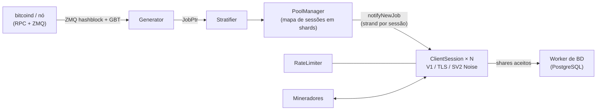

<div align="center">

# mkpool

### Motor moderno de pool de mineração solo multi-moeda, escrito em C++23

Stratum V1 · Stratum V1 sobre TLS · Stratum V2 nativo (criptografado com Noise) · 9 famílias de moedas · uma única base de código

[](COPYING)
[](CMakeLists.txt)
[](#início-rápido)
[](#comparação-de-recursos-mkpool-vs-ckpool)
[](https://mkpool.com/blog/mkpool-vs-ckpool-benchmark)
[](https://github.com/Mecanik/mkpool/stargazers)

[Pool ao vivo](https://mkpool.com) · [Relatório de benchmark](https://mkpool.com/blog/mkpool-vs-ckpool-benchmark) · [Início rápido](#início-rápido) · [Como contribuir](CONTRIBUTING.md) · [Política de segurança](SECURITY.md)

[English](README.md) | [简体中文](README.zh-CN.md) | [Русский](README.ru.md) | [Español](README.es.md) | **Português (Brasil)** | [Deutsch](README.de.md) | [Français](README.fr.md) | [日本語](README.ja.md) | [한국어](README.ko.md) | [Türkçe](README.tr.md)

*Esta tradução pode ocasionalmente ficar defasada em relação ao README em inglês.*

</div>

---

O **mkpool** é um motor de pool de mineração solo multi-moeda, multi-thread e de alto desempenho. Ele fala **Stratum V1**, **Stratum V1 sobre TLS** e **Stratum V2 nativo (criptografado com Noise)**, e roda **nove famílias de moedas** (incluindo Dogecoin em mineração mesclada e Zcash com Equihash) a partir de uma única base de código. Está ao vivo na mainnet hoje, movendo o [mkpool.com](https://mkpool.com); este README reflete o estado em produção.

Em hardware idêntico, o mkpool entrega aproximadamente **2.8x o throughput de shares**, **3.2x menos latência mediana** e **16x a capacidade de reconexão** do ckpool, tudo medido por um benchmark de código aberto totalmente reproduzível ([detalhes abaixo](#benchmarks-mkpool-vs-ckpool)).

## Sumário

- [Por que mkpool?](#por-que-mkpool)
- [Benchmarks: mkpool vs ckpool](#benchmarks-mkpool-vs-ckpool)
- [Moedas suportadas](#moedas-suportadas)
- [Comparação de recursos: mkpool vs ckpool](#comparação-de-recursos-mkpool-vs-ckpool)
- [Início rápido](#início-rápido)
- [Controle em tempo de execução (`mkpool-ctl`)](#controle-em-tempo-de-execução-mkpool-ctl)
- [Testes e hardening](#testes-e-hardening)
- [Arquitetura](#arquitetura)
- [Escopo do projeto](#escopo-do-projeto)
- [Como contribuir](#como-contribuir)
- [Apoie o projeto](#apoie-o-projeto)
- [Agradecimentos](#agradecimentos)
- [Atribuição e licença](#atribuição-e-licença)

## Por que mkpool?

- ⚡ **Rápido onde importa.** ~330k shares totalmente validados por segundo em uma máquina de 8 núcleos, submit-to-ack abaixo de um milissegundo em todos os percentis, e tempestades de reconexão (no estilo NiceHash e MiningRigRentals) absorvidas a ~6,400 ciclos completos de conexão por segundo.
- 🔐 **Stratum criptografado, dentro do binário.** TLS (`stratum+ssl://`) e Stratum V2 nativo com handshake Noise `NX` e certificados de autoridade assinados. Sem stunnel, sem proxy externo.
- 🪙 **Nove famílias de moedas, uma única base de código.** BTC, BCH, BC2, BCH2, XEC, DGB, LTC com DOGE em mineração mesclada (AuxPoW) e ZEC com Equihash, cada uma a um arquivo de configuração de distância.
- 🎯 **Mineração solo de verdade.** O nome de usuário do minerador é o seu endereço de pagamento; a coinbase é reconstruída por sessão, então a recompensa do bloco vai direto para a carteira de quem o encontrou.
- 🛡️ **Blindado contra tráfego hostil.** Rate limiting com token bucket, banimento automático em enxurradas de shares inválidos, blacklist em memória, rejeição de shares obsoletos por bloco e de shares duplicados, além de um harness de fuzzing publicado que castiga o parser Stratum.
- 🔧 **Operável em tempo de execução.** Failover de RPC entre vários nós com watchdog de recuperação do primário, retry de envio de bloco e um socket de controle JSON (`mkpool-ctl`) para estatísticas ao vivo, `client.reconnect`, desconexão e nível de log, além de reinícios de baixa indisponibilidade com `SO_REUSEPORT`. Veja quem está minerando e gerencie-os sem ida e volta ao banco de dados nem reinício.
- 🧪 **Engenharia de verdade, não folclore.** Testes unitários, varreduras com ASan/TSan/UBSan, builds CMake + Ninja prontos para CI e métricas Prometheus integradas.
- 🏭 **Comprovado em produção.** Cada recurso deste repositório roda na mainnet agora mesmo, nas nove chains, sob churn real de hashrate alugado.

## Benchmarks: mkpool vs ckpool

Um benchmark Stratum justo e totalmente reproduzível em duas máquinas idênticas de 8 núcleos (Azure `Standard_D8lds_v7`), um pool por vez, mesmo nó `bitcoind` em regtest, mesmo gerador de carga, dificuldade fixa 1. Cada share submetido é totalmente validado (reconstrução da coinbase, merkle root, cabeçalho de 80 bytes, double SHA-256) antes de o pool responder, e os motivos de rejeição comprovam isso dos dois lados.

| Cenário | mkpool | ckpool | Margem |
| --- | --- | --- | --- |
| Shares validados/s sustentados (128 a 2,048 conexões) | ~315k a 337k | ~108k a 118k | **~2.8x** |
| Latência mediana submit-to-ack (100 conexões, carga leve) | 116 µs | 371 µs | **~3.2x menor** |
| Latência no percentil 99 | 602 µs | 814 µs | menor em todos os percentis |
| Ciclos de reconexão/s (200 loops paralelos de connect-subscribe-authorize-submit-close) | ~6,391 (4 erros) | ~402 (1,000+ erros) | **~16x** |
| Memória residente com 2k / 4k / 8k conexões ociosas | 66 / 108 / 197 MiB | 25 / 39 / 68 MiB | **ckpool ~2.7x mais enxuto** |

A vitória do ckpool em memória está publicada exatamente como foi medida: sua pegada enxuta em C é uma conquista genuína de engenharia, e o trade-off do modelo mais pesado de buffering e threading por conexão do mkpool é real. Todo o resto ficou com o mkpool, e as proporções mal se movem conforme a carga aumenta.

- 📊 [Análise completa com metodologia e gráficos](https://mkpool.com/blog/mkpool-vs-ckpool-benchmark)
- 📄 [O relatório HTML autocontido exato](https://mkpool.com/benchmarks/mkpool-vs-ckpool.html)
- 🔁 [Reproduza você mesmo: kit de benchmark (gerador de carga, orquestrador, configurações)](https://github.com/Mecanik/mkpool-vs-ckpool-benchmark)

> **Dica ao fazer benchmark do mkpool por conta própria:** use um endereço de pagamento real e válido como nome de usuário Stratum. O mkpool valida endereços localmente no momento do authorize e rejeita de imediato nomes de usuário inválidos, o que pularia injustamente o trabalho que está sendo medido.

## Moedas suportadas

| Moeda | Ticker | Algoritmo | Observações |
| --- | --- | --- | --- |
| Bitcoin | BTC | SHA-256d | V1, TLS, SV2 |
| Bitcoin Cash | BCH | SHA-256d | CashAddr, V1/TLS/SV2 |
| BitcoinII | BC2 | SHA-256d | V1/TLS/SV2 |
| Bitcoin Cash II | BCH2 | SHA-256d | CashAddr, V1/TLS/SV2 |
| eCash | XEC | SHA-256d | pré-consenso Avalanche, SV2 |
| DigiByte | DGB | SHA-256d | V1/TLS/SV2 |
| Litecoin | LTC | Scrypt | mineração mesclada de DOGE |
| Dogecoin | DOGE | Scrypt (AuxPoW) | minerado de forma mesclada com LTC |
| Zcash | ZEC | Equihash 200,9 | `mining.set_target`, subsídio Blossom |

## Comparação de recursos: mkpool vs ckpool

Legenda: ✅ suportado · ⚠️ parcial / condicional · ❌ não suportado

### Protocolos e criptografia

| Capacidade | mkpool | ckpool |
| --- | :---: | :---: |
| Stratum V1 (`mining.*`) | ✅ | ✅ |
| Stratum V1 sobre **TLS** (`stratum+ssl://`) | ✅ variante `any_stream` no binário, recarga de certificado via SIGHUP | ❌ |
| **Stratum V2** nativo (handshake Noise `NX`, criptografado) | ✅ modo full-block, coleta as taxas | ❌ |
| Chave secreta de autoridade SV2 / certificados assinados | ✅ | ❌ |
| Alternância SV2 entre bloco vazio e bloco completo (`v2EmptyBlocks`) | ✅ | ❌ |
| BIP310 `mining.configure` (negociação de version-rolling) | ✅ | ✅ |
| ASICBoost / version-mask (`version_mask`) | ✅ validado (BIP310) | ✅ |
| Extensão `subscribe-extranonce` | ✅ | ✅ |
| Dificuldade sugerida (`mining.suggest_difficulty`, `d=` na senha) | ✅ com clamp por moeda | ✅ |

### Moedas, algoritmos e mineração mesclada

| Capacidade | mkpool | ckpool |
| --- | :---: | :---: |
| Bitcoin (BTC, SHA-256d) | ✅ | ✅ |
| Bitcoin Cash (BCH, SHA-256d, CashAddr) | ✅ | ❌ |
| BitcoinII (BC2, SHA-256d) | ✅ | ❌ |
| Bitcoin Cash II (BCH2, SHA-256d, CashAddr) | ✅ | ❌ |
| eCash (XEC, SHA-256d + pré-consenso Avalanche) | ✅ | ❌ |
| DigiByte (DGB, SHA-256d) | ✅ | ❌ |
| Litecoin (LTC, Scrypt) | ✅ | ❌ |
| **Dogecoin em mineração mesclada com LTC** (AuxPoW) | ✅ blocos pai + aux | ❌ |
| Zcash (ZEC, Equihash 200,9, `mining.set_target`) | ✅ | ❌ |
| Base de código única, configuração por moeda | ✅ 9 famílias | ❌ apenas Bitcoin |
| Validação de shares Equihash (in-process) | ✅ `equihash.hpp` + teste unitário | ❌ |
| Subsídio / halving ciente do Blossom (ZEC) | ✅ | ❌ |

### Motor do pool e arquitetura

| Capacidade | mkpool | ckpool |
| --- | :---: | :---: |
| Linguagem / padrão | C++23 | C |
| Modelo de concorrência | Processo único, pool assíncrono de workers `io_context` (`std::jthread`) | Multiprocesso (fork) + threads, IPC via socket Unix |
| Rede | Boost.Asio / Beast, strand por sessão | epoll escrito à mão + sockets Unix |
| Mapa de sessões | Particionado em shards (padrão 64), broadcast de baixa contenção | Tabelas hash (uthash) |
| Caminho de escrita por sessão | `WriteQueue` vinculada à strand + marca d'água de 1 MiB (sem corridas de `async_write`) | Buffers de envio dirigidos por epoll |
| Janela de jobs | Buffer rotativo `JobWindow` (padrão 32 jobs) indexado por `job_id` | Lista de workbases |
| Novo trabalho na troca de bloco | ✅ conjunto completo de transações, dirigido por ZMQ, sem trabalho vazio de transações | ✅ |
| Rebroadcast periódico de jobs (keepalive para clientes rigorosos) | ✅ 30s, reinicia em blocos reais | ✅ |
| Notificação de hash de bloco via ZMQ | ✅ bug de edge-trigger corrigido | ✅ (opcional) |
| Failover de `bitcoind` (vários nós locais ou remotos) | ✅ `rpcFallbacks` ordenados + watchdog de recuperação do primário a cada 30s | ✅ |
| Retry de envio de bloco em falha de transporte | ✅ só reenvia quando o nó não respondeu (nunca em um resultado real) | ✅ (até 5×) |
| Propagação redundante de blocos (nós de envio adicionais) | ✅ `additionalSubmitEndpoints`, fire-and-forget, nunca bloqueia o envio primário | ⚠️ via modo node |
| Coinbase solo (endereço do minerador = nome de usuário) | ✅ reconstrução de coinbase2 por sessão | ✅ (modo BTCSOLO) |
| Taxa do operador / doação a partir da coinbase | ✅ % configurável, incl. divisão aux/DOGE | ✅ padrão 0.5% |
| Assinatura de coinbase personalizada | ✅ configurável | ✅ configurável |
| Modo proxy | ✅ TLS uplink; multi-upstream hot-standby + active/active | ✅ |
| Modos passthrough / node / redirector | ✅ all three (mkpool-native TLS cluster protocol; node adds local block submit; health/latency-aware redirector) | ✅ |
| Reinício de baixa indisponibilidade | ✅ deploy sem indisponibilidade: troca de 2 slots (`SO_REUSEPORT` + `client.reconnect` escalonado) | ✅ handover de socket |

### Dificuldade e tratamento de shares

| Capacidade | mkpool | ckpool |
| --- | :---: | :---: |
| Vardiff (EMA / média com decaimento) | ✅ reimplementação fiel de `decay_time`/`time_bias` do ckpool | ✅ (original) |
| Faixas de vardiff por moeda | ✅ (p.ex. BTC/BCH/BC2/BCH2/DGB/XEC `[1024, 1M]`, ZEC `[8192, 524288]`) | ⚠️ um único `mindiff`/`maxdiff` |
| Camadas de dificuldade fixa (uma porta TCP cada) | ✅ p.ex. portas 10M / 50M / 100M | ⚠️ via instâncias separadas |
| Clamp de `d=` personalizado (1024-10M) | ✅ | ⚠️ |
| Rejeição de shares obsoletos por bloco | ✅ prevhash conferido contra o tip atual | ✅ |
| Rejeição de shares duplicados | ✅ conjunto de deduplicação em memória, limpo a cada bloco | ✅ |
| Validação de ntime (compatível com BIP113) | ✅ `utils::valid_ntime` | ✅ |
| Valor de coinbase em `int64_t` (seguro contra overflow) | ✅ de ponta a ponta | ✅ |
| Validação local de endereços (sem RPC a cada authorize) | ✅ decodificadores BIP173/BIP350/base58/CashAddr | ⚠️ depende do bitcoind |

### Segurança e operações

| Capacidade | mkpool | ckpool |
| --- | :---: | :---: |
| Rate limiting por IP com token bucket | ✅ | ⚠️ |
| Banimento automático por excesso de shares inválidos | ✅ | ⚠️ |
| Blacklist de IPs em memória | ✅ | ⚠️ |
| Observabilidade de quedas de conexão (logs por desconexão) | ✅ motivo/worker/tempo de vida/shares | ⚠️ |
| Socket de controle / administração em tempo de execução | ✅ `mkpool-ctl` (21 comandos JSON) | ✅ `ckpmsg` |
| `client.reconnect` (mover mineradores sem desconexão do lado do operador) | ✅ broadcast ou por cliente, via socket de controle | ✅ |
| Estatísticas in-process via socket (hashrate 1m/5m, melhor share da rodada, segundos ocioso) | ✅ por minerador / worker / usuário / pool, calculadas sob demanda a partir do vardiff (sem acesso ao BD) | ✅ |
| Detecção de workers ociosos / mortos + coleta opcional | ✅ `idleDropSeconds` opcional | ✅ |
| Resiliência de banco de dados (reconexão automática + refileiramento sem perdas) | ✅ | n/a (sem BD) |
| Endpoint de métricas Prometheus | ✅ opcional (`MKPOOL_ENABLE_METRICS`) | ❌ |
| Builds com sanitizers (ASan / TSan / UBSan) | ✅ opções do CMake + `scripts/run_sanitizers.sh` | ❌ |
| Testes unitários (Catch2 / estilo Catch) | ✅ merkle, vardiff, endereços, SV2 noise etc. | ❌ |
| Harness de fuzzing do Stratum | ✅ `scripts/fuzz_*.sh` (7 categorias de abuso, asserções de sobrevivência do daemon) | ❌ |
| Sistema de build | CMake + Ninja | autotools (`./configure && make`) |
| Plataforma | Linux (Ubuntu 24.04+) | Linux |
| Dependências externas | Boost, OpenSSL, libpq/pqxx, libzmq, libsodium | Mínimas (glibc, yasm, zmq opcional) |

## Início rápido

### 1. Compilar (Ubuntu 24.04+)

```bash
# dependências do sistema
sudo apt update
sudo apt install -y build-essential cmake ninja-build pkg-config git \
    libboost-system-dev libboost-thread-dev libboost-program-options-dev \
    libssl-dev libpq-dev libpqxx-dev libzmq3-dev cppzmq-dev libsodium-dev libsecp256k1-dev

# clonar + configurar + compilar (C++23)
git clone https://github.com/Mecanik/mkpool.git && cd mkpool
cmake -S . -B build -GNinja -DCMAKE_BUILD_TYPE=RelWithDebInfo
cmake --build build -j
```

<details>
<summary><b>Opções do CMake</b></summary>

| Opção | Padrão | Descrição |
| --- | --- | --- |
| `MKPOOL_BUILD_TESTS` | `ON` | Testes unitários Catch2 |
| `MKPOOL_ENABLE_LTO` | `ON` | Otimização em tempo de link |
| `MKPOOL_ENABLE_TLS` | `ON` | Suporte a contexto TLS via OpenSSL |
| `MKPOOL_ENABLE_METRICS` | `ON` | Exposer Prometheus |
| `MKPOOL_ENABLE_ASAN` | `OFF` | AddressSanitizer |
| `MKPOOL_ENABLE_TSAN` | `OFF` | ThreadSanitizer |
| `MKPOOL_ENABLE_UBSAN` | `OFF` | UndefinedBehaviorSanitizer |
| `MKPOOL_ENABLE_NATIVE` | `OFF` | `-march=native` |

</details>

### 2. Configurar

Você precisa de um nó da moeda sincronizado (com notificações de bloco via ZMQ habilitadas) e de uma instância PostgreSQL acessível.

```bash
cp config.json.example config.json
# em seguida, edite o config.json:
#  - host/credenciais RPC do(s) daemon(s) da(s) sua(s) moeda(s)
#  - credenciais do PostgreSQL
#  - SEUS endereços de doação/pagamento (nunca deixe os placeholders)
#  - camadas/portas do stratum, faixas de vardiff, caminhos opcionais de certificado TLS, porta SV2 opcional
```

O [`config.json.example`](config.json.example) documenta todos os campos que o carregador entende, incluindo camadas de dificuldade fixa, camadas TLS (`"tls": true`), configurações de Stratum V2 e mineração mesclada LTC+DOGE (bloco `aux`).

### 3. Executar

```bash
./build/mkpool --config config.json
```

Um pool em execução expõe, dependendo da configuração:

- **Stratum V1:** camadas de vardiff e de dificuldade fixa, uma porta cada (p.ex. `3331` vardiff, `3335` fixa em 10M).
- **Stratum sobre TLS:** qualquer camada com `"tls": true` fala `stratum+ssl://` em sua porta.
- **Stratum V2 (Noise):** a `stratumV2Port` (p.ex. BTC `3340`).
- **Métricas Prometheus:** `metricsListenPort` (padrão `9090`) quando compilado com métricas.

Os mineradores se conectam usando o **endereço de pagamento como nome de usuário**; a recompensa do bloco vai direto para esse endereço.

## Controle em tempo de execução (`mkpool-ctl`)

Cada instância abre um socket Unix de controle privado (padrão `/run/mkpool/<instância>.sock`; use `controlSocket` para alterar, ou `"off"` para desativar). Consulte e gerencie um pool em execução com o [`scripts/mkpool-ctl.py`](scripts/mkpool-ctl.py) incluído (mostrado abaixo como `mkpool-ctl`), sem reinício, sem ida e volta ao banco de dados:

```bash
mkpool-ctl -i btc-mainnet stats          # uptime, conexões, hashrate do pool, template + melhor share por moeda
mkpool-ctl -i btc-mainnet clients        # cada conexão: IP, worker, dificuldade, hashrate, segundos ocioso
mkpool-ctl -i btc-mainnet workers        # agregado por address.worker
mkpool-ctl -i btc-mainnet users          # agregado por endereço de pagamento
mkpool-ctl -i btc-mainnet getclient 42   # uma conexão em detalhe
mkpool-ctl -i btc-mainnet reconnect      # client.reconnect para cada minerador (p.ex. antes de manutenção)
mkpool-ctl -i btc-mainnet dropclient 42  # desconectar um minerador
mkpool-ctl -i btc-mainnet loglevel debug # mudar o nível de log ao vivo
mkpool-ctl -i btc-mainnet healthcheck    # frescor do template por moeda
mkpool-ctl -i btc-mainnet help           # lista completa de comandos
```

Conjunto completo de comandos: `ping`, `help`, `version`, `uptime`, `stats`, `clients`, `workers`, `users`, `getclient`, `getuser`, `getworker`, `userclients`, `workerclients`, `loglevel`, `reconnect`, `reconnclient`, `dropclient`, `dropall`, `resetshares`, `blacklistreload`, `healthcheck`. Cada resposta é JSON. Hashrate, melhor share da rodada e tempo ocioso são mantidos in-process (derivados da taxa de shares que o vardiff já acompanha) e lidos sob demanda, então listar 50k workers não custa nada até você pedir. O socket é criado como `0600` (apenas o dono); com um processo por moeda sob systemd, cada moeda tem seu próprio socket.

## Testes e hardening

### Testes unitários

```bash
cd build
ctest --output-on-failure -j
```

### Varreduras com sanitizers

O `scripts/run_sanitizers.sh` compila os testes unitários sob AddressSanitizer, UndefinedBehaviorSanitizer e ThreadSanitizer em um diretório descartável `.san/` (seu `build/` normal fica intocado) e relata qualquer achado.

```bash
./scripts/run_sanitizers.sh            # asan+ubsan e tsan
./scripts/run_sanitizers.sh asan       # um único sabor
./scripts/run_sanitizers.sh --fuzz     # também faz fuzzing de uma instância sanitizada
```

### Fuzzing do parser Stratum

Os scripts `scripts/fuzz_*.sh` disparam tráfego Stratum malformado e abusivo contra um pool em execução e verificam que ele sobrevive (mesmo PID antes e depois) sem exceções nos handlers. Aponte-os para uma instância local:

```bash
# bateria rápida de frames malformados
HOST=127.0.0.1 PORT=3331 ./scripts/fuzz_stratum.sh

# suíte completa: JSON malformado, abuso de protocolo, spam de shares, abuso de autenticação,
# slowloris, abuso de version-rolling, ruído binário
HOST=127.0.0.1 PORT=3331 ./scripts/fuzz_suite.sh
```

## Arquitetura



- O `IoPool` executa N `io_context`s de worker (padrão = `hardware_concurrency()`).
- Cada `ClientSession` vive em um `io_context` de worker via uma strand do Asio; o tipo de socket (plano / TLS / SV2 Noise) fica abstraído atrás de `any_stream`, e todas as escritas passam por uma `WriteQueue` vinculada à strand.
- O `PoolManager` percorre os shards a cada `JobPtr` e despacha `notifyNewJob` para a strand de cada sessão.
- O `Generator` retransmite o job atual a cada 30 segundos como keepalive (com `clean_jobs=false`, então nenhum trabalho é descartado), o que impede que clientes rigorosos, como proxies de marketplaces de aluguel e controladores de farms, desconectem por ociosidade entre blocos.

## Escopo do projeto

Este repositório é o **motor do pool**, publicado por transparência. A pilha operacional que o cerca em produção (o serviço de banco de dados/analytics, a API REST pública e o site) **não** faz parte desta versão aberta.

O mkpool é uma base de código original. O motor assíncrono em C++, o suporte multi-moeda, a pilha Stratum V2 (Noise) e TLS, a construção de coinbase solo por minerador e o ferramental de segurança foram todos escritos do zero. O único componente que intencionalmente toma emprestado do [ckpool](https://bitbucket.org/ckolivas/ckpool) (o pool em C sob GPLv3 de Con Kolivas) é a **matemática de retarget de dificuldade variável**, uma pequena reimplementação devidamente atribuída de um algoritmo muito bem comprovado (veja [Atribuição e licença](#atribuição-e-licença)).

## Como contribuir

Contribuições são bem-vindas: relatos de bugs, casos extremos de protocolo, novas famílias de moedas, trabalho de desempenho, documentação e traduções deste README.

- Leia o [CONTRIBUTING.md](CONTRIBUTING.md) antes de abrir um PR.
- Problemas de segurança: siga o [SECURITY.md](SECURITY.md) em vez de abrir uma issue pública.
- Se o mkpool é útil para você, **dar uma estrela no repositório** ajuda de verdade o projeto a ser encontrado. ⭐

## Apoie o projeto

O mkpool é gratuito e de código aberto. Não há taxa para usar o código nem desconto de doação embutido. Se o projeto foi útil para você e você quiser colaborar com o desenvolvimento, pode enviar uma gorjeta aqui. É totalmente opcional e muito apreciado.

**BTC:** `bc1qlugz6as6x3n03c6x8zddpnmypsaucdmh3lc5z0`

## Agradecimentos

O mkpool é construído sobre muito trabalho excelente de código aberto. Um sincero obrigado aos mantenedores e contribuidores de cada projeto abaixo. O pool não existiria sem eles.

| Biblioteca | Licença | Usada para |
| --- | --- | --- |
| [Boost](https://www.boost.org/) (Asio / Beast) | BSL-1.0 | Rede assíncrona, strands, cliente HTTP RPC |
| [OpenSSL](https://www.openssl.org/) | Apache-2.0 | TLS, SHA-256 |
| [fmt](https://github.com/fmtlib/fmt) | MIT | Formatação Stratum no hot path |
| [spdlog](https://github.com/gabime/spdlog) | MIT | Logging |
| [nlohmann/json](https://github.com/nlohmann/json) | MIT | JSON de configuração e RPC |
| [cxxopts](https://github.com/jarro2783/cxxopts) | MIT | Parsing de linha de comando |
| [libpqxx](https://github.com/jtv/libpqxx) / [libpq](https://www.postgresql.org/) | BSD-3-Clause / PostgreSQL | Acesso ao banco de dados |
| [ZeroMQ](https://zeromq.org/) (libzmq + binding [cppzmq](https://github.com/zeromq/cppzmq)) | MPL-2.0 / MIT | Notificações de hash de bloco |
| [libsodium](https://libsodium.org/) | ISC | Criptografia Noise do Stratum V2 |
| [libsecp256k1](https://github.com/bitcoin-core/secp256k1) | MIT | Chaves EC / assinaturas (SV2) |
| [Catch2](https://github.com/catchorg/Catch2) | BSL-1.0 | Testes unitários |
| [prometheus-cpp](https://github.com/jupp0r/prometheus-cpp) | MIT | Endpoint de métricas opcional |

Todos estão sob licenças compatíveis com a GPLv3. O mkpool não incorpora (copia) o código-fonte deles; eles são linkados a partir do gerenciador de pacotes do seu sistema ou baixados pelo CMake em tempo de build. Se você distribuir um binário **compilado** do mkpool, inclua junto um arquivo `THIRD-PARTY-NOTICES` reproduzindo os textos de copyright e licença desses projetos.

## Atribuição e licença

O mkpool é **software original**, © 2025-2026 Mecanik1337 (<contact@mecanik.dev>), licenciado sob a **GNU General Public License v3.0** (`GPL-3.0`). Todo arquivo-fonte carrega o cabeçalho completo da GPLv3.

Quase toda a base de código (o motor assíncrono, o suporte multi-moeda, Stratum V2 (Noise) e TLS, a construção de coinbase solo e o ferramental de segurança) foi escrita do zero e não deve nada ao ckpool além de ser o mesmo tipo de programa.

A única exceção, revelada por honestidade e por conformidade de licença: a **matemática de retarget** de dificuldade variável em [`vardiff.cpp`](src/vardiff.cpp) / [`vardiff.hpp`](src/vardiff.hpp) reimplementa o `decay_time()` (`src/libckpool.c`) e o `time_bias()` / `add_submit()` (`src/stratifier.c`) do ckpool, de autoria de **Con Kolivas** (também GPLv3). Essa é a única parte adaptada do ckpool; nenhum arquivo-fonte C do ckpool é incorporado ou copiado literalmente, e algumas convenções de campos Stratum (p.ex. extranonce1 de 4 bytes) simplesmente seguem a prática comum. Os nomes dos comandos do socket de controle em tempo de execução (`stats`, `clients`, `workers`, `reconnect`, …) espelham os do ckpool para serem familiares aos operadores, mas o dispatch, o formato JSON e a implementação são totalmente originais. Tudo isso está atribuído no próprio código. Como o mkpool é GPLv3, esse reuso é plenamente permitido; se você redistribuir o mkpool, mantenha-o sob a GPLv3, preserve essas atribuições e inclua o texto completo da licença ([`COPYING`](COPYING)).

ckpool: <https://bitbucket.org/ckolivas/ckpool>, © 2014-2026 Con Kolivas.

---

<div align="center">

**[⬆ voltar ao topo](#mkpool)**

Se você roda o mkpool, encontra um bloco com ele ou simplesmente curte a engenharia, [uma estrela](https://github.com/Mecanik/mkpool/stargazers) é a forma mais fácil de apoiar o projeto.

</div>
