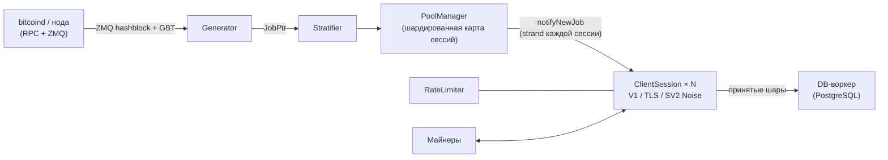

<div align="center">

# mkpool

### Современный мультимонетный движок соло-майнинг-пула, написанный на C++23

Stratum V1 · Stratum V1 поверх TLS · нативный Stratum V2 (с шифрованием Noise) · 9 семейств монет · одна кодовая база

[](COPYING)
[](CMakeLists.txt)
[](#быстрый-старт)
[](#сравнение-возможностей-mkpool-против-ckpool)
[](https://mkpool.com/blog/mkpool-vs-ckpool-benchmark)
[](https://github.com/Mecanik/mkpool/stargazers)

[Действующий пул](https://mkpool.com) · [Отчёт о бенчмарке](https://mkpool.com/blog/mkpool-vs-ckpool-benchmark) · [Быстрый старт](#быстрый-старт) · [Участие в разработке](CONTRIBUTING.md) · [Политика безопасности](SECURITY.md)

[English](README.md) | [简体中文](README.zh-CN.md) | **Русский** | [Español](README.es.md) | [Português (Brasil)](README.pt-BR.md) | [Deutsch](README.de.md) | [Français](README.fr.md) | [日本語](README.ja.md) | [한국어](README.ko.md) | [Türkçe](README.tr.md)

*Этот перевод может иногда отставать от английской версии README.*

</div>

---

**mkpool** представляет собой высокопроизводительный многопоточный движок соло-майнинг-пула. Он поддерживает **Stratum V1**, **Stratum V1 поверх TLS** и нативный **Stratum V2 (с шифрованием Noise)**, а также обслуживает **девять семейств монет** (включая совмещённо добываемый Dogecoin и Zcash на Equihash) из единой кодовой базы. Движок уже сегодня работает в mainnet и обслуживает [mkpool.com](https://mkpool.com); этот README описывает именно развёрнутое состояние.

На идентичном железе mkpool даёт примерно **в 2.8 раза большую пропускную способность по шарам**, **в 3.2 раза меньшую медианную задержку** и **в 16 раз большую устойчивость к переподключениям** по сравнению с ckpool, что подтверждено полностью воспроизводимым open source бенчмарком ([подробности ниже](#бенчмарки-mkpool-против-ckpool)).

## Содержание

- [Почему mkpool?](#почему-mkpool)
- [Бенчмарки: mkpool против ckpool](#бенчмарки-mkpool-против-ckpool)
- [Поддерживаемые монеты](#поддерживаемые-монеты)
- [Сравнение возможностей: mkpool против ckpool](#сравнение-возможностей-mkpool-против-ckpool)
- [Быстрый старт](#быстрый-старт)
- [Управление во время работы (`mkpool-ctl`)](#управление-во-время-работы-mkpool-ctl)
- [Тестирование и защита](#тестирование-и-защита)
- [Архитектура](#архитектура)
- [Рамки проекта](#рамки-проекта)
- [Участие в разработке](#участие-в-разработке)
- [Поддержать проект](#поддержать-проект)
- [Благодарности](#благодарности)
- [Атрибуция и лицензия](#атрибуция-и-лицензия)

## Почему mkpool?

- ⚡ **Быстрый там, где это важно.** ~330k полностью провалидированных шар в секунду на 8-ядерной машине, задержка от отправки шары до подтверждения ниже миллисекунды на всех перцентилях, а штормы переподключений (в духе NiceHash и MiningRigRentals) поглощаются со скоростью ~6,400 полных циклов подключения в секунду.
- 🔐 **Шифрованный Stratum прямо в бинарнике.** TLS (`stratum+ssl://`) и нативный Stratum V2 с Noise-рукопожатием `NX` и подписанными сертификатами authority. Никакого stunnel, никакого внешнего прокси.
- 🪙 **Девять семейств монет, одна кодовая база.** BTC, BCH, BC2, BCH2, XEC, DGB, LTC с совмещённым майнингом DOGE (AuxPoW) и ZEC на Equihash; каждая монета подключается одним конфигурационным файлом.
- 🎯 **Настоящий соло-майнинг.** В качестве имени пользователя майнер указывает свой адрес выплаты; coinbase пересобирается для каждой сессии, поэтому награда за блок уходит прямо в кошелёк нашедшего.
- 🛡️ **Закалён против враждебного трафика.** Ограничение частоты запросов по алгоритму token bucket, автобан за флуд невалидными шарами, чёрный список в памяти, отклонение устаревших по блоку и дублирующихся шар, а также опубликованный фаззинг-харнесс, который методично бьёт по парсеру Stratum.
- 🔧 **Управляется во время работы.** Многонодовый RPC-failover со сторожевым таймером восстановления основной ноды, повтор отправки блока и JSON-сокет управления (`mkpool-ctl`) для живой статистики, `client.reconnect`, отключения и уровня логирования, плюс перезапуски с минимальным простоем через `SO_REUSEPORT`. Смотрите, кто майнит, и управляйте майнерами без обращения к базе данных и без перезапуска.
- 🧪 **Сделан по инженерным правилам, а не по фольклору.** Модульные тесты, прогоны ASan/TSan/UBSan, дружелюбные к CI сборки на CMake + Ninja и встроенные метрики Prometheus.
- 🏭 **Проверен в продакшене.** Каждая функция из этого репозитория прямо сейчас работает в mainnet на всех девяти цепочках под реальной текучкой арендованного хешрейта.

## Бенчмарки: mkpool против ckpool

Честный, полностью воспроизводимый бенчмарк Stratum на двух идентичных 8-ядерных машинах (Azure `Standard_D8lds_v7`): по одному пулу за раз, один и тот же regtest-узел `bitcoind`, один и тот же генератор нагрузки, фиксированная сложность 1. Каждая отправленная шара полностью валидируется (пересборка coinbase, корень Меркла, 80-байтовый заголовок, двойной SHA-256) до того, как пул отвечает, и причины отклонения подтверждают это с обеих сторон.

| Сценарий | mkpool | ckpool | Перевес |
| --- | --- | --- | --- |
| Устойчивый поток провалидированных шар/с (от 128 до 2,048 подключений) | от ~315k до 337k | от ~108k до 118k | **~2.8x** |
| Медианная задержка от отправки до подтверждения (100 подключений, лёгкая нагрузка) | 116 µs | 371 µs | **~3.2x ниже** |
| Задержка на 99-м перцентиле | 602 µs | 814 µs | ниже на каждом перцентиле |
| Циклы переподключения/с (200 параллельных циклов connect-subscribe-authorize-submit-close) | ~6,391 (4 ошибки) | ~402 (1,000+ ошибок) | **~16x** |
| Резидентная память при 2k / 4k / 8k простаивающих подключениях | 66 / 108 / 197 MiB | 25 / 39 / 68 MiB | **ckpool ~2.7x экономнее** |

Выигрыш ckpool по памяти опубликован ровно так, как был измерен: его компактный след на C является настоящим инженерным достижением, а цена более тяжёлой модели буферизации и потоков mkpool на каждое подключение вполне реальна. Всё остальное осталось за mkpool, и соотношения почти не меняются с ростом нагрузки.

- 📊 [Полный разбор с методологией и графиками](https://mkpool.com/blog/mkpool-vs-ckpool-benchmark)
- 📄 [Тот самый самодостаточный HTML-отчёт](https://mkpool.com/benchmarks/mkpool-vs-ckpool.html)
- 🔁 [Воспроизведите сами: комплект для бенчмарка (генератор нагрузки, оркестратор, конфиги)](https://github.com/Mecanik/mkpool-vs-ckpool-benchmark)

> **Совет тем, кто бенчмаркает mkpool самостоятельно:** используйте настоящий валидный адрес выплаты в качестве имени пользователя Stratum. mkpool валидирует адреса локально в момент authorize и сразу отклоняет невалидные имена пользователей, из-за чего измеряемая работа была бы несправедливо пропущена.

## Поддерживаемые монеты

| Монета | Тикер | Алгоритм | Примечания |
| --- | --- | --- | --- |
| Bitcoin | BTC | SHA-256d | V1, TLS, SV2 |
| Bitcoin Cash | BCH | SHA-256d | CashAddr, V1/TLS/SV2 |
| BitcoinII | BC2 | SHA-256d | V1/TLS/SV2 |
| Bitcoin Cash II | BCH2 | SHA-256d | CashAddr, V1/TLS/SV2 |
| eCash | XEC | SHA-256d | предконсенсус Avalanche, SV2 |
| DigiByte | DGB | SHA-256d | V1/TLS/SV2 |
| Litecoin | LTC | Scrypt | совмещённый майнинг DOGE |
| Dogecoin | DOGE | Scrypt (AuxPoW) | добывается совместно с LTC |
| Zcash | ZEC | Equihash 200,9 | `mining.set_target`, субсидия Blossom |

## Сравнение возможностей: mkpool против ckpool

Обозначения: ✅ поддерживается · ⚠️ частично / с оговорками · ❌ не поддерживается

### Протоколы и шифрование

| Возможность | mkpool | ckpool |
| --- | :---: | :---: |
| Stratum V1 (`mining.*`) | ✅ | ✅ |
| Stratum V1 поверх **TLS** (`stratum+ssl://`) | ✅ встроенный вариант `any_stream`, перезагрузка сертификатов по SIGHUP | ❌ |
| Нативный **Stratum V2** (Noise-рукопожатие `NX`, шифрование) | ✅ режим полных блоков, собирает комиссии | ❌ |
| Секретный ключ authority SV2 / подписанные сертификаты | ✅ | ❌ |
| Переключатель SV2 пустой блок / полный блок (`v2EmptyBlocks`) | ✅ | ❌ |
| BIP310 `mining.configure` (согласование version-rolling) | ✅ | ✅ |
| ASICBoost / маска версии (`version_mask`) | ✅ с валидацией (BIP310) | ✅ |
| Расширение `subscribe-extranonce` | ✅ | ✅ |
| Предлагаемая сложность (`mining.suggest_difficulty`, `d=` в пароле) | ✅ с ограничением по монете | ✅ |

### Монеты, алгоритмы и совмещённый майнинг

| Возможность | mkpool | ckpool |
| --- | :---: | :---: |
| Bitcoin (BTC, SHA-256d) | ✅ | ✅ |
| Bitcoin Cash (BCH, SHA-256d, CashAddr) | ✅ | ❌ |
| BitcoinII (BC2, SHA-256d) | ✅ | ❌ |
| Bitcoin Cash II (BCH2, SHA-256d, CashAddr) | ✅ | ❌ |
| eCash (XEC, SHA-256d + предконсенсус Avalanche) | ✅ | ❌ |
| DigiByte (DGB, SHA-256d) | ✅ | ❌ |
| Litecoin (LTC, Scrypt) | ✅ | ❌ |
| **Dogecoin совмещённо с LTC** (AuxPoW) | ✅ родительские + aux-блоки | ❌ |
| Zcash (ZEC, Equihash 200,9, `mining.set_target`) | ✅ | ❌ |
| Единая кодовая база, конфиг на каждую монету | ✅ 9 семейств | ❌ только Bitcoin |
| Валидация шар Equihash (внутри процесса) | ✅ `equihash.hpp` + модульный тест | ❌ |
| Субсидия / халвинг с учётом Blossom (ZEC) | ✅ | ❌ |

### Движок пула и архитектура

| Возможность | mkpool | ckpool |
| --- | :---: | :---: |
| Язык / стандарт | C++23 | C |
| Модель конкурентности | Один процесс, пул асинхронных воркеров `io_context` (`std::jthread`) | Несколько процессов (fork) + потоки, IPC через Unix-сокеты |
| Сеть | Boost.Asio / Beast, strand на каждую сессию | Самописный epoll + Unix-сокеты |
| Карта сессий | Шардированная (по умолчанию 64 шарда), рассылка с низкой конкуренцией за блокировки | Хеш-таблицы (uthash) |
| Путь записи на сессию | Привязанный к strand `WriteQueue` + водяной знак 1 MiB (никаких гонок `async_write`) | Буферы отправки на epoll |
| Окно заданий | Скользящий буфер `JobWindow` (по умолчанию 32 задания) с ключом `job_id` | Список workbase |
| Новая работа при смене блока | ✅ полный набор транзакций, по событию ZMQ, без пустой работы | ✅ |
| Периодическая ретрансляция задания (keepalive для строгих клиентов) | ✅ каждые 30 с, сбрасывается на реальных блоках | ✅ |
| Уведомления ZMQ о хеше блока | ✅ исправлен баг edge-trigger | ✅ (опционально) |
| Failover `bitcoind` (несколько локальных или удалённых нод) | ✅ упорядоченные `rpcFallbacks` + сторожевой таймер восстановления основной ноды каждые 30 с | ✅ |
| Повтор отправки блока при сбое транспорта | ✅ повторяет только когда нода не ответила, но никогда при реальном результате | ✅ (до 5 раз) |
| Избыточное распространение блоков (дополнительные ноды для отправки) | ✅ `additionalSubmitEndpoints`, fire-and-forget, никогда не блокирует основную отправку | ⚠️ через режим node |
| Соло-coinbase (адрес майнера = имя пользователя) | ✅ пересборка coinbase2 на сессию | ✅ (режим BTCSOLO) |
| Комиссия оператора / донат из coinbase | ✅ настраиваемый %, включая разбиение aux/DOGE | ✅ по умолчанию 0.5% |
| Собственная подпись в coinbase | ✅ настраивается | ✅ настраивается |
| Режим прокси | ✅ TLS uplink; multi-upstream hot-standby + active/active | ✅ |
| Режимы passthrough / node / redirector | ✅ all three (mkpool-native TLS cluster protocol; node adds local block submit; health/latency-aware redirector) | ✅ |
| Перезапуск с минимальным простоем | ✅ развёртывание без простоя: переключение 2 слотов (`SO_REUSEPORT` + поэтапный `client.reconnect`) | ✅ передача сокетов |

### Сложность и обработка шар

| Возможность | mkpool | ckpool |
| --- | :---: | :---: |
| Vardiff (EMA / затухающее среднее) | ✅ точная переимплементация `decay_time`/`time_bias` из ckpool | ✅ (оригинал) |
| Диапазоны vardiff на каждую монету | ✅ (например, BTC/BCH/BC2/BCH2/DGB/XEC `[1024, 1M]`, ZEC `[8192, 524288]`) | ⚠️ единственная пара `mindiff`/`maxdiff` |
| Уровни с фиксированной сложностью (по одному TCP-порту на каждый) | ✅ например, порты 10M / 50M / 100M | ⚠️ через отдельные инстансы |
| Пользовательский `d=` с ограничением (1024-10M) | ✅ | ⚠️ |
| Отклонение шар, устаревших по блоку | ✅ prevhash сверяется с текущей вершиной цепи | ✅ |
| Отклонение дублирующихся шар | ✅ dedupe-набор в памяти, очищается на каждом блоке | ✅ |
| Валидация ntime (совместимая с BIP113) | ✅ `utils::valid_ntime` | ✅ |
| Значение coinbase в `int64_t` (защита от переполнения) | ✅ по всему пути | ✅ |
| Локальная валидация адресов (без RPC на каждый authorize) | ✅ декодеры BIP173/BIP350/base58/CashAddr | ⚠️ полагается на bitcoind |

### Безопасность и эксплуатация

| Возможность | mkpool | ckpool |
| --- | :---: | :---: |
| Ограничение частоты по IP (token bucket) | ✅ | ⚠️ |
| Автобан за чрезмерное число невалидных шар | ✅ | ⚠️ |
| Чёрный список IP в памяти | ✅ | ⚠️ |
| Наблюдаемость обрывов подключений (лог на каждый дисконнект) | ✅ причина/воркер/время жизни/шары | ⚠️ |
| Сокет управления / администрирования во время работы | ✅ `mkpool-ctl` (21 JSON-команда) | ✅ `ckpmsg` |
| `client.reconnect` (перемещение майнеров без отключения со стороны оператора) | ✅ широковещательно или по клиенту, через сокет управления | ✅ |
| Внутрипроцессная статистика через сокет (хешрейт 1m/5m, лучшая шара раунда, секунды простоя) | ✅ по майнеру / воркеру / пользователю / пулу, вычисляется по запросу из vardiff (без обращения к БД) | ✅ |
| Обнаружение простаивающих / мёртвых воркеров + опциональная очистка | ✅ опциональный `idleDropSeconds` | ✅ |
| Устойчивость базы данных (автопереподключение + повторная постановка в очередь без потерь) | ✅ | n/a (нет БД) |
| Эндпоинт метрик Prometheus | ✅ опционально (`MKPOOL_ENABLE_METRICS`) | ❌ |
| Сборки с санитайзерами (ASan / TSan / UBSan) | ✅ опции CMake + `scripts/run_sanitizers.sh` | ❌ |
| Модульные тесты (Catch2 / в стиле Catch) | ✅ меркл, vardiff, адреса, SV2 noise и т.д. | ❌ |
| Фаззинг-харнесс для Stratum | ✅ `scripts/fuzz_*.sh` (7 категорий злоупотреблений, проверки выживания демона) | ❌ |
| Система сборки | CMake + Ninja | autotools (`./configure && make`) |
| Платформа | Linux (Ubuntu 24.04+) | Linux |
| Внешние зависимости | Boost, OpenSSL, libpq/pqxx, libzmq, libsodium | Минимальные (glibc, yasm, опционально zmq) |

## Быстрый старт

### 1. Сборка (Ubuntu 24.04+)

```bash
# системные зависимости
sudo apt update
sudo apt install -y build-essential cmake ninja-build pkg-config git \
    libboost-system-dev libboost-thread-dev libboost-program-options-dev \
    libssl-dev libpq-dev libpqxx-dev libzmq3-dev cppzmq-dev libsodium-dev libsecp256k1-dev

# клонирование + конфигурирование + сборка (C++23)
git clone https://github.com/Mecanik/mkpool.git && cd mkpool
cmake -S . -B build -GNinja -DCMAKE_BUILD_TYPE=RelWithDebInfo
cmake --build build -j
```

<details>
<summary><b>Опции CMake</b></summary>

| Опция | По умолчанию | Описание |
| --- | --- | --- |
| `MKPOOL_BUILD_TESTS` | `ON` | Модульные тесты Catch2 |
| `MKPOOL_ENABLE_LTO` | `ON` | Оптимизация на этапе компоновки (LTO) |
| `MKPOOL_ENABLE_TLS` | `ON` | Поддержка TLS-контекста OpenSSL |
| `MKPOOL_ENABLE_METRICS` | `ON` | Экспортёр Prometheus |
| `MKPOOL_ENABLE_ASAN` | `OFF` | AddressSanitizer |
| `MKPOOL_ENABLE_TSAN` | `OFF` | ThreadSanitizer |
| `MKPOOL_ENABLE_UBSAN` | `OFF` | UndefinedBehaviorSanitizer |
| `MKPOOL_ENABLE_NATIVE` | `OFF` | `-march=native` |

</details>

### 2. Настройка

Вам понадобятся синхронизированная нода монеты (с включёнными ZMQ-уведомлениями о блоках) и доступный инстанс PostgreSQL.

```bash
cp config.json.example config.json
# затем отредактируйте config.json:
#  - хост и учётные данные RPC для демонов ваших монет
#  - учётные данные PostgreSQL
#  - ВАШИ адреса для донатов/выплат (никогда не оставляйте заглушки)
#  - уровни/порты stratum, диапазоны vardiff, опциональные пути к TLS-сертификатам, опциональный порт SV2
```

[`config.json.example`](config.json.example) документирует каждое поле, которое понимает загрузчик, включая уровни с фиксированной сложностью, TLS-уровни (`"tls": true`), настройки Stratum V2 и совмещённый майнинг LTC+DOGE (блок `aux`).

### 3. Запуск

```bash
./build/mkpool --config config.json
```

Запущенный пул, в зависимости от конфигурации, открывает:

- **Stratum V1:** уровни vardiff и фиксированной сложности, по одному порту на каждый (например, `3331` для vardiff, `3335` для фиксированных 10M).
- **Stratum поверх TLS:** любой уровень с `"tls": true` говорит по `stratum+ssl://` на своём порту.
- **Stratum V2 (Noise):** порт `stratumV2Port` (например, BTC `3340`).
- **Метрики Prometheus:** `metricsListenPort` (по умолчанию `9090`) при сборке с метриками.

Майнеры подключаются, указывая **адрес выплаты в качестве имени пользователя**; награда за блок уходит прямо на этот адрес.

## Управление во время работы (`mkpool-ctl`)

Каждый инстанс открывает приватный Unix-сокет управления (по умолчанию `/run/mkpool/<инстанс>.sock`; переопределите через `controlSocket` или задайте `"off"`, чтобы отключить). Запрашивайте состояние и управляйте работающим пулом с помощью прилагаемого [`scripts/mkpool-ctl.py`](scripts/mkpool-ctl.py) (ниже обозначен как `mkpool-ctl`), без перезапуска и без обращения к базе данных:

```bash
mkpool-ctl -i btc-mainnet stats          # аптайм, подключения, хешрейт пула, шаблон + лучшая шара по монете
mkpool-ctl -i btc-mainnet clients        # каждое подключение: IP, воркер, сложность, хешрейт, секунды простоя
mkpool-ctl -i btc-mainnet workers        # агрегировано по address.worker
mkpool-ctl -i btc-mainnet users          # агрегировано по адресу выплаты
mkpool-ctl -i btc-mainnet getclient 42   # одно подключение подробно
mkpool-ctl -i btc-mainnet reconnect      # client.reconnect каждому майнеру (например, перед обслуживанием)
mkpool-ctl -i btc-mainnet dropclient 42  # отключить одного майнера
mkpool-ctl -i btc-mainnet loglevel debug # изменить уровень логирования на лету
mkpool-ctl -i btc-mainnet healthcheck    # свежесть шаблона по монете
mkpool-ctl -i btc-mainnet help           # полный список команд
```

Полный набор команд: `ping`, `help`, `version`, `uptime`, `stats`, `clients`, `workers`, `users`, `getclient`, `getuser`, `getworker`, `userclients`, `workerclients`, `loglevel`, `reconnect`, `reconnclient`, `dropclient`, `dropall`, `resetshares`, `blacklistreload`, `healthcheck`. Каждый ответ приходит в JSON. Хешрейт, лучшая шара раунда и время простоя поддерживаются внутри процесса (выводятся из частоты шар, которую vardiff и так отслеживает) и читаются по запросу, поэтому вывод 50k воркеров ничего не стоит, пока вы его не запросите. Сокет создаётся с правами `0600` (только владелец); при одном процессе на монету под systemd у каждой монеты свой сокет.

## Тестирование и защита

### Модульные тесты

```bash
cd build
ctest --output-on-failure -j
```

### Прогоны с санитайзерами

`scripts/run_sanitizers.sh` собирает модульные тесты под AddressSanitizer, UndefinedBehaviorSanitizer и ThreadSanitizer в одноразовом каталоге `.san/` (ваш обычный `build/` остаётся нетронутым) и сообщает обо всех находках.

```bash
./scripts/run_sanitizers.sh            # asan+ubsan и tsan
./scripts/run_sanitizers.sh asan       # один вариант
./scripts/run_sanitizers.sh --fuzz     # плюс фаззинг инстанса, собранного с санитайзером
```

### Фаззинг парсера Stratum

`scripts/fuzz_*.sh` обрушивают на работающий пул искажённый и злонамеренный Stratum-трафик и проверяют, что он выживает (тот же PID до и после) без единого исключения в обработчиках. Направьте их на локальный инстанс:

```bash
# быстрая серия искажённых фреймов
HOST=127.0.0.1 PORT=3331 ./scripts/fuzz_stratum.sh

# полный набор: искажённый JSON, злоупотребление протоколом, спам шарами, злоупотребление авторизацией,
# slowloris, злоупотребление version-rolling, бинарный шум
HOST=127.0.0.1 PORT=3331 ./scripts/fuzz_suite.sh
```

## Архитектура



- `IoPool` запускает N рабочих `io_context` (по умолчанию = `hardware_concurrency()`).
- Каждая `ClientSession` живёт на одном рабочем `io_context` через strand из Asio; тип сокета (обычный / TLS / SV2 Noise) абстрагирован за `any_stream`, и все записи идут через привязанный к strand `WriteQueue`.
- `PoolManager` на каждом `JobPtr` обходит шарды и отправляет `notifyNewJob` в strand каждой сессии.
- `Generator` каждые 30 секунд ретранслирует текущее задание в качестве keepalive (с `clean_jobs=false`, поэтому никакая работа не выбрасывается), что не даёт строгим клиентам, таким как прокси маркетплейсов аренды и контроллеры ферм, отключаться по простою между блоками.

## Рамки проекта

Этот репозиторий содержит **движок пула**, опубликованный ради прозрачности. Операционная обвязка вокруг него в продакшене (сервис базы данных и аналитики, публичный REST API и сайт) **не** входит в этот открытый релиз.

mkpool является оригинальной кодовой базой. Асинхронный движок на C++, мультимонетная поддержка, стек Stratum V2 (Noise) и TLS, построение соло-coinbase для каждого майнера и инструментарий безопасности написаны с нуля. Единственный компонент, намеренно заимствованный из [ckpool](https://bitbucket.org/ckolivas/ckpool) (GPLv3 C-пула от Con Kolivas), это **математика ретаргета переменной сложности**: небольшая, снабжённая атрибуцией переимплементация давно проверенного алгоритма (см. [Атрибуция и лицензия](#атрибуция-и-лицензия)).

## Участие в разработке

Вклад приветствуется: отчёты об ошибках, пограничные случаи протокола, новые семейства монет, работа над производительностью, документация и переводы этого README.

- Прочитайте [CONTRIBUTING.md](CONTRIBUTING.md), прежде чем открывать PR.
- Проблемы безопасности: пожалуйста, следуйте [SECURITY.md](SECURITY.md) вместо открытия публичного issue.
- Если mkpool вам полезен, **звезда репозиторию** действительно помогает проекту быть замеченным. ⭐

## Поддержать проект

mkpool бесплатен и открыт. За использование кода нет никакой платы, и в нём нет встроенного отчисления в пользу автора. Если проект был вам полезен и вы хотите поддержать его развитие, можете отправить чаевые сюда. Это полностью добровольно и очень ценится.

**BTC:** `bc1qlugz6as6x3n03c6x8zddpnmypsaucdmh3lc5z0`

## Благодарности

mkpool построен поверх множества превосходных open source проектов. Искренняя благодарность мейнтейнерам и контрибьюторам каждого проекта из списка ниже. Без них этого пула бы не существовало.

| Библиотека | Лицензия | Используется для |
| --- | --- | --- |
| [Boost](https://www.boost.org/) (Asio / Beast) | BSL-1.0 | Асинхронная сеть, strand'ы, HTTP-клиент для RPC |
| [OpenSSL](https://www.openssl.org/) | Apache-2.0 | TLS, SHA-256 |
| [fmt](https://github.com/fmtlib/fmt) | MIT | Форматирование Stratum на горячем пути |
| [spdlog](https://github.com/gabime/spdlog) | MIT | Логирование |
| [nlohmann/json](https://github.com/nlohmann/json) | MIT | JSON конфигурации и RPC |
| [cxxopts](https://github.com/jarro2783/cxxopts) | MIT | Разбор командной строки |
| [libpqxx](https://github.com/jtv/libpqxx) / [libpq](https://www.postgresql.org/) | BSD-3-Clause / PostgreSQL | Доступ к базе данных |
| [ZeroMQ](https://zeromq.org/) (libzmq + биндинг [cppzmq](https://github.com/zeromq/cppzmq)) | MPL-2.0 / MIT | Уведомления о хешах блоков |
| [libsodium](https://libsodium.org/) | ISC | Криптография Noise для Stratum V2 |
| [libsecp256k1](https://github.com/bitcoin-core/secp256k1) | MIT | EC-ключи / подписи (SV2) |
| [Catch2](https://github.com/catchorg/Catch2) | BSL-1.0 | Модульные тесты |
| [prometheus-cpp](https://github.com/jupp0r/prometheus-cpp) | MIT | Опциональный эндпоинт метрик |

Все они распространяются под лицензиями, совместимыми с GPLv3. mkpool не вендорит (не копирует) их исходники; они линкуются из пакетного менеджера вашей системы или скачиваются CMake во время сборки. Если вы распространяете **скомпилированный** бинарник mkpool, приложите к нему файл `THIRD-PARTY-NOTICES`, воспроизводящий тексты авторских прав и лицензий этих проектов.

## Атрибуция и лицензия

mkpool является **оригинальным программным обеспечением**, © 2025-2026 Mecanik1337 (<contact@mecanik.dev>), под лицензией **GNU General Public License v3.0** (`GPL-3.0`). Каждый исходный файл несёт полный заголовок GPLv3.

Почти вся кодовая база (асинхронный движок, мультимонетная поддержка, Stratum V2 (Noise) и TLS, построение соло-coinbase и инструментарий безопасности) написана с нуля и ничем не обязана ckpool, кроме того, что это программа того же класса.

Единственное исключение, раскрытое ради честности и соблюдения лицензии: **математика ретаргета** переменной сложности в [`vardiff.cpp`](src/vardiff.cpp) / [`vardiff.hpp`](src/vardiff.hpp) переимплементирует `decay_time()` (`src/libckpool.c`) и `time_bias()` / `add_submit()` (`src/stratifier.c`) из ckpool за авторством **Con Kolivas** (также GPLv3). Это единственная часть, адаптированная из ckpool; ни один C-файл из ckpool не вендорится и не копируется дословно, а несколько соглашений о полях Stratum (например, 4-байтовый extranonce1) просто следуют общепринятой практике. Имена команд сокета управления во время работы (`stats`, `clients`, `workers`, `reconnect`, …) повторяют команды ckpool, чтобы быть привычными операторам, но диспетчеризация, формат JSON и реализация полностью оригинальны. Всё это атрибутировано прямо в коде. Поскольку mkpool распространяется под GPLv3, такое переиспользование полностью разрешено; если вы распространяете mkpool, оставляйте его под GPLv3, сохраняйте эти атрибуции и прикладывайте полный текст лицензии ([`COPYING`](COPYING)).

ckpool: <https://bitbucket.org/ckolivas/ckpool>, © 2014-2026 Con Kolivas.

---

<div align="center">

**[⬆ наверх](#mkpool)**

Если вы запускаете mkpool, находите с его помощью блок или вам просто нравится инженерия, [звезда](https://github.com/Mecanik/mkpool/stargazers) остаётся самым простым способом поддержать проект.

</div>
