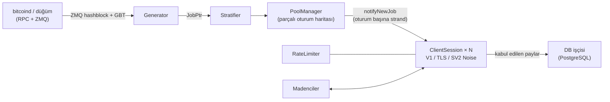

<div align="center">

# mkpool

### C++23 ile yazılmış modern, çok coinli solo madencilik havuzu motoru

Stratum V1 · Stratum V1 over TLS · yerel Stratum V2 (Noise şifreli) · 9 coin ailesi · tek kod tabanı

[](COPYING)
[](CMakeLists.txt)
[](#hızlı-başlangıç)
[](#özellik-karşılaştırması-mkpool-vs-ckpool)
[](https://mkpool.com/blog/mkpool-vs-ckpool-benchmark)
[](https://github.com/Mecanik/mkpool/stargazers)

[Canlı havuz](https://mkpool.com) · [Benchmark raporu](https://mkpool.com/blog/mkpool-vs-ckpool-benchmark) · [Hızlı başlangıç](#hızlı-başlangıç) · [Katkıda bulunma](CONTRIBUTING.md) · [Güvenlik politikası](SECURITY.md)

[English](README.md) | [简体中文](README.zh-CN.md) | [Русский](README.ru.md) | [Español](README.es.md) | [Português (Brasil)](README.pt-BR.md) | [Deutsch](README.de.md) | [Français](README.fr.md) | [日本語](README.ja.md) | [한국어](README.ko.md) | **Türkçe**

*Bu çeviri zaman zaman İngilizce README'nin gerisinde kalabilir.*

</div>

---

**mkpool**, yüksek performanslı, çok iş parçacıklı bir solo madencilik havuzu motorudur. **Stratum V1**, **Stratum V1 over TLS** ve yerel **Stratum V2 (Noise şifreli)** protokollerini konuşur; tek bir kod tabanından **dokuz coin ailesini** (birleşik madencilikle kazılan Dogecoin ve Equihash tabanlı Zcash dahil) çalıştırır. Bugün mainnet üzerinde canlıdır ve [mkpool.com](https://mkpool.com)'u çalıştırır; bu README, sahada dağıtılmış durumu yansıtır.

Aynı donanım üzerinde mkpool, ckpool'a kıyasla yaklaşık **2.8x pay (share) işleme kapasitesi**, **3.2x daha düşük medyan gecikme** ve **16x yeniden bağlanma kapasitesi** sunar; bunların tümü, tamamen yeniden üretilebilir açık kaynaklı bir benchmark ile ölçülmüştür ([ayrıntılar aşağıda](#benchmarklar-mkpool-vs-ckpool)).

## Neler var

- [Neden mkpool?](#neden-mkpool)
- [Benchmarklar: mkpool vs ckpool](#benchmarklar-mkpool-vs-ckpool)
- [Desteklenen coinler](#desteklenen-coinler)
- [Özellik karşılaştırması: mkpool vs ckpool](#özellik-karşılaştırması-mkpool-vs-ckpool)
- [Hızlı başlangıç](#hızlı-başlangıç)
- [Çalışma zamanı denetimi (`mkpool-ctl`)](#çalışma-zamanı-denetimi-mkpool-ctl)
- [Test ve sağlamlaştırma](#test-ve-sağlamlaştırma)
- [Mimari](#mimari)
- [Proje kapsamı](#proje-kapsamı)
- [Katkıda bulunma](#katkıda-bulunma)
- [Projeye destek olun](#projeye-destek-olun)
- [Teşekkürler](#teşekkürler)
- [Atıf ve lisans](#atıf-ve-lisans)

## Neden mkpool?

- ⚡ **Önemli olan yerde hızlı.** 8 çekirdekli bir makinede saniyede ~330k tam doğrulanmış pay, her yüzdelik dilimde milisaniyenin altında submit-to-ack süresi ve saniyede ~6,400 tam bağlantı döngüsüyle soğurulan yeniden bağlanma fırtınaları (NiceHash, MiningRigRentals tarzı).
- 🔐 **Şifreli Stratum, doğrudan binary içinde.** TLS (`stratum+ssl://`) ve Noise `NX` el sıkışması ile imzalı otorite sertifikaları kullanan yerel Stratum V2. stunnel yok, harici proxy yok.
- 🪙 **Dokuz coin ailesi, tek kod tabanı.** BTC, BCH, BC2, BCH2, XEC, DGB, birleşik madencilikle DOGE kazan LTC (AuxPoW) ve Equihash ZEC; her biri yalnızca bir yapılandırma dosyası uzağınızda.
- 🎯 **Gerçek solo madencilik.** Madencinin kullanıcı adı, ödeme adresidir; coinbase her oturum için yeniden inşa edilir, böylece blok ödülleri doğrudan bloğu bulanın cüzdanına gider.
- 🛡️ **Düşmanca trafiğe karşı sağlamlaştırılmış.** Token-bucket hız sınırlama, geçersiz pay sellerine karşı otomatik yasaklama, bellek içi kara liste, bloğa göre bayat (stale) ve yinelenen pay reddi ve Stratum ayrıştırıcısını hırpalayan, yayımlanmış bir fuzzing altyapısı.
- 🔧 **Çalışma zamanında yönetilebilir.** Birincil düğüm kurtarma bekçisiyle çok düğümlü RPC yük devretme, blok gönderiminde yeniden deneme ve canlı istatistikler, `client.reconnect`, bağlantı kesme ve log seviyesi için bir JSON denetim soketi (`mkpool-ctl`), ayrıca `SO_REUSEPORT` ile düşük kesintili yeniden başlatmalar. Kimin madencilik yaptığını görün ve madencileri veritabanına gidip gelmeden veya yeniden başlatmadan yönetin.
- 🧪 **Kulaktan dolma değil, mühendislik ürünü.** Birim testleri, ASan/TSan/UBSan taramaları, CI dostu CMake + Ninja derlemeleri ve yerleşik Prometheus metrikleri.
- 🏭 **Üretimde kanıtlanmış.** Bu depodaki her özellik şu anda mainnet üzerinde, dokuz zincirin tamamında, gerçek kiralık hashrate dalgalanması altında çalışıyor.

## Benchmarklar: mkpool vs ckpool

İki özdeş 8 çekirdekli makinede (Azure `Standard_D8lds_v7`), her seferinde tek havuz, aynı `bitcoind` regtest düğümü, aynı yük üreteci ve sabit zorluk 1 ile yürütülen adil, tamamen yeniden üretilebilir bir Stratum benchmark'ı. Gönderilen her pay, havuz yanıt vermeden önce eksiksiz doğrulanır (coinbase yeniden inşası, merkle kökü, 80 baytlık başlık, çift SHA-256) ve reddetme nedenleri bunu her iki tarafta da kanıtlar.

| Senaryo | mkpool | ckpool | Fark |
| --- | --- | --- | --- |
| Sürekli doğrulanmış pay/s (128 ila 2,048 bağlantı) | ~315k ila 337k | ~108k ila 118k | **~2.8x** |
| Medyan submit-to-ack gecikmesi (100 bağlantı, hafif yük) | 116 µs | 371 µs | **~3.2x daha düşük** |
| 99. yüzdelik gecikme | 602 µs | 814 µs | her yüzdelik dilimde daha düşük |
| Yeniden bağlanma döngüsü/s (200 paralel connect-subscribe-authorize-submit-close döngüsü) | ~6,391 (4 hata) | ~402 (1,000+ hata) | **~16x** |
| 2k / 4k / 8k boşta bağlantıda yerleşik bellek | 66 / 108 / 197 MiB | 25 / 39 / 68 MiB | **ckpool ~2.7x daha yalın** |

ckpool'un bellek üstünlüğü tam olarak ölçüldüğü haliyle yayımlanmıştır: sıkı C ayak izi gerçek bir mühendislik başarısıdır ve mkpool'un bağlantı başına daha ağır tamponlama ve iş parçacığı modelinin getirdiği ödünleşim gerçektir. Geri kalan her başlık mkpool'a gitti ve oranlar yük arttıkça neredeyse hiç kıpırdamıyor.

- 📊 [Yöntem ve grafiklerle birlikte tam yazı](https://mkpool.com/blog/mkpool-vs-ckpool-benchmark)
- 📄 [Bire bir, kendi kendine yeten HTML raporu](https://mkpool.com/benchmarks/mkpool-vs-ckpool.html)
- 🔁 [Kendiniz yeniden üretin: benchmark kiti (yük üreteci, orkestratör, yapılandırmalar)](https://github.com/Mecanik/mkpool-vs-ckpool-benchmark)

> **mkpool'u kendiniz benchmark ederken bir ipucu:** Stratum kullanıcı adı olarak gerçek, geçerli bir ödeme adresi kullanın. mkpool, adresleri authorize anında yerel olarak doğrular ve geçersiz kullanıcı adlarını erken aşamada reddeder; bu da ölçülmek istenen işin haksız biçimde atlanmasına yol açar.

## Desteklenen coinler

| Coin | Sembol | Algoritma | Notlar |
| --- | --- | --- | --- |
| Bitcoin | BTC | SHA-256d | V1, TLS, SV2 |
| Bitcoin Cash | BCH | SHA-256d | CashAddr, V1/TLS/SV2 |
| BitcoinII | BC2 | SHA-256d | V1/TLS/SV2 |
| Bitcoin Cash II | BCH2 | SHA-256d | CashAddr, V1/TLS/SV2 |
| eCash | XEC | SHA-256d | Avalanche pre-consensus, SV2 |
| DigiByte | DGB | SHA-256d | V1/TLS/SV2 |
| Litecoin | LTC | Scrypt | DOGE ile birleşik madencilik |
| Dogecoin | DOGE | Scrypt (AuxPoW) | LTC üzerinde birleşik kazılır |
| Zcash | ZEC | Equihash 200,9 | `mining.set_target`, Blossom sübvansiyonu |

## Özellik karşılaştırması: mkpool vs ckpool

Açıklama: ✅ destekleniyor · ⚠️ kısmi / koşullu · ❌ desteklenmiyor

### Protokoller ve şifreleme

| Özellik | mkpool | ckpool |
| --- | :---: | :---: |
| Stratum V1 (`mining.*`) | ✅ | ✅ |
| **TLS** üzerinden Stratum V1 (`stratum+ssl://`) | ✅ binary içi `any_stream` varyantı, SIGHUP ile sertifika yenileme | ❌ |
| Yerel **Stratum V2** (Noise `NX` el sıkışması, şifreli) | ✅ tam blok modu, ücretleri toplar | ❌ |
| SV2 gizli otorite anahtarı / imzalı sertifikalar | ✅ | ❌ |
| SV2 boş blok / tam blok seçimi (`v2EmptyBlocks`) | ✅ | ❌ |
| BIP310 `mining.configure` (version-rolling pazarlığı) | ✅ | ✅ |
| ASICBoost / version-mask (`version_mask`) | ✅ doğrulanmış (BIP310) | ✅ |
| `subscribe-extranonce` uzantısı | ✅ | ✅ |
| Önerilen zorluk (`mining.suggest_difficulty`, parolada `d=`) | ✅ coin başına sınırlandırılmış | ✅ |

### Coinler, algoritmalar ve birleşik madencilik

| Özellik | mkpool | ckpool |
| --- | :---: | :---: |
| Bitcoin (BTC, SHA-256d) | ✅ | ✅ |
| Bitcoin Cash (BCH, SHA-256d, CashAddr) | ✅ | ❌ |
| BitcoinII (BC2, SHA-256d) | ✅ | ❌ |
| Bitcoin Cash II (BCH2, SHA-256d, CashAddr) | ✅ | ❌ |
| eCash (XEC, SHA-256d + Avalanche pre-consensus) | ✅ | ❌ |
| DigiByte (DGB, SHA-256d) | ✅ | ❌ |
| Litecoin (LTC, Scrypt) | ✅ | ❌ |
| **LTC üzerinde birleşik kazılan Dogecoin** (AuxPoW) | ✅ ana (parent) + aux bloklar | ❌ |
| Zcash (ZEC, Equihash 200,9, `mining.set_target`) | ✅ | ❌ |
| Tek kod tabanı, coin başına yapılandırma | ✅ 9 aile | ❌ yalnızca Bitcoin |
| Equihash pay doğrulaması (süreç içi) | ✅ `equihash.hpp` + birim testi | ❌ |
| Blossom uyumlu sübvansiyon / yarılanma (ZEC) | ✅ | ❌ |

### Havuz motoru ve mimari

| Özellik | mkpool | ckpool |
| --- | :---: | :---: |
| Dil / standart | C++23 | C |
| Eşzamanlılık modeli | Tek süreç, async `io_context` işçi havuzu (`std::jthread`) | Çok süreçli (fork) + iş parçacıkları, Unix soketi IPC |
| Ağ katmanı | Boost.Asio / Beast, oturum başına strand | Elle yazılmış epoll + Unix soketleri |
| Oturum haritası | Parçalı (varsayılan 64 shard), düşük çekişmeli yayın | Hash tabloları (uthash) |
| Oturum başına yazma yolu | Strand'e bağlı `WriteQueue` + 1 MiB su seviyesi (`async_write` yarışları yok) | epoll güdümlü gönderim tamponları |
| İş penceresi | `job_id` ile anahtarlanan `JobWindow` kayan tamponu (varsayılan 32 iş) | Workbase listesi |
| Blok değişiminde yeni iş | ✅ tam tx kümesi, ZMQ güdümlü, işlemsiz iş üretilmez | ✅ |
| Periyodik iş yeniden yayını (katı istemciler için keepalive) | ✅ 30s, gerçek bloklarda sıfırlanır | ✅ |
| ZMQ blok hash bildirimi | ✅ edge-trigger hatası düzeltildi | ✅ (isteğe bağlı) |
| `bitcoind` yük devretme (yerel veya uzak birden çok düğüm) | ✅ sıralı `rpcFallbacks` + her 30s'de birincil düğüm kurtarma bekçisi | ✅ |
| Taşıma hatasında blok gönderiminde yeniden deneme | ✅ yalnızca düğüm yanıt vermediğinde yeniden gönderir (gerçek bir sonuçta asla) | ✅ (en fazla 5×) |
| Yedekli blok yayılımı (ek gönderim düğümleri) | ✅ `additionalSubmitEndpoints`, fire-and-forget, birincil gönderimi asla engellemez | ⚠️ node modu üzerinden |
| Solo coinbase (madenci adresi = kullanıcı adı) | ✅ oturum başına coinbase2 yeniden inşası | ✅ (BTCSOLO modu) |
| Coinbase'den operatör komisyonu / bağış | ✅ yapılandırılabilir %, aux/DOGE bölüşümü dahil | ✅ varsayılan 0.5% |
| Özel coinbase imzası | ✅ yapılandırılabilir | ✅ yapılandırılabilir |
| Proxy modu | ✅ TLS uplink; multi-upstream hot-standby + active/active | ✅ |
| Passthrough / node / redirector modları | ✅ all three (mkpool-native TLS cluster protocol; node adds local block submit; health/latency-aware redirector) | ✅ |
| Düşük kesintili yeniden başlatma | ✅ kesintisiz dağıtım: 2 yuvalı geçiş (`SO_REUSEPORT` + kademeli `client.reconnect`) | ✅ soket devri |

### Zorluk ve pay yönetimi

| Özellik | mkpool | ckpool |
| --- | :---: | :---: |
| Vardiff (EMA / azalan ortalama) | ✅ ckpool `decay_time`/`time_bias` mantığının birebir yeniden uygulaması | ✅ (orijinal) |
| Coin başına vardiff aralıkları | ✅ (örn. BTC/BCH/BC2/BCH2/DGB/XEC `[1024, 1M]`, ZEC `[8192, 524288]`) | ⚠️ tek `mindiff`/`maxdiff` |
| Sabit zorluk katmanları (her biri ayrı TCP portu) | ✅ örn. 10M / 50M / 100M portları | ⚠️ ayrı örneklerle |
| Özel `d=` sınırı (1024-10M) | ✅ | ⚠️ |
| Bloğa göre bayat pay reddi | ✅ prevhash güncel zincir ucuna göre kontrol edilir | ✅ |
| Yinelenen pay reddi | ✅ bellek içi tekilleştirme kümesi, her blokta temizlenir | ✅ |
| ntime doğrulaması (BIP113 uyumlu) | ✅ `utils::valid_ntime` | ✅ |
| `int64_t` coinbase değeri (taşmaya karşı güvenli) | ✅ uçtan uca | ✅ |
| Yerel adres doğrulaması (authorize başına RPC yok) | ✅ BIP173/BIP350/base58/CashAddr çözücüleri | ⚠️ bitcoind'e bağımlı |

### Güvenlik ve operasyon

| Özellik | mkpool | ckpool |
| --- | :---: | :---: |
| IP başına token-bucket hız sınırlama | ✅ | ⚠️ |
| Aşırı geçersiz pay gönderiminde otomatik yasaklama | ✅ | ⚠️ |
| Bellek içi IP kara listesi | ✅ | ⚠️ |
| Bağlantı kopuşu gözlemlenebilirliği (kopuş başına log) | ✅ neden/işçi/ömür/paylar | ⚠️ |
| Çalışma zamanı denetim / yönetim soketi | ✅ `mkpool-ctl` (21 JSON komutu) | ✅ `ckpmsg` |
| `client.reconnect` (madencileri operatör tarafında bağlantı kesmeden taşıma) | ✅ yayın veya istemci başına, denetim soketi üzerinden | ✅ |
| Soket üzerinden süreç içi istatistikler (hashrate 1m/5m, turun en iyi payı, boşta saniye) | ✅ madenci / işçi / kullanıcı / havuz başına, vardiff'ten istek üzerine hesaplanır (DB erişimi yok) | ✅ |
| Boşta / ölü işçi tespiti + isteğe bağlı temizleme | ✅ isteğe bağlı `idleDropSeconds` | ✅ |
| Veritabanı dayanıklılığı (otomatik yeniden bağlanma + kayıpsız yeniden kuyruklama) | ✅ | n/a (DB yok) |
| Prometheus metrik uç noktası | ✅ isteğe bağlı (`MKPOOL_ENABLE_METRICS`) | ❌ |
| Sanitizer derlemeleri (ASan / TSan / UBSan) | ✅ CMake seçenekleri + `scripts/run_sanitizers.sh` | ❌ |
| Birim testleri (Catch2 / Catch tarzı) | ✅ merkle, vardiff, adres, SV2 noise vb. | ❌ |
| Stratum fuzzing altyapısı | ✅ `scripts/fuzz_*.sh` (7 kötüye kullanım kategorisi, daemon hayatta kalma denetimleri) | ❌ |
| Derleme sistemi | CMake + Ninja | autotools (`./configure && make`) |
| Platform | Linux (Ubuntu 24.04+) | Linux |
| Harici bağımlılıklar | Boost, OpenSSL, libpq/pqxx, libzmq, libsodium | Minimal (glibc, yasm, isteğe bağlı zmq) |

## Hızlı başlangıç

### 1. Derleme (Ubuntu 24.04+)

```bash
# sistem bağımlılıkları
sudo apt update
sudo apt install -y build-essential cmake ninja-build pkg-config git \
    libboost-system-dev libboost-thread-dev libboost-program-options-dev \
    libssl-dev libpq-dev libpqxx-dev libzmq3-dev cppzmq-dev libsodium-dev libsecp256k1-dev

# klonla + yapılandır + derle (C++23)
git clone https://github.com/Mecanik/mkpool.git && cd mkpool
cmake -S . -B build -GNinja -DCMAKE_BUILD_TYPE=RelWithDebInfo
cmake --build build -j
```

<details>
<summary><b>CMake seçenekleri</b></summary>

| Seçenek | Varsayılan | Açıklama |
| --- | --- | --- |
| `MKPOOL_BUILD_TESTS` | `ON` | Catch2 birim testleri |
| `MKPOOL_ENABLE_LTO` | `ON` | Bağlama zamanı optimizasyonu (LTO) |
| `MKPOOL_ENABLE_TLS` | `ON` | OpenSSL TLS bağlamı desteği |
| `MKPOOL_ENABLE_METRICS` | `ON` | Prometheus exposer |
| `MKPOOL_ENABLE_ASAN` | `OFF` | AddressSanitizer |
| `MKPOOL_ENABLE_TSAN` | `OFF` | ThreadSanitizer |
| `MKPOOL_ENABLE_UBSAN` | `OFF` | UndefinedBehaviorSanitizer |
| `MKPOOL_ENABLE_NATIVE` | `OFF` | `-march=native` |

</details>

### 2. Yapılandırma

Senkronize olmuş bir coin düğümüne (ZMQ blok bildirimleri etkin) ve erişilebilir bir PostgreSQL örneğine ihtiyacınız var.

```bash
cp config.json.example config.json
# ardından config.json dosyasını düzenleyin:
#  - coin daemon'larınız için RPC sunucusu/kimlik bilgileri
#  - PostgreSQL kimlik bilgileri
#  - KENDİ bağış/ödeme adresleriniz (yer tutucuları asla olduğu gibi bırakmayın)
#  - stratum katmanları/portları, vardiff aralıkları, isteğe bağlı TLS sertifika yolları, isteğe bağlı SV2 portu
```

[`config.json.example`](config.json.example), sabit zorluk katmanları, TLS katmanları (`"tls": true`), Stratum V2 ayarları ve LTC+DOGE birleşik madenciliği (`aux` bloğu) dahil olmak üzere yükleyicinin anladığı her alanı belgeler.

### 3. Çalıştırma

```bash
./build/mkpool --config config.json
```

Çalışan bir havuz, yapılandırmaya bağlı olarak şunları sunar:

- **Stratum V1:** vardiff ve sabit zorluk katmanları, her biri kendi portunda (örn. `3331` vardiff, `3335` sabit-10M).
- **TLS üzerinden Stratum:** `"tls": true` olan her katman kendi portunda `stratum+ssl://` konuşur.
- **Stratum V2 (Noise):** `stratumV2Port` (örn. BTC `3340`).
- **Prometheus metrikleri:** metrik desteğiyle derlendiğinde `metricsListenPort` (varsayılan `9090`).

Madenciler, kullanıcı adı olarak **ödeme adresleriyle** bağlanır; blok ödülü doğrudan o adrese gider.

## Çalışma zamanı denetimi (`mkpool-ctl`)

Her örnek, özel bir Unix denetim soketi açar (varsayılan `/run/mkpool/<örnek>.sock`; `controlSocket` ile değiştirin veya devre dışı bırakmak için `"off"` yapın). Çalışan bir havuzu, birlikte gelen [`scripts/mkpool-ctl.py`](scripts/mkpool-ctl.py) (aşağıda `mkpool-ctl` olarak gösterilmiştir) ile yeniden başlatmadan ve veritabanına gidip gelmeden sorgulayın ve yönetin:

```bash
mkpool-ctl -i btc-mainnet stats          # çalışma süresi, bağlantılar, havuz hashrate'i, coin başına template + en iyi pay
mkpool-ctl -i btc-mainnet clients        # her bağlantı: IP, işçi, zorluk, hashrate, boşta saniye
mkpool-ctl -i btc-mainnet workers        # address.worker başına toplanmış
mkpool-ctl -i btc-mainnet users          # ödeme adresi başına toplanmış
mkpool-ctl -i btc-mainnet getclient 42   # tek bir bağlantı ayrıntılı
mkpool-ctl -i btc-mainnet reconnect      # her madenciye client.reconnect (örn. bakımdan önce)
mkpool-ctl -i btc-mainnet dropclient 42  # bir madencinin bağlantısını kes
mkpool-ctl -i btc-mainnet loglevel debug # log seviyesini canlı değiştir
mkpool-ctl -i btc-mainnet healthcheck    # coin başına template tazeliği
mkpool-ctl -i btc-mainnet help           # tam komut listesi
```

Tam komut kümesi: `ping`, `help`, `version`, `uptime`, `stats`, `clients`, `workers`, `users`, `getclient`, `getuser`, `getworker`, `userclients`, `workerclients`, `loglevel`, `reconnect`, `reconnclient`, `dropclient`, `dropall`, `resetshares`, `blacklistreload`, `healthcheck`. Her yanıt JSON'dur. Hashrate, turun en iyi payı ve boşta kalma süresi süreç içinde tutulur (vardiff'in zaten izlediği pay hızından türetilir) ve istek üzerine okunur; dolayısıyla 50k işçiyi listelemek, siz isteyene kadar hiçbir maliyet getirmez. Soket `0600` (yalnızca sahip) olarak oluşturulur; systemd altında coin başına tek süreçle her coin kendi soketine sahip olur.

## Test ve sağlamlaştırma

### Birim testleri

```bash
cd build
ctest --output-on-failure -j
```

### Sanitizer taramaları

`scripts/run_sanitizers.sh`, birim testlerini AddressSanitizer, UndefinedBehaviorSanitizer ve ThreadSanitizer altında, kullanılıp atılan bir `.san/` dizininde derler (normal `build/` dizininize dokunulmaz) ve bulguları raporlar.

```bash
./scripts/run_sanitizers.sh            # asan+ubsan ve tsan
./scripts/run_sanitizers.sh asan       # tek bir tür
./scripts/run_sanitizers.sh --fuzz     # ayrıca sanitize edilmiş bir örneği fuzz'la
```

### Stratum ayrıştırıcısını fuzz'lama

`scripts/fuzz_*.sh` betikleri, çalışan bir havuza bozuk ve kötü niyetli Stratum trafiği gönderir ve havuzun hiçbir handler istisnası olmadan hayatta kaldığını (öncesinde ve sonrasında aynı PID) doğrular. Betikleri yerel bir örneğe yöneltin:

```bash
# hızlı bozuk çerçeve bataryası
HOST=127.0.0.1 PORT=3331 ./scripts/fuzz_stratum.sh

# tam paket: bozuk JSON, protokol istismarı, pay spam'i, kimlik doğrulama istismarı,
# slowloris, version-rolling istismarı, ikili gürültü
HOST=127.0.0.1 PORT=3331 ./scripts/fuzz_suite.sh
```

## Mimari



- `IoPool`, N adet işçi `io_context` çalıştırır (varsayılan = `hardware_concurrency()`).
- Her `ClientSession`, bir Asio strand'i aracılığıyla tek bir işçi `io_context` üzerinde yaşar; soket türü (düz / TLS / SV2 Noise) `any_stream` arkasında soyutlanmıştır ve tüm yazmalar strand'e bağlı bir `WriteQueue` üzerinden geçer.
- `PoolManager`, her `JobPtr` geldiğinde shard'ları dolaşır ve `notifyNewJob` çağrısını her oturumun strand'ine gönderir.
- `Generator`, güncel işi keepalive olarak her 30 saniyede bir yeniden yayınlar (`clean_jobs=false` ile, dolayısıyla hiçbir iş çöpe gitmez); bu, kiralama pazarı proxy'leri ve çiftlik denetleyicileri gibi katı istemcilerin bloklar arasında boşta kalıp bağlantıyı kesmesini önler.

## Proje kapsamı

Bu depo, şeffaflık amacıyla yayımlanan **havuz motorudur**. Üretimde onu çevreleyen operasyonel yığın (veritabanı/analitik servisi, herkese açık REST API ve web sitesi) bu açık sürümün parçası **değildir**.

mkpool özgün bir kod tabanıdır. Async C++ motoru, çoklu coin desteği, Stratum V2 (Noise) ve TLS yığını, madenci başına solo coinbase inşası ve güvenlik araçlarının tamamı sıfırdan yazılmıştır. [ckpool](https://bitbucket.org/ckolivas/ckpool)'dan (Con Kolivas'ın GPLv3 lisanslı C havuzu) bilinçli olarak ödünç alınan tek bileşen, **değişken zorluk yeniden hedefleme matematiğidir**: kendini kanıtlamış bir algoritmanın küçük, atıfla belirtilmiş bir yeniden uygulaması (bkz. [Atıf ve lisans](#atıf-ve-lisans)).

## Katkıda bulunma

Katkılara açığız: hata raporları, protokol uç durumları, yeni coin aileleri, performans çalışmaları, dokümantasyon ve bu README'nin çevirileri.

- PR açmadan önce [CONTRIBUTING.md](CONTRIBUTING.md) dosyasını okuyun.
- Güvenlik sorunları: herkese açık bir issue açmak yerine lütfen [SECURITY.md](SECURITY.md) yönergelerini izleyin.
- mkpool işinize yaradıysa, **depoya yıldız vermek** projenin keşfedilmesine gerçekten yardımcı olur. ⭐

## Projeye destek olun

mkpool ücretsiz ve açık kaynaklıdır. Kodu kullanmanın bir ücreti yoktur ve içine gömülü bir bağış kesintisi de bulunmaz. Proje size faydalı olduysa ve geliştirilmesine katkıda bulunmak isterseniz buraya bir bahşiş gönderebilirsiniz. Tamamen isteğe bağlıdır ve çok makbule geçer.

**BTC:** `bc1qlugz6as6x3n03c6x8zddpnmypsaucdmh3lc5z0`

## Teşekkürler

mkpool, pek çok mükemmel açık kaynak çalışmasının üzerine inşa edilmiştir. Aşağıdaki her projenin bakımcılarına ve katkıda bulunanlarına içten teşekkürler. Havuz onlar olmadan var olamazdı.

| Kütüphane | Lisans | Kullanım alanı |
| --- | --- | --- |
| [Boost](https://www.boost.org/) (Asio / Beast) | BSL-1.0 | Async ağ, strand'ler, HTTP RPC istemcisi |
| [OpenSSL](https://www.openssl.org/) | Apache-2.0 | TLS, SHA-256 |
| [fmt](https://github.com/fmtlib/fmt) | MIT | Sıcak yoldaki Stratum biçimlendirmesi |
| [spdlog](https://github.com/gabime/spdlog) | MIT | Loglama |
| [nlohmann/json](https://github.com/nlohmann/json) | MIT | Yapılandırma ve RPC JSON'u |
| [cxxopts](https://github.com/jarro2783/cxxopts) | MIT | Komut satırı ayrıştırma |
| [libpqxx](https://github.com/jtv/libpqxx) / [libpq](https://www.postgresql.org/) | BSD-3-Clause / PostgreSQL | Veritabanı erişimi |
| [ZeroMQ](https://zeromq.org/) (libzmq + [cppzmq](https://github.com/zeromq/cppzmq) bağlayıcısı) | MPL-2.0 / MIT | Blok hash bildirimleri |
| [libsodium](https://libsodium.org/) | ISC | Stratum V2 Noise kriptografisi |
| [libsecp256k1](https://github.com/bitcoin-core/secp256k1) | MIT | EC anahtarları / imzalar (SV2) |
| [Catch2](https://github.com/catchorg/Catch2) | BSL-1.0 | Birim testleri |
| [prometheus-cpp](https://github.com/jupp0r/prometheus-cpp) | MIT | İsteğe bağlı metrik uç noktası |

Bunların tümü GPLv3 uyumlu lisanslar altındadır. mkpool bu projelerin kaynak kodunu depoya kopyalamaz (vendoring yapmaz); sistem paket yöneticinizden bağlanır veya derleme sırasında CMake tarafından indirilirler. **Derlenmiş** bir mkpool binary'si dağıtıyorsanız, yanında bu projelerin telif hakkı ve lisans metinlerini içeren bir `THIRD-PARTY-NOTICES` dosyası da gönderin.

## Atıf ve lisans

mkpool **özgün bir yazılımdır**, © 2025-2026 Mecanik1337 (<contact@mecanik.dev>), **GNU General Public License v3.0** (`GPL-3.0`) altında lisanslanmıştır. Her kaynak dosya tam GPLv3 başlığını taşır.

Kod tabanının neredeyse tamamı (async motor, çoklu coin desteği, Stratum V2 (Noise) ve TLS, solo coinbase inşası ve güvenlik araçları) sıfırdan yazılmıştır ve aynı tür bir program olması dışında ckpool'a hiçbir şey borçlu değildir.

Dürüstlük ve lisans uyumluluğu adına açıklanan tek istisna: [`vardiff.cpp`](src/vardiff.cpp) / [`vardiff.hpp`](src/vardiff.hpp) içindeki değişken zorluk **yeniden hedefleme matematiği**, **Con Kolivas** imzalı ckpool'un `decay_time()` (`src/libckpool.c`) ile `time_bias()` / `add_submit()` (`src/stratifier.c`) fonksiyonlarını yeniden uygular (o da GPLv3'tür). ckpool'dan uyarlanan tek parça budur; hiçbir ckpool C kaynak dosyası depoya kopyalanmamış veya birebir alınmamıştır ve birkaç Stratum alan geleneği (örn. 4 baytlık extranonce1) yalnızca yaygın pratiği izler. Çalışma zamanı denetim soketinin komut adları (`stats`, `clients`, `workers`, `reconnect`, …), operatörlere tanıdık gelsin diye ckpool'unkileri yansıtır, ancak sevk (dispatch), JSON biçimi ve uygulama tamamen özgündür. Bunlar kodun içinde atıfla belirtilmiştir. mkpool GPLv3 olduğu için bu yeniden kullanım tamamen izinlidir; mkpool'u yeniden dağıtırsanız GPLv3 altında tutun, bu atıfları koruyun ve tam lisans metnini ([`COPYING`](COPYING)) birlikte gönderin.

ckpool: <https://bitbucket.org/ckolivas/ckpool>, © 2014-2026 Con Kolivas.

---

<div align="center">

**[⬆ başa dön](#mkpool)**

mkpool'u çalıştırıyorsanız, onunla bir blok bulduysanız ya da sadece mühendisliğini beğendiyseniz, [bir yıldız](https://github.com/Mecanik/mkpool/stargazers) projeye destek olmanın en kolay yoludur.

</div>
