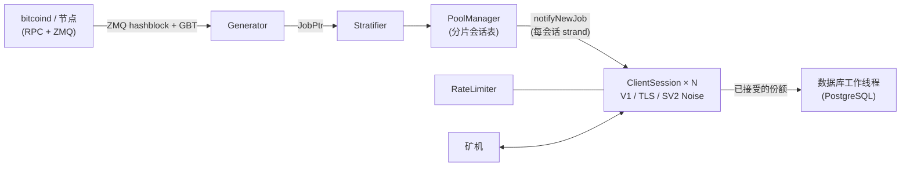

<div align="center">

# mkpool

### 现代化多币种 solo 挖矿矿池引擎，以 C++23 编写

Stratum V1 · Stratum V1 over TLS · 原生 Stratum V2（Noise 加密）· 9 大币种家族 · 单一代码库

[](COPYING)
[](CMakeLists.txt)
[](#快速开始)
[](#功能对比mkpool-对比-ckpool)
[](https://mkpool.com/blog/mkpool-vs-ckpool-benchmark)
[](https://github.com/Mecanik/mkpool/stargazers)

[在线矿池](https://mkpool.com) · [基准测试报告](https://mkpool.com/blog/mkpool-vs-ckpool-benchmark) · [快速开始](#快速开始) · [参与贡献](CONTRIBUTING.md) · [安全策略](SECURITY.md)

[English](README.md) | **简体中文** | [Русский](README.ru.md) | [Español](README.es.md) | [Português (Brasil)](README.pt-BR.md) | [Deutsch](README.de.md) | [Français](README.fr.md) | [日本語](README.ja.md) | [한국어](README.ko.md) | [Türkçe](README.tr.md)

*本翻译可能偶尔滞后于英文版 README。*

</div>

---

**mkpool** 是一款高性能、多线程的 solo 挖矿矿池引擎。它同时支持 **Stratum V1**、**Stratum V1 over TLS** 以及原生 **Stratum V2（Noise 加密）**，并以单一代码库驱动**九大币种家族**（包括合并挖矿的 Dogecoin 和 Equihash 算法的 Zcash）。它如今已在主网稳定运行，为 [mkpool.com](https://mkpool.com) 提供动力；本 README 反映的就是实际部署的状态。

在完全相同的硬件上，mkpool 的份额吞吐量约为 ckpool 的 **2.8 倍**，中位延迟低 **3.2 倍**，重连承载能力达 **16 倍**，这些数据均出自一套完全可复现的开源基准测试（[详见下文](#基准测试mkpool-对比-ckpool)）。

## 目录

- [为什么选择 mkpool？](#为什么选择-mkpool)
- [基准测试：mkpool 对比 ckpool](#基准测试mkpool-对比-ckpool)
- [支持的币种](#支持的币种)
- [功能对比：mkpool 对比 ckpool](#功能对比mkpool-对比-ckpool)
- [快速开始](#快速开始)
- [运行时控制（`mkpool-ctl`）](#运行时控制mkpool-ctl)
- [测试与加固](#测试与加固)
- [架构](#架构)
- [项目范围](#项目范围)
- [参与贡献](#参与贡献)
- [支持本项目](#支持本项目)
- [致谢](#致谢)
- [署名与许可证](#署名与许可证)

## 为什么选择 mkpool？

- ⚡ **快在刀刃上。** 8 核机器上每秒约 330k 个经过完整验证的份额，从提交到确认在每个百分位都保持亚毫秒级，重连风暴（NiceHash、MiningRigRentals 之类）以每秒约 6,400 次完整连接循环的速度被稳稳吸收。
- 🔐 **加密 Stratum，直接内建于二进制。** TLS（`stratum+ssl://`）与原生 Stratum V2，采用 Noise `NX` 握手和签名的授权证书。不需要 stunnel，也不需要任何外部代理。
- 🪙 **九大币种家族，同一套代码。** BTC、BCH、BC2、BCH2、XEC、DGB、支持合并挖矿 DOGE（AuxPoW）的 LTC，以及 Equihash 的 ZEC，每个币种只差一个配置文件。
- 🎯 **真正的 solo 挖矿。** 矿工的用户名就是收款地址；coinbase 按会话重建，区块奖励直接进入找到区块者的钱包。
- 🛡️ **针对恶意流量的加固设计。** 令牌桶限速、无效份额泛滥自动封禁、内存黑名单、按区块判定过期与重复份额的拒绝机制，外加一套公开的、专门轰击 Stratum 解析器的模糊测试工具。
- 🔧 **可在运行时管控。** 带主节点恢复看门狗的多节点 RPC 故障转移、区块提交重试，以及用于实时统计、`client.reconnect`、断开连接和日志级别的 JSON 控制套接字（`mkpool-ctl`），外加基于 `SO_REUSEPORT` 的低停机重启。无需往返数据库、无需重启，即可查看谁在挖矿并对矿工进行管控。
- 🧪 **按软件工程标准打造，而不是靠口口相传。** 单元测试、ASan/TSan/UBSan 全面扫描、对 CI 友好的 CMake + Ninja 构建，以及内置的 Prometheus 指标。
- 🏭 **生产环境实证。** 本仓库中的每一项功能此刻都运行在主网上，覆盖全部九条链，经受着真实租赁算力的反复冲击。

## 基准测试：mkpool 对比 ckpool

一场公平且完全可复现的 Stratum 基准测试：两台完全相同的 8 核机器（Azure `Standard_D8lds_v7`），每次只运行一个矿池，使用同一个 `bitcoind` regtest 节点、同一个负载生成器、固定难度 1。每个提交的份额在矿池应答之前都经过完整验证（coinbase 重建、merkle 根、80 字节区块头、双重 SHA-256），双方的拒绝原因可以证明这一点。

| 场景 | mkpool | ckpool | 差距 |
| --- | --- | --- | --- |
| 持续验证份额/秒（128 至 2,048 个连接） | ~315k 至 337k | ~108k 至 118k | **~2.8x** |
| 提交到确认的中位延迟（100 个连接，轻负载） | 116 µs | 371 µs | **低 ~3.2x** |
| 第 99 百分位延迟 | 602 µs | 814 µs | 每个百分位都更低 |
| 重连循环/秒（200 个并行的连接、订阅、认证、提交、关闭循环） | ~6,391（4 个错误） | ~402（1,000+ 个错误） | **~16x** |
| 2k / 4k / 8k 空闲连接时的常驻内存 | 66 / 108 / 197 MiB | 25 / 39 / 68 MiB | **ckpool 精简约 2.7x** |

ckpool 的内存优势按实测原样公布：它紧凑的 C 语言内存占用是货真价实的工程成就，而 mkpool 较重的每连接缓冲与线程模型所付出的代价也是真实存在的。除此之外的所有项目均由 mkpool 胜出，而且随着负载上升，这些比值几乎不变。

- 📊 [包含方法论与图表的完整报告](https://mkpool.com/blog/mkpool-vs-ckpool-benchmark)
- 📄 [自包含的原始 HTML 报告](https://mkpool.com/benchmarks/mkpool-vs-ckpool.html)
- 🔁 [自己动手复现：基准测试套件（负载生成器、编排器、配置）](https://github.com/Mecanik/mkpool-vs-ckpool-benchmark)

> **自行对 mkpool 做基准测试时的提示：** 请使用真实有效的收款地址作为 Stratum 用户名。mkpool 会在 authorize 阶段本地验证地址，对无效用户名提前拒绝，这会让本应测量的工作量被不公平地跳过。

## 支持的币种

| 币种 | 代码 | 算法 | 说明 |
| --- | --- | --- | --- |
| Bitcoin（比特币） | BTC | SHA-256d | V1、TLS、SV2 |
| Bitcoin Cash（比特币现金） | BCH | SHA-256d | CashAddr，V1/TLS/SV2 |
| BitcoinII | BC2 | SHA-256d | V1/TLS/SV2 |
| Bitcoin Cash II | BCH2 | SHA-256d | CashAddr，V1/TLS/SV2 |
| eCash | XEC | SHA-256d | Avalanche 预共识，SV2 |
| DigiByte | DGB | SHA-256d | V1/TLS/SV2 |
| Litecoin（莱特币） | LTC | Scrypt | 合并挖矿 DOGE |
| Dogecoin（狗狗币） | DOGE | Scrypt (AuxPoW) | 在 LTC 上合并挖矿 |
| Zcash | ZEC | Equihash 200,9 | `mining.set_target`，Blossom 补贴 |

## 功能对比：mkpool 对比 ckpool

图例：✅ 支持 · ⚠️ 部分 / 有条件 · ❌ 不支持

### 协议与加密

| 能力 | mkpool | ckpool |
| --- | :---: | :---: |
| Stratum V1（`mining.*`） | ✅ | ✅ |
| Stratum V1 over **TLS**（`stratum+ssl://`） | ✅ 内建 `any_stream` 变体，SIGHUP 重载证书 | ❌ |
| 原生 **Stratum V2**（Noise `NX` 握手，加密） | ✅ 完整区块模式，可收取交易费 | ❌ |
| SV2 秘密授权密钥 / 签名证书 | ✅ | ❌ |
| SV2 空块与完整区块切换（`v2EmptyBlocks`） | ✅ | ❌ |
| BIP310 `mining.configure`（version-rolling 协商） | ✅ | ✅ |
| ASICBoost / 版本掩码（`version_mask`） | ✅ 已验证（BIP310） | ✅ |
| `subscribe-extranonce` 扩展 | ✅ | ✅ |
| 建议难度（`mining.suggest_difficulty`、密码中的 `d=`） | ✅ 按币种钳制 | ✅ |

### 币种、算法与合并挖矿

| 能力 | mkpool | ckpool |
| --- | :---: | :---: |
| Bitcoin（BTC，SHA-256d） | ✅ | ✅ |
| Bitcoin Cash（BCH，SHA-256d，CashAddr） | ✅ | ❌ |
| BitcoinII（BC2，SHA-256d） | ✅ | ❌ |
| Bitcoin Cash II（BCH2，SHA-256d，CashAddr） | ✅ | ❌ |
| eCash（XEC，SHA-256d + Avalanche 预共识） | ✅ | ❌ |
| DigiByte（DGB，SHA-256d） | ✅ | ❌ |
| Litecoin（LTC，Scrypt） | ✅ | ❌ |
| **Dogecoin 在 LTC 上合并挖矿**（AuxPoW） | ✅ 父块 + 辅助块 | ❌ |
| Zcash（ZEC，Equihash 200,9，`mining.set_target`） | ✅ | ❌ |
| 单一代码库，按币种配置 | ✅ 9 大家族 | ❌ 仅限 Bitcoin |
| Equihash 份额验证（进程内） | ✅ `equihash.hpp` + 单元测试 | ❌ |
| 感知 Blossom 的区块补贴 / 减半（ZEC） | ✅ | ❌ |

### 矿池引擎与架构

| 能力 | mkpool | ckpool |
| --- | :---: | :---: |
| 语言 / 标准 | C++23 | C |
| 并发模型 | 单进程，异步 `io_context` 工作线程池（`std::jthread`） | 多进程（fork）+ 线程，Unix socket IPC |
| 网络层 | Boost.Asio / Beast，每会话 strand | 手写 epoll + Unix socket |
| 会话表 | 分片式（默认 64 个分片），低竞争广播 | 哈希表（uthash） |
| 每会话写路径 | 绑定 strand 的 `WriteQueue` + 1 MiB 水位线（无 `async_write` 竞争） | epoll 驱动的发送缓冲区 |
| 任务/工作窗口 | `JobWindow` 滚动缓冲区（默认 32 个任务），以 `job_id` 为键 | Workbase 列表 |
| 区块变化时下发新任务 | ✅ 完整交易集，ZMQ 驱动，绝不下发无交易任务 | ✅ |
| 周期性任务重播（对严格客户端的保活） | ✅ 30 秒，遇到真实区块即重置 | ✅ |
| ZMQ 区块哈希通知 | ✅ 已修复边沿触发 bug | ✅（可选） |
| `bitcoind` 故障转移（多个本地或远程节点） | ✅ 有序的 `rpcFallbacks` + 每 30 秒一次的主节点恢复看门狗 | ✅ |
| 传输失败时的区块提交重试 | ✅ 仅在节点没有应答时重发（对真实结果绝不重发） | ✅（最多 5 次） |
| 冗余区块传播（额外的提交节点） | ✅ `additionalSubmitEndpoints`，fire-and-forget，绝不阻塞主提交 | ⚠️ 通过节点模式 |
| Solo coinbase（矿工地址 = 用户名） | ✅ 每会话重建 coinbase2 | ✅（BTCSOLO 模式） |
| 从 coinbase 抽取运营费 / 捐赠 | ✅ 百分比可配置，含 aux/DOGE 拆分 | ✅ 默认 0.5% |
| 自定义 coinbase 签名 | ✅ 可配置 | ✅ 可配置 |
| 代理模式 | ✅ TLS uplink; multi-upstream hot-standby + active/active | ✅ |
| Passthrough / 节点 / 重定向模式 | ✅ all three (mkpool-native TLS cluster protocol; node adds local block submit; health/latency-aware redirector) | ✅ |
| 低停机重启 | ✅ 零停机部署：双槽切换（`SO_REUSEPORT` + 分批 `client.reconnect`） | ✅ socket 交接 |

### 难度与份额处理

| 能力 | mkpool | ckpool |
| --- | :---: | :---: |
| Vardiff（EMA / 衰减平均） | ✅ 忠实重实现 ckpool 的 `decay_time`/`time_bias` | ✅（原版） |
| 按币种的 vardiff 范围 | ✅（例如 BTC/BCH/BC2/BCH2/DGB/XEC 为 `[1024, 1M]`，ZEC 为 `[8192, 524288]`） | ⚠️ 单一 `mindiff`/`maxdiff` |
| 固定难度档位（每档独占一个 TCP 端口） | ✅ 例如 10M / 50M / 100M 端口 | ⚠️ 需分开的实例 |
| 自定义 `d=` 钳制（1024-10M） | ✅ | ⚠️ |
| 按区块判定并拒绝过期份额 | ✅ 将 prevhash 与当前链尖比对 | ✅ |
| 重复份额拒绝 | ✅ 内存去重集合，每个区块清空一次 | ✅ |
| ntime 验证（兼容 BIP113） | ✅ `utils::valid_ntime` | ✅ |
| `int64_t` coinbase 金额（防溢出） | ✅ 端到端 | ✅ |
| 本地地址验证（authorize 时无需 RPC） | ✅ BIP173/BIP350/base58/CashAddr 解码器 | ⚠️ 依赖 bitcoind |

### 安全与运维

| 能力 | mkpool | ckpool |
| --- | :---: | :---: |
| 令牌桶按 IP 限速 | ✅ | ⚠️ |
| 无效份额过多时自动封禁 | ✅ | ⚠️ |
| 内存 IP 黑名单 | ✅ | ⚠️ |
| 连接断开可观测性（每次断开记录日志） | ✅ 原因/矿机/存活时长/份额数 | ⚠️ |
| 运行时控制 / 管理套接字 | ✅ `mkpool-ctl`（21 个 JSON 命令） | ✅ `ckpmsg` |
| `client.reconnect`（在运营方不断开连接的情况下迁移矿工） | ✅ 广播或按客户端，经由控制套接字 | ✅ |
| 经由套接字的进程内统计（算力 1m/5m、本轮最佳份额、空闲秒数） | ✅ 按矿工 / 矿机 / 用户 / 矿池，按需从 vardiff 计算（不访问数据库） | ✅ |
| 空闲 / 死亡矿机检测 + 可选回收 | ✅ 可选的 `idleDropSeconds` | ✅ |
| 数据库韧性（自动重连 + 零丢失重排队） | ✅ | n/a（无数据库） |
| Prometheus 指标端点 | ✅ 可选（`MKPOOL_ENABLE_METRICS`） | ❌ |
| Sanitizer 构建（ASan / TSan / UBSan） | ✅ CMake 选项 + `scripts/run_sanitizers.sh` | ❌ |
| 单元测试（Catch2 / Catch 风格） | ✅ merkle、vardiff、地址、SV2 noise 等 | ❌ |
| Stratum 模糊测试工具 | ✅ `scripts/fuzz_*.sh`（7 类滥用场景，含守护进程存活断言） | ❌ |
| 构建系统 | CMake + Ninja | autotools（`./configure && make`） |
| 平台 | Linux（Ubuntu 24.04+） | Linux |
| 外部依赖 | Boost、OpenSSL、libpq/pqxx、libzmq、libsodium | 极简（glibc、yasm、可选 zmq） |

## 快速开始

### 1. 构建（Ubuntu 24.04+）

```bash
# 系统依赖
sudo apt update
sudo apt install -y build-essential cmake ninja-build pkg-config git \
    libboost-system-dev libboost-thread-dev libboost-program-options-dev \
    libssl-dev libpq-dev libpqxx-dev libzmq3-dev cppzmq-dev libsodium-dev libsecp256k1-dev

# 克隆 + 配置 + 构建（C++23）
git clone https://github.com/Mecanik/mkpool.git && cd mkpool
cmake -S . -B build -GNinja -DCMAKE_BUILD_TYPE=RelWithDebInfo
cmake --build build -j
```

<details>
<summary><b>CMake 选项</b></summary>

| 选项 | 默认值 | 说明 |
| --- | --- | --- |
| `MKPOOL_BUILD_TESTS` | `ON` | Catch2 单元测试 |
| `MKPOOL_ENABLE_LTO` | `ON` | 链接时优化 |
| `MKPOOL_ENABLE_TLS` | `ON` | OpenSSL TLS 上下文支持 |
| `MKPOOL_ENABLE_METRICS` | `ON` | Prometheus 指标暴露器 |
| `MKPOOL_ENABLE_ASAN` | `OFF` | AddressSanitizer |
| `MKPOOL_ENABLE_TSAN` | `OFF` | ThreadSanitizer |
| `MKPOOL_ENABLE_UBSAN` | `OFF` | UndefinedBehaviorSanitizer |
| `MKPOOL_ENABLE_NATIVE` | `OFF` | `-march=native` |

</details>

### 2. 配置

你需要一个已完成同步的币种节点（开启 ZMQ 区块通知），以及一个可以访问的 PostgreSQL 实例。

```bash
cp config.json.example config.json
# 然后编辑 config.json：
#  - 你的币种守护进程的 RPC 主机/凭据
#  - PostgreSQL 凭据
#  - 你自己的捐赠/收款地址（千万不要保留占位符）
#  - stratum 档位/端口、vardiff 范围、可选的 TLS 证书路径、可选的 SV2 端口
```

[`config.json.example`](config.json.example) 记录了加载器能识别的每一个字段，包括固定难度档位、TLS 档位（`"tls": true`）、Stratum V2 设置，以及 LTC+DOGE 合并挖矿（`aux` 配置块）。

### 3. 运行

```bash
./build/mkpool --config config.json
```

矿池运行后，根据配置对外开放：

- **Stratum V1：** vardiff 与固定难度档位，每档一个端口（例如 `3331` 为 vardiff，`3335` 为固定 10M）。
- **Stratum over TLS：** 任何设置了 `"tls": true` 的档位在各自端口上使用 `stratum+ssl://`。
- **Stratum V2（Noise）：** `stratumV2Port`（例如 BTC 为 `3340`）。
- **Prometheus 指标：** 构建时启用 metrics 后的 `metricsListenPort`（默认 `9090`）。

矿工连接时以**收款地址作为用户名**，区块奖励会直接进入该地址。

## 运行时控制（`mkpool-ctl`）

每个实例都会打开一个私有的 Unix 控制套接字（默认 `/run/mkpool/<实例>.sock`；可用 `controlSocket` 覆盖，或设为 `"off"` 关闭）。借助随附的 [`scripts/mkpool-ctl.py`](scripts/mkpool-ctl.py)（下文简记为 `mkpool-ctl`），无需重启、也无需往返数据库，即可查询并管控运行中的矿池：

```bash
mkpool-ctl -i btc-mainnet stats          # 运行时长、连接数、矿池算力、各币种的模板 + 最佳份额
mkpool-ctl -i btc-mainnet clients        # 每个连接：IP、矿机、难度、算力、空闲秒数
mkpool-ctl -i btc-mainnet workers        # 按 address.worker 聚合
mkpool-ctl -i btc-mainnet users          # 按收款地址聚合
mkpool-ctl -i btc-mainnet getclient 42   # 单个连接的详情
mkpool-ctl -i btc-mainnet reconnect      # 向每个矿工发送 client.reconnect（例如维护前）
mkpool-ctl -i btc-mainnet dropclient 42  # 断开某个矿工
mkpool-ctl -i btc-mainnet loglevel debug # 实时修改日志级别
mkpool-ctl -i btc-mainnet healthcheck    # 各币种的模板新鲜度
mkpool-ctl -i btc-mainnet help           # 完整命令列表
```

完整命令集：`ping`、`help`、`version`、`uptime`、`stats`、`clients`、`workers`、`users`、`getclient`、`getuser`、`getworker`、`userclients`、`workerclients`、`loglevel`、`reconnect`、`reconnclient`、`dropclient`、`dropall`、`resetshares`、`blacklistreload`、`healthcheck`。每条响应都是 JSON。算力、本轮最佳份额和空闲时间都在进程内维护（由 vardiff 本就跟踪的份额速率推导得出），且按需读取，因此在你主动查询之前，列出 5 万个矿机不会带来任何开销。套接字以 `0600`（仅属主）创建；在 systemd 下每币种一个进程，因此每个币种都有各自的套接字。

## 测试与加固

### 单元测试

```bash
cd build
ctest --output-on-failure -j
```

### Sanitizer 扫描

`scripts/run_sanitizers.sh` 会在一次性的 `.san/` 目录中分别以 AddressSanitizer、UndefinedBehaviorSanitizer 和 ThreadSanitizer 构建单元测试（你正常的 `build/` 目录不受任何影响），并报告所有发现的问题。

```bash
./scripts/run_sanitizers.sh            # asan+ubsan 与 tsan
./scripts/run_sanitizers.sh asan       # 只跑单一类型
./scripts/run_sanitizers.sh --fuzz     # 额外对带 sanitizer 的实例做模糊测试
```

### 对 Stratum 解析器做模糊测试

`scripts/fuzz_*.sh` 会向运行中的矿池投掷畸形与滥用性的 Stratum 流量，并断言矿池安然无恙（前后 PID 相同）且没有任何处理器异常。把它们指向本地实例即可：

```bash
# 快速的畸形帧连发
HOST=127.0.0.1 PORT=3331 ./scripts/fuzz_stratum.sh

# 完整套件：畸形 JSON、协议滥用、份额刷屏、认证滥用、
# slowloris、version-rolling 滥用、二进制噪声
HOST=127.0.0.1 PORT=3331 ./scripts/fuzz_suite.sh
```

## 架构



- `IoPool` 运行 N 个工作 `io_context`（默认 = `hardware_concurrency()`）。
- 每个 `ClientSession` 通过 Asio strand 固定在一个工作 `io_context` 上；socket 类型（明文 / TLS / SV2 Noise）由 `any_stream` 抽象封装，所有写操作都经过绑定 strand 的 `WriteQueue`。
- `PoolManager` 在每个 `JobPtr` 到来时遍历各分片，把 `notifyNewJob` 分发到每个会话自己的 strand 上。
- `Generator` 每 30 秒把当前任务作为保活重播一次（`clean_jobs=false`，因此不会丢弃任何已有工作），让租赁市场代理、矿场控制器这类严格客户端不会在两个区块之间因空闲而断开。

## 项目范围

本仓库是**矿池引擎**，出于透明目的公开发布。生产环境中围绕它的运营组件（数据库/分析服务、公开 REST API 以及网站）**不**在本次开源范围之内。

mkpool 是一套原创代码库。异步 C++ 引擎、多币种支持、Stratum V2（Noise）与 TLS 栈、按矿工构建的 solo coinbase，以及安全工具链，全部从零写起。唯一有意借鉴 [ckpool](https://bitbucket.org/ckolivas/ckpool)（Con Kolivas 的 GPLv3 C 矿池）的组件是**可变难度调整算法**，那是对一个久经考验的算法的小规模、已注明出处的重实现（见[署名与许可证](#署名与许可证)）。

## 参与贡献

欢迎各种形式的贡献：bug 报告、协议边界情况、新的币种家族、性能优化、文档，以及本 README 的翻译。

- 提交 PR 之前请先阅读 [CONTRIBUTING.md](CONTRIBUTING.md)。
- 安全问题：请遵循 [SECURITY.md](SECURITY.md)，不要公开提 issue。
- 如果 mkpool 对你有用，**给仓库点个 star** 真的能帮项目被更多人发现。⭐

## 支持本项目

mkpool 免费且开源。使用这些代码不收取任何费用，也没有任何内置的捐赠抽成。如果这个项目帮到了你，而你愿意为它的开发出一份力，可以往这里打赏一笔。完全自愿，不胜感激。

**BTC:** `bc1qlugz6as6x3n03c6x8zddpnmypsaucdmh3lc5z0`

## 致谢

mkpool 建立在大量优秀的开源作品之上。向下列每一个项目的维护者与贡献者致以真诚的感谢。没有他们，这个矿池不会存在。

| 库 | 许可证 | 用途 |
| --- | --- | --- |
| [Boost](https://www.boost.org/)（Asio / Beast） | BSL-1.0 | 异步网络、strand、HTTP RPC 客户端 |
| [OpenSSL](https://www.openssl.org/) | Apache-2.0 | TLS、SHA-256 |
| [fmt](https://github.com/fmtlib/fmt) | MIT | 热路径 Stratum 格式化 |
| [spdlog](https://github.com/gabime/spdlog) | MIT | 日志 |
| [nlohmann/json](https://github.com/nlohmann/json) | MIT | 配置与 RPC JSON |
| [cxxopts](https://github.com/jarro2783/cxxopts) | MIT | 命令行解析 |
| [libpqxx](https://github.com/jtv/libpqxx) / [libpq](https://www.postgresql.org/) | BSD-3-Clause / PostgreSQL | 数据库访问 |
| [ZeroMQ](https://zeromq.org/)（libzmq + [cppzmq](https://github.com/zeromq/cppzmq) 绑定） | MPL-2.0 / MIT | 区块哈希通知 |
| [libsodium](https://libsodium.org/) | ISC | Stratum V2 Noise 加密 |
| [libsecp256k1](https://github.com/bitcoin-core/secp256k1) | MIT | EC 密钥 / 签名（SV2） |
| [Catch2](https://github.com/catchorg/Catch2) | BSL-1.0 | 单元测试 |
| [prometheus-cpp](https://github.com/jupp0r/prometheus-cpp) | MIT | 可选的指标端点 |

以上项目均采用与 GPLv3 兼容的许可证。mkpool 不内嵌（复制）它们的源代码；它们由系统包管理器提供并在链接时使用，或在构建时由 CMake 拉取。如果你分发**编译后**的 mkpool 二进制文件，请随附一个 `THIRD-PARTY-NOTICES` 文件，完整转载这些项目的版权与许可证文本。

## 署名与许可证

mkpool 是**原创软件**，© 2025-2026 Mecanik1337（<contact@mecanik.dev>），以 **GNU General Public License v3.0**（`GPL-3.0`）授权。每个源文件都带有完整的 GPLv3 头部。

代码库的几乎全部内容（异步引擎、多币种支持、Stratum V2（Noise）与 TLS、solo coinbase 构建，以及安全工具链）都是从零编写的，除了同属一类程序之外，与 ckpool 没有任何渊源。

唯一的例外，出于诚实与许可证合规在此披露：[`vardiff.cpp`](src/vardiff.cpp) / [`vardiff.hpp`](src/vardiff.hpp) 中的可变难度**调整算法**重实现了 **Con Kolivas** 在 ckpool 中的 `decay_time()`（`src/libckpool.c`）以及 `time_bias()` / `add_submit()`（`src/stratifier.c`），后者同样以 GPLv3 授权。这是唯一改编自 ckpool 的部分；没有任何 ckpool 的 C 源文件被内嵌或逐字复制，个别 Stratum 字段约定（例如 4 字节的 extranonce1）只是沿袭业界通行做法。运行时控制套接字的命令名（`stats`、`clients`、`workers`、`reconnect` 等）沿用了 ckpool 的命名以便运营者熟悉，但其分发逻辑、JSON 格式与实现均为完全原创。这些均已在代码内注明出处。由于 mkpool 本身就是 GPLv3，这种复用完全合规；如果你再分发 mkpool，请保持 GPLv3 授权、保留这些署名，并附带完整的许可证文本（[`COPYING`](COPYING)）。

ckpool：<https://bitbucket.org/ckolivas/ckpool>，© 2014-2026 Con Kolivas。

---

<div align="center">

**[⬆ 回到顶部](#mkpool)**

如果你在运行 mkpool，用它挖到了区块，或者只是欣赏这份工程本身，[点一个 star](https://github.com/Mecanik/mkpool/stargazers) 就是支持这个项目最简单的方式。

</div>
